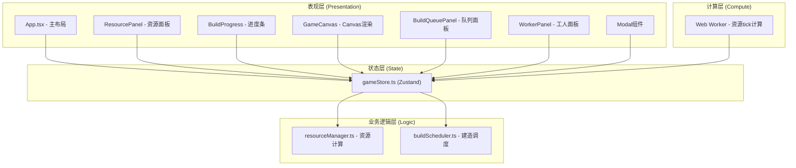
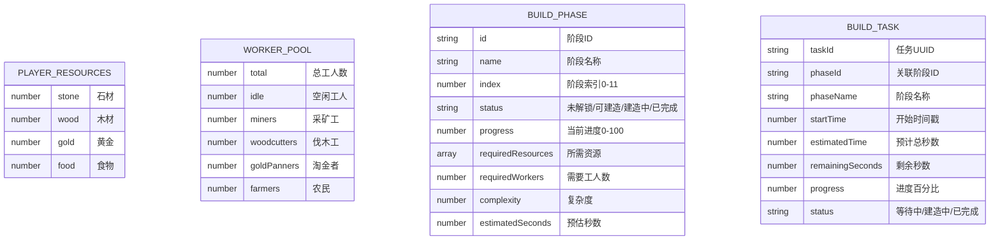

## 1. 架构设计



---

## 2. 技术选型

| 类别 | 技术 | 版本 | 说明 |
|------|------|------|------|
| 前端框架 | React | 18.x | 组件化UI开发 |
| 构建工具 | Vite | 5.x | 极速HMR开发体验 |
| 语言 | TypeScript | 5.x | 静态类型安全 |
| 状态管理 | Zustand | 4.x | 轻量高性能状态管理 |
| Canvas渲染 | Canvas 2D API | - | 原生API渲染金字塔 |
| 图标库 | lucide-react | latest | 轻量图标组件 |
| 后台计算 | Web Worker | - | 资源tick计算 |
| UUID生成 | uuid | latest | 任务唯一标识 |

**项目初始化**：使用 `vite-init` 的 `react-ts` 模板脚手架

---

## 3. 文件结构与调用关系

```
src/
├── main.tsx                  # React入口 → 渲染 App
├── App.tsx                   # 主布局 → 组合所有子组件，分发状态
├── workers/
│   └── gameWorker.ts         # Web Worker → 定时tick，通知主线程
├── store/
│   └── gameStore.ts          # Zustand仓库 → 被所有组件读取，调用modules
├── modules/
│   ├── resourceManager.ts    # 资源纯函数 → 被gameStore调用
│   └── buildScheduler.ts     # 调度纯函数 → 被gameStore调用
├── types/
│   └── index.ts              # 全局类型定义
├── hooks/
│   ├── useAnimatedNumber.ts  # 数字动画Hook
│   └── useGameTick.ts        # 游戏循环Hook
├── components/
│   ├── layout/
│   │   └── MainLayout.tsx    # 布局容器
│   ├── ResourcePanel.tsx     # 顶部资源栏 → 读取store
│   ├── BuildProgress.tsx     # 建造进度条 → 读取/写入store
│   ├── GameCanvas.tsx        # Canvas渲染 → 读取store
│   ├── BuildQueuePanel.tsx   # 队列面板 → 读取/写入store
│   ├── WorkerPanel.tsx       # 工人面板 → 读取/写入store
│   ├── AnimatedNumber.tsx    # 动画数字组件
│   ├── DispatchWorkerModal.tsx # 派遣工人弹窗
│   └── HireWorkerModal.tsx   # 雇佣工人弹窗
└── styles/
    └── globals.css           # 全局样式
```

**数据流向说明**：
- 读取：组件 → gameStore.getState() / useGameStore()
- 写入：组件事件 → store.action → modules纯函数计算 → state更新 → 组件重渲染
- 后台计算：Web Worker postMessage → main监听 → store.collectResource → 更新

---

## 4. 数据模型

### 4.1 ER图



### 4.2 核心类型定义

```typescript
type ResourceType = 'stone' | 'wood' | 'gold' | 'food';
type WorkerType = 'miner' | 'woodcutter' | 'goldPanner' | 'farmer';
type PhaseStatus = 'locked' | 'available' | 'building' | 'completed';
type TaskStatus = 'pending' | 'building' | 'done';

interface Resources {
  stone: number;
  wood: number;
  gold: number;
  food: number;
}

interface WorkerAssignment {
  miners: number;
  woodcutters: number;
  goldPanners: number;
  farmers: number;
  idle: number;
  total: number;
}

interface BuildPhase {
  id: string;
  index: number;
  name: string;
  description: string;
  status: PhaseStatus;
  requiredResources: Partial<Resources>;
  requiredWorkers: number;
  complexity: number;
  materials: ('stone' | 'wood' | 'gold')[];
}

interface BuildTask {
  taskId: string;
  phaseId: string;
  phaseName: string;
  phaseIndex: number;
  startTime: number | null;
  estimatedTime: number;
  remainingSeconds: number;
  progress: number;
  status: TaskStatus;
}
```

---

## 5. Store Action 定义

| Action名 | 参数 | 功能 | 调用模块 |
|----------|------|------|----------|
| `collectResource(type, amount)` | 资源类型,数量 | 增加指定资源 | - |
| `dispatchWorkers(type, count)` | 职业,数量 | 分配空闲工人到岗位 | resourceManager |
| `recallWorkers(type, count)` | 职业,数量 | 召回工人到空闲池 | resourceManager |
| `hireWorker(count)` | 数量 | 消耗食物雇佣工人 | resourceManager |
| `addBuildTask(phaseId)` | 阶段ID | 添加任务到队列末尾 | buildScheduler |
| `cancelBuildTask(taskId)` | 任务ID | 取消队列任务 | buildScheduler |
| `prioritizeBuildTask(taskId)` | 任务ID | 置顶队列任务 | buildScheduler |
| `reorderBuildTasks(from, to)` | 起始索引,目标索引 | 拖拽排序队列 | buildScheduler |
| `advanceBuildStep(deltaMs)` | 时间增量ms | 推进建造进度 | buildScheduler |
| `tickResources(deltaSeconds)` | 秒数增量 | 计算并增加资源产量 | resourceManager |

---

## 6. 性能优化策略

1. **Web Worker计算**：资源生产tick、建造进度计算在Worker中运行，每500ms同步一次
2. **Canvas优化**：
   - 使用 `requestAnimationFrame` 循环，目标60fps
   - 金字塔分层缓存为离屏Canvas，减少重复绘制
   - 脏矩形区域重绘，非变化区域不重绘
   - 帧时间监控，超过33ms降级简化渲染
3. **React渲染优化**：
   - Zustand selector 精确订阅，避免无关组件重渲染
   - `React.memo` 包装大列表项
   - `useCallback` / `useMemo` 稳定引用
4. **拖拽优化**：使用原生HTML5 DnD + transform动画，避免频繁重排
5. **数字动画**：RAF驱动的插值动画，不触发状态密集更新
