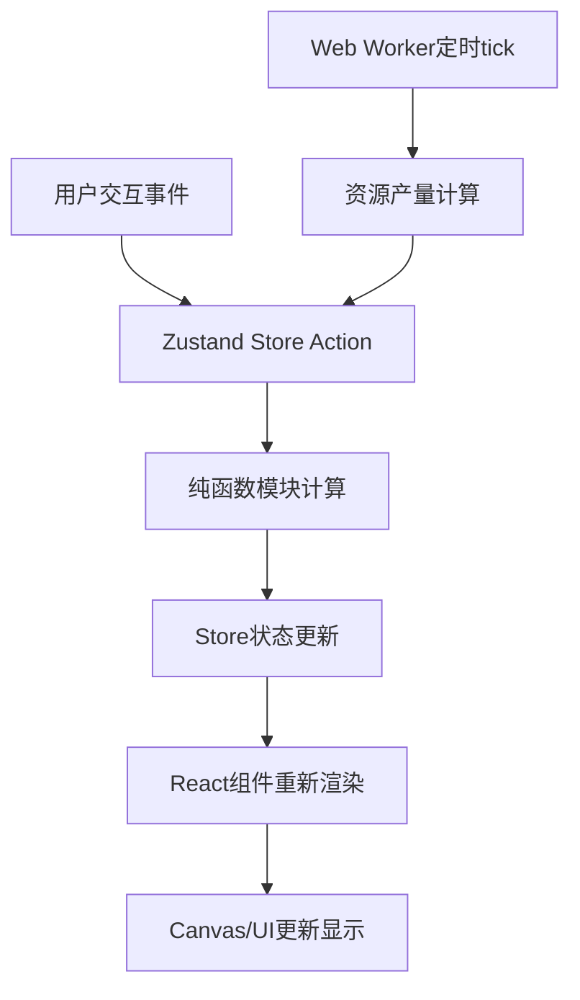

## 1. 产品概述

古埃及金字塔建造模拟游戏是一款以古埃及文明为背景的模拟经营类Web应用，玩家扮演法老的建筑师，通过管理资源、雇佣工人、规划施工顺序来完成宏伟的金字塔建造工程。

- **主要目的**：让玩家体验从资源采集到建筑落成的完整建造流程，培养策略规划能力
- **目标用户**：对历史模拟、资源管理类游戏感兴趣的玩家
- **产品价值**：寓教于乐，通过游戏化方式展示古埃及建筑工程的复杂性

---

## 2. 核心功能

### 2.1 功能模块

1. **资源管理系统**：四种核心资源（石材、木材、黄金、食物）的采集、存储、消耗管理
2. **工人管理系统**：工人雇佣、职业分配、状态追踪（空闲/在岗）
3. **建造规划系统**：12阶段金字塔建造进度、前置条件检查、施工队列管理
4. **可视化渲染系统**：Canvas 2D实时渲染金字塔建造进度、动画效果
5. **施工调度系统**：施工队列动态排序、自动推进、进度追踪

### 2.2 页面详情

| 页面名称 | 模块名称 | 功能描述 |
|-----------|-------------|---------------------|
| 主游戏页 | 顶部资源面板 | 显示四种资源数量与产量，支持派遣/召回工人 |
| 主游戏页 | 建造进度条 | 12阶段垂直进度条，显示阶段详情，支持加入队列 |
| 主游戏页 | Canvas渲染区 | 金字塔剖面图实时渲染，悬停高亮提示 |
| 主游戏页 | 施工队列面板 | 队列列表、进度条、取消/置顶、拖拽排序 |
| 主游戏页 | 工人管理面板 | 工人统计、职业分布图表、雇佣新工人、空闲工人展示 |
| 主游戏页 | 派遣工人模态框 | 选择职业派遣空闲工人采集资源 |
| 主游戏页 | 雇佣工人模态框 | 展示工人定价，消耗食物雇佣新工人 |

---

## 3. 核心流程

### 3.1 主要用户流程

1. 玩家进入游戏，查看初始资源和工人状态
2. 通过"派遣工人"按钮分配空闲工人到四种资源采集岗位
3. 资源随时间自动增长（Web Worker后台计算）
4. 查看建造进度条，选择当前可建造阶段，若资源充足则加入施工队列
5. 施工队列自动推进建造，完成后解锁下一阶段
6. 玩家调整队列顺序、取消任务或置顶任务
7. 通过"工人管理"按钮查看工人统计、雇佣新工人
8. 重复上述流程，直到完成金字塔全部12个建造阶段

### 3.2 数据流流程图

---

## 4. 用户界面设计

### 4.1 设计风格

- **主色调**：米黄色背景 (#f5e6c8)、深褐色文字 (#3d2b1f)、金色装饰 (#cfb53b)
- **辅助色**：石材灰 (#808080)、木材棕 (#8B4513)、黄金金 (#FFD700)、食物绿 (#228B22)
- **按钮风格**：圆角矩形 (8px)、浅色阴影 (0 2px 8px rgba(0,0,0,0.1))、按压缩放效果
- **字体**：标题使用衬线字体（营造古典感），正文使用易读无衬线字体
- **图标风格**：简约线性图标，配合职业特色（镐、斧、筛子、麦穗）
- **整体氛围**：古埃及纸莎草卷风格，沙漠色调渐变背景

### 4.2 页面设计概述

| 页面名称 | 模块名称 | UI元素与交互 |
|-----------|-------------|-------------|
| 主游戏页 | 顶部资源栏 | 固定顶部、四色资源卡片、数字滚动动画、派遣按钮 |
| 主游戏页 | 建造进度条 | 左侧垂直布局、12阶段节点、绿色已完成/高亮当前/灰色未解锁 |
| 主游戏页 | Canvas区 | 沙漠渐变背景、金字塔分层渲染、在建层脉动动画、悬停高亮 |
| 主游戏页 | 队列面板 | 右侧卡片列表、进度百分比条、拖拽虚线占位、淡入淡出 |
| 主游戏页 | 工人面板 | 右下角浮动按钮、展开动画、横向柱状图、圆形头像滚动 |
| 主游戏页 | 模态框 | 半透明遮罩、居中弹出、300ms淡入、圆角大卡片 |

### 4.3 响应式设计

- **设计原则**：Desktop-first，宽度 < 768px 自适应
- **移动端适配**：
  - 右侧施工队列面板折叠为底部抽屉
  - 底部抽屉支持手势上拉展开
  - 建造进度条改为紧凑水平布局
  - Canvas缩放适配屏幕宽度
  - 按钮增大触控区域 (44px x 44px 最小)

### 4.4 动画与动效

- **过渡动画**：opacity 0→1, 300ms 淡入淡出
- **数字变化**：ease-out 500ms 缓动滚动
- **按钮交互**：scale(0.95) 按压效果, 150ms 恢复
- **在建层**：轻微脉动呼吸动画
- **可建造阶段**：高亮闪烁吸引点击
- **页面元素**：入场时 staggered reveal 动画
