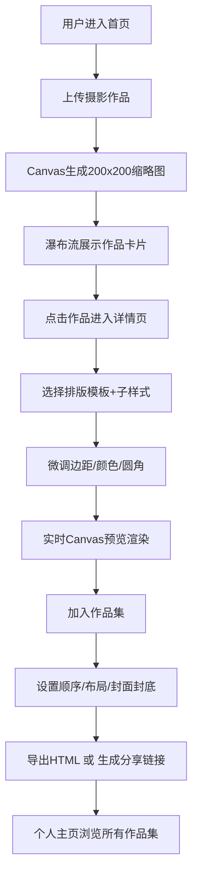

## 1. 产品概述
面向摄影爱好者的浏览器端摄影作品集创建与分享应用，解决传统作品集模板雷同、自建成本高、排版定制困难的痛点。
- 核心价值：零技术门槛创建专业级摄影作品集，丰富的在线排版能力，一键导出/分享
- 目标用户：摄影爱好者、独立摄影师、视觉创作者

## 2. 核心功能

### 2.1 用户角色
| 角色 | 注册方式 | 核心权限 |
|------|----------|----------|
| 普通用户 | 无需注册（本地存储） | 上传作品、排版编辑、创建作品集、导出HTML、生成分享链接 |

### 2.2 功能模块
1. **首页（作品库）**：瀑布流作品展示、作品上传、搜索筛选
2. **作品详情页（排版编辑器）**：排版模板选择、参数微调、实时预览
3. **作品集管理**：作品集创建、作品组合排序、封面/封底设置
4. **个人主页**：作品集列表展示、幻灯片预览模态框
5. **导出分享**：HTML单文件导出、公开分享链接生成

### 2.3 页面详情
| 页面名称 | 模块名称 | 功能描述 |
|----------|----------|----------|
| 首页（作品库） | 顶部导航栏 | Logo、页面切换（作品/作品集）、上传按钮 |
| 首页（作品库） | 瀑布流作品网格 | 缩略图卡片、悬停放大阴影、点击跳转详情 |
| 首页（作品库） | 上传区域 | 拖拽/点击上传JPG/PNG/WebP（≤10MB）、自动生成缩略图 |
| 作品详情页 | 高清预览区 | 1200px+宽度排版预览、30fps参数刷新 |
| 作品详情页 | 排版编辑面板 | 3种主模板（满版/白边/跨页）、子样式选择、边距/颜色/圆角滑块 |
| 作品集编辑 | 作品排序区 | 拖拽排序、每页1张/2张布局切换 |
| 作品集编辑 | 封面设置 | 自定义背景色、标题文字、封面图选择 |
| 个人主页 | 作品集网格 | 动静结合卡片（左大右三缩略图）、悬停遮罩预览按钮 |
| 个人主页 | 幻灯片模态框 | 毛玻璃背景、键盘左右翻页、关闭按钮悬停变红 |

## 3. 核心流程

## 4. 用户界面设计

### 4.1 设计风格
- **主色调**：深灰 `#2D2D2D` + 白色 `#FFFFFF`（极简对比）
- **辅助色**：浅蓝 `#4A90D9`（按钮、链接、交互强调）
- **按钮风格**：圆角4px、悬停0.3s ease-in-out平滑过渡、无多余装饰
- **字体方案**：标题使用 Playfair Display（衬线，提升艺术感），正文使用 IBM Plex Sans（清晰易读）
- **布局风格**：卡片式 + 瀑布流，大量留白，注重作品本身的视觉呈现
- **动效设计**：卡片淡入（0.5s从下往上）、骨架屏闪烁渐变、悬停微交互

### 4.2 页面设计概览
| 页面名称 | 模块名称 | UI元素 |
|----------|----------|--------|
| 首页（作品库） | 瀑布流网格 | 卡片圆角8px、悬停scale(1.05)+阴影、封面标题日期标签叠加底部、三断点响应式 |
| 首页（作品库） | 上传拖拽区 | 虚线边框、浅蓝高亮、拖拽进入时背景微亮 |
| 作品详情页 | 预览画布 | 居中展示、1200px最小宽度、阴影投影、画布外深灰背景 |
| 作品详情页 | 编辑面板 | 右侧固定宽度、分组折叠、滑块+数值输入联动、颜色选择器 |
| 个人主页 | 作品集卡片 | 左大图+右侧3缩略图网格、悬停半透明遮罩从下往上滑入、预览按钮居中淡入 |
| 个人主页 | 模态框 | backdrop-filter blur(12px)、全屏暗色遮罩、关闭按钮右上角悬停红色、左右箭头+键盘翻页 |

### 4.3 响应式设计
- **设计优先**：Desktop-first
- **断点定义**：
  - 桌面（≥1200px）：瀑布流4列、作品集卡片完整展示
  - 平板（768-1199px）：瀑布流3列、作品集卡片缩略图缩小
  - 手机（<768px）：瀑布流2列、编辑面板移至底部、作品集卡片改为纵向布局
- **触控优化**：移动端按钮尺寸≥44px、卡片点击热区扩大

### 4.4 性能指标
| 指标 | 目标值 |
|------|--------|
| 缩略图生成 | ≤1秒/张 |
| 排版预览响应 | ≤500ms |
| HTML导出 | ≤3秒 |
| 骨架屏展示 | 图片加载期间 |
| 预览刷新帧率 | 30fps |
