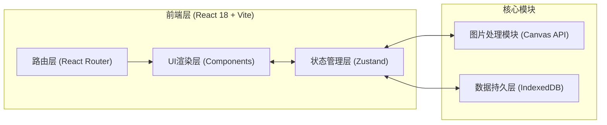

## 1. 架构设计



## 2. 技术选型说明
- **前端框架**：React 18 + TypeScript（严格模式）
- **构建工具**：Vite 5 + @vitejs/plugin-react
- **状态管理**：Zustand（轻量、跨模块同步、无Provider嵌套）
- **图片处理**：Canvas API（离屏Canvas + ImageBitmap）
- **本地存储**：IndexedDB（idb封装，存储原图和缩略图Blob）
- **路由**：React Router DOM（Hash路由，兼容静态导出）
- **唯一ID**：uuid v4
- **样式方案**：原生CSS Modules + CSS变量（无Tailwind，追求极致定制）

## 3. 路由定义
| 路由 | 页面组件 | 用途 |
|------|----------|------|
| `/` | `pages/HomePage.tsx` | 首页，瀑布流作品库 |
| `/photo/:id` | `pages/PhotoDetailPage.tsx` | 作品详情 + 排版编辑器 |
| `/portfolio` | `pages/PortfolioListPage.tsx` | 个人主页，作品集列表 |
| `/portfolio/:id/edit` | `pages/PortfolioEditPage.tsx` | 作品集编辑（排序/封面） |
| `/share/:id` | `pages/ShareViewPage.tsx` | 分享链接只读预览 |

## 4. 状态仓库设计（Zustand）

```typescript
// Photo: 单张摄影作品
interface Photo {
  id: string;
  title: string;
  originalUrl: string;      // ObjectURL 指向 IndexedDB Blob
  thumbnailUrl: string;     // 200x200缩略图
  originalWidth: number;
  originalHeight: number;
  captureDate: string;      // ISO date
  tags: string[];           // ['风光','人像','街拍'...]
  createdAt: number;
}

// LayoutConfig: 排版配置
interface LayoutConfig {
  templateType: 'full' | 'border' | 'spread';
  subStyle: number;         // 0-2 子样式索引
  margin: number;           // 0-50px
  borderColor: string;      // HEX
  borderRadius: number;     // 0-20px
  previewWidth: number;     // 输出宽度(≥1200)
}

// Portfolio: 作品集
interface Portfolio {
  id: string;
  title: string;
  coverImageId?: string;    // 作品ID 或 自定义上传
  coverColor: string;       // HEX
  coverTitle: string;
  backCoverColor: string;
  items: { photoId: string; layout: LayoutConfig; }[];
  layoutPerPage: 1 | 2;     // 每页1张或2张
  createdAt: number;
  shareToken?: string;
}

// AppStore
interface AppStore {
  photos: Photo[];
  portfolios: Portfolio[];
  currentPhotoId: string | null;
  currentLayout: LayoutConfig;
  currentPortfolioId: string | null;
  // actions
  addPhoto: (file: File) => Promise<Photo>;
  deletePhoto: (id: string) => void;
  updatePhoto: (id: string, patch: Partial<Photo>) => void;
  setCurrentPhoto: (id: string | null) => void;
  updateLayout: (patch: Partial<LayoutConfig>) => void;
  createPortfolio: () => string;
  updatePortfolio: (id: string, patch: Partial<Portfolio>) => void;
  deletePortfolio: (id: string) => void;
  exportPortfolioHTML: (id: string) => Promise<Blob>;
  generateShareLink: (id: string) => string;
}
```

## 5. 文件结构

```
src/
├── App.tsx                       # 根组件，路由初始化
├── main.tsx                      # 入口
├── store/
│   └── useAppStore.ts            # Zustand 状态仓库
├── utils/
│   ├── imageProcessor.ts         # 图片处理模块（缩略图/排版渲染/HTML导出）
│   ├── db.ts                     # IndexedDB 封装
│   └── helpers.ts                # 通用工具函数
├── components/
│   ├── PhotoCard.tsx             # 瀑布流作品卡片
│   ├── EditorPanel.tsx           # 排版编辑面板
│   ├── MasonryGrid.tsx           # 瀑布流布局容器
│   ├── LayoutPreview.tsx         # 排版预览画布
│   ├── UploadZone.tsx            # 上传拖拽区
│   ├── PortfolioCard.tsx         # 作品集展示卡片
│   ├── SlideshowModal.tsx        # 幻灯片模态框
│   └── Skeleton.tsx              # 骨架屏组件
├── pages/
│   ├── HomePage.tsx
│   ├── PhotoDetailPage.tsx
│   ├── PortfolioListPage.tsx
│   ├── PortfolioEditPage.tsx
│   └── ShareViewPage.tsx
├── styles/
│   ├── variables.css             # CSS变量（颜色/字体/断点）
│   ├── animations.css            # 动画关键帧
│   └── global.css                # 全局样式
├── types/
│   └── index.ts                  # 全局TypeScript类型
└── assets/
    └── fonts/                    # 本地字体文件
```

## 6. 图片处理模块核心算法（imageProcessor.ts）

| 函数 | 输入 | 输出 | 性能要求 |
|------|------|------|----------|
| `generateThumbnail(file)` | File (≤10MB) | Blob (200x200 WebP) | ≤1s |
| `renderLayoutPreview(image, config, targetWidth=1200)` | HTMLImageElement + LayoutConfig | canvas.toDataURL() | ≤500ms |
| `exportSingleImageHTML(photo, layout)` | Photo + LayoutConfig | string (HTML单文件) | - |
| `exportPortfolioHTML(portfolio, photosMap)` | Portfolio + Map<id,Photo> | Blob (≤50MB) | ≤3s |

实现要点：
- 缩略图：`createImageBitmap` → 离屏Canvas绘制 → `toBlob('image/webp', 0.85)`
- 排版模板：
  - `full`（满版无框）：直接将图片缩放到目标宽度
  - `border`（白色留白）：计算内边距，绘制白色背景+图片+可选圆角裁剪
  - `spread`（画册跨页）：左右分栏，半透明中线阴影叠加
- HTML导出：所有图片转为base64内联、CSS内联到`<style>`、单文件结构、`Blob`+`URL.createObjectURL`触发下载

## 7. 性能优化策略
1. **懒加载**：IntersectionObserver + 骨架屏占位
2. **防抖节流**：滑块调整参数使用 requestAnimationFrame 合并，保证30fps
3. **IndexedDB缓存**：原图、缩略图、导出产物均持久化到本地，避免重复处理
4. **Web Worker（可选）**：缩略图批量生成放入 Worker，避免阻塞主线程
5. **ObjectURL管理**：组件卸载时 revokeObjectURL，防止内存泄漏

## 8. 构建配置
- **别名**：`@/` → `src/`（vite.config.js + tsconfig.json 同步配置）
- **目标**：ES2020（现代浏览器原生支持async/await、可选链）
- **严格模式**：`strict: true`、`noImplicitAny: true`、`strictNullChecks: true`
- **路径别名**：`baseUrl: "."` + `paths: { "@/*": ["src/*"] }`
