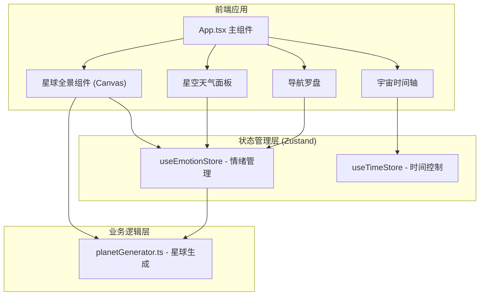

## 1. 架构设计



## 2. 技术选型说明

- **前端框架**：React@18 + TypeScript（严格模式）
- **构建工具**：Vite + @vitejs/plugin-react
- **状态管理**：Zustand（轻量级，适合模块化状态）
- **渲染方式**：
  - 星球像素、粒子效果：HTML5 Canvas 2D API
  - UI面板、图标、动画：CSS + React DOM
- **无后端**：纯前端应用，所有数据本地程序化生成

## 3. 模块文件结构

```
auto49/
├── index.html                  # 入口HTML，含#root容器
├── package.json                # 依赖与启动脚本
├── vite.config.js              # Vite配置（React插件）
├── tsconfig.json               # TypeScript严格模式配置
└── src/
    ├── App.tsx                 # 主组件，布局组合+整体动画编排
    ├── planetGenerator.ts      # 星球生成模块：像素矩阵、情绪映射、种子生成
    ├── emotionManager.ts       # 情绪状态管理：Zustand store
    └── timeController.ts       # 时间控制模块：计时器、切换动画编排
```

## 4. 模块职责定义

### 4.1 planetGenerator.ts
- **输入**：随机种子 seed: number
- **输出**：PixelData[] 数组（每个元素包含坐标、情绪类型、颜色值）
- **核心逻辑**：
  - 基于种子的伪随机数生成器
  - 情绪池权重分配：快乐、思念、冒险、沉思
  - 每种情绪对应渐变色系的具体色值计算
  - 圆形掩码处理，确保像素在圆内
- **导出函数**：
  - `generatePlanet(seed: number, radius: number): PlanetData`
  - `getEmotionColor(emotion: EmotionType, variance: number): string`

### 4.2 emotionManager.ts (useEmotionStore)
- **状态字段**：
  - `currentSeed: number` - 当前星球种子
  - `emotionDistribution: Record<EmotionType, number>` - 情绪占比
  - `weather: WeatherData` - 虚构天气数据
  - `clickHistory: EmotionType[]` - 点击历史
  - `compassAngle: number` - 罗盘当前角度
  - `isCompassGlowing: boolean` - 罗盘光晕状态
- **动作方法**：
  - `generateNewPlanet()` - 生成新星球
  - `registerEmotionClick(emotion: EmotionType)` - 记录情绪点击并更新罗盘
  - `triggerCompassGlow()` - 触发罗盘光晕

### 4.3 timeController.ts (useTimeStore)
- **状态字段**：
  - `elapsedTime: number` - 已停留时间（0.1秒精度）
  - `isAnimating: boolean` - 是否在星球切换动画中
  - `timelinePhase: 'idle' | 'sliding-out' | 'sliding-in'` - 时间轴动画阶段
- **动作方法**：
  - `startTimer()` - 启动计时器
  - `stopTimer()` - 停止计时器
  - `resetTimeline()` - 重置时间轴并播放侧滑出动画
  - `setAnimating(state: boolean)` - 设置动画状态

### 4.4 App.tsx 主组件
- **布局**：全屏相对定位，中央星球、左天气、上右罗盘、底时间轴
- **Canvas渲染**：useEffect驱动，requestAnimationFrame循环
- **动画编排**：粒子爆炸 → 星球缩小旋转 → 星球展开 → 罗盘旋转 → 时间轴重置
- **样式**：CSS Modules 或 内联 styled-jsx（用户未指定，用全局CSS + CSS变量）

## 5. 情绪与天气数据模型

```typescript
type EmotionType = 'joy' | 'miss' | 'adventure' | 'contemplation';

interface PixelData {
  x: number;
  y: number;
  emotion: EmotionType;
  color: string;
  gridX: number;
  gridY: number;
}

interface PlanetData {
  seed: number;
  pixels: PixelData[];
  emotionDistribution: Record<EmotionType, number>;
  radius: number;
}

interface WeatherData {
  type: 'sunny' | 'misty' | 'starry' | 'quiet';
  description: string;
  icon: string;
}
```

## 6. 情绪象限映射

| 情绪 | 象限方向 | 角度 | 色系 |
|------|---------|------|------|
| 快乐 Joy | 东 (右) | 0° | 橙黄渐变 #FFB347 → #FFD700 |
| 思念 Miss | 北 (上) | 90° | 粉紫渐变 #FFB6C1 → #9B59B6 |
| 冒险 Adventure | 南 (下) | 270° | 翠蓝渐变 #2ECC71 → #3498DB |
| 沉思 Contemplation | 西 (左) | 180° | 深蓝灰渐变 #34495E → #5D6D7E |

## 7. 性能优化策略

- Canvas 像素绘制采用批量 ImageData 操作，避免逐像素 fillRect
- 粒子动画使用对象池，避免频繁 GC
- requestAnimationFrame 驱动所有动画，确保与显示器同步
- Zustand selector 精确订阅，避免不必要重渲染
- 计时器使用 setInterval(100ms) 而非更短间隔，平衡精度与性能
