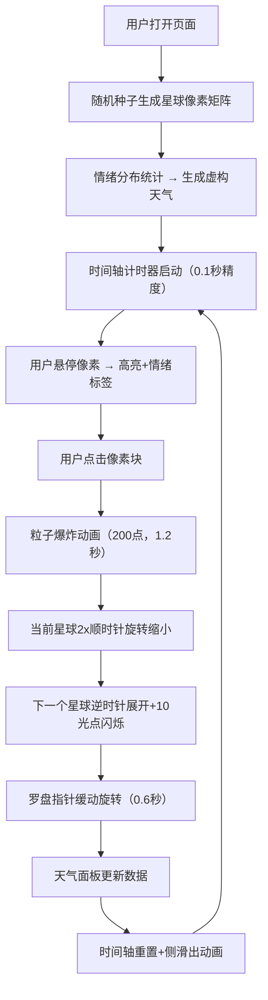

## 1. 产品概述

小王子星球旅行是一个沉浸式的情绪探索Web应用，用户每次访问都会随机降落在一个由像素色块组成的星球上，通过点击像素块触发情绪转换与星球间的旅程动画。

- 核心目的：打造一个兼具艺术感与治愈感的互动体验，让用户在像素星球间探索不同情绪
- 目标用户：追求审美体验、喜欢艺术化交互、需要情绪放松的互联网用户
- 产品价值：通过程序化生成的视觉艺术与流畅的过渡动画，提供沉浸式的情绪漫游体验

## 2. 核心功能

### 2.1 功能模块

1. **星球全景展示**：Canvas绘制圆形像素星球，数百个情绪色块组成星球表面
2. **情绪交互系统**：鼠标悬停高亮显示情绪标签，点击触发粒子爆炸与星球转换
3. **星空天气面板**：根据当前星球情绪分布生成虚构天气数据，动态天气图标
4. **宇宙时间轴**：记录在当前星球的停留时间，星球切换时重置并播放动画
5. **导航罗盘**：右上方情绪象限罗盘，指针随点击情绪平滑旋转指向对应象限

### 2.2 页面详情

| 页面名称 | 模块名称 | 功能描述 |
|-----------|-------------|---------------------|
| 主页面 | 星球全景Canvas | 圆形区域填充随机情绪像素块，直径占屏幕高度60%，8x8像素方格 |
| 主页面 | 悬停高亮系统 | 鼠标悬停方格时高亮并显示对应情绪标签文字 |
| 主页面 | 粒子爆炸效果 | 点击位置产生200个带拖尾小点，透明度1→0，持续1.2秒 |
| 主页面 | 星球转换动画 | 当前星球2倍速顺时针旋转缩小，下一个星球逆时针展开放大+10个闪烁光点 |
| 主页面 | 星空天气面板 | 左侧显示情绪组合生成的虚构天气，CSS绘制emoji风格图标+飘动动画 |
| 主页面 | 宇宙时间轴 | 底部计时器，精度0.1秒，切换时向右侧滑出重置 |
| 主页面 | 导航罗盘 | 右上方四象限罗盘，指针0.6秒缓入缓出旋转，切换星球彩色光晕0.5秒 |

## 3. 核心流程

用户打开页面 → 随机生成星球像素矩阵 → 根据情绪分布生成天气 → 计时器开始累计 → 用户悬停像素查看情绪 → 用户点击像素 → 粒子爆炸效果播放 → 当前星球旋转缩小消失 → 下一个星球展开出现 → 罗盘指针旋转指向对应情绪象限 → 天气面板更新 → 时间轴重置并播放滑出动画

## 4. 用户界面设计

### 4.1 设计风格

- **主色调**：深空蓝紫色 `#0B0A2E` 作为基底
- **情绪色彩**：快乐=橙黄渐变、思念=粉紫渐变、冒险=翠蓝渐变、沉思=深蓝灰渐变
- **面板风格**：磨砂玻璃 `backdrop-filter: blur(8px)`，半透明白色边框
- **按钮交互**：点击时 `transform: scale(0.98)` 微震动反馈
- **动画帧率**：不低于50fps，CSS动画 + Canvas绘制
- **星球区域**：径向渐变产生立体感，与星空背景形成景深

### 4.2 页面布局

| 区域 | 位置 | UI元素 |
|-----------|-------------|-------------|
| 星球区域 | 页面中央 | Canvas圆形星球，直径60%屏幕高度，径向渐变背景 |
| 天气面板 | 页面左侧 | 磨砂玻璃卡片，天气图标（飘动动画），天气文字描述 |
| 时间轴 | 页面底部 | 横向进度条+计时器文字（0.1秒精度），切换时侧滑出 |
| 导航罗盘 | 页面右上方 | 圆形罗盘，四象限情绪标签，中央图标（小王子/火箭），旋转指针 |
| 星空背景 | 整页 | 深空蓝紫径向渐变，微妙星点闪烁 |

### 4.3 响应式设计

- 桌面端优先设计，星球直径自适应屏幕高度
- 移动端压缩面板尺寸，保持中央星球为视觉焦点
- 触摸设备优化点击区域，像素块悬停效果改为长按触发

### 4.4 交互动效细节

- **星球旋转**：顺时针2x速度缩小 → 逆时针展开放大，ease-in-out缓动
- **粒子效果**：Canvas绘制200粒子，带速度衰减与透明度渐变，拖尾效果
- **罗盘指针**：0.6秒 cubic-bezier(0.4, 0, 0.2, 1) 缓入缓出旋转
- **时间轴**：向右 translate(100%) 滑出后重置滑入
- **天气图标**：轻微上下浮动 + 呼吸式透明度变化
