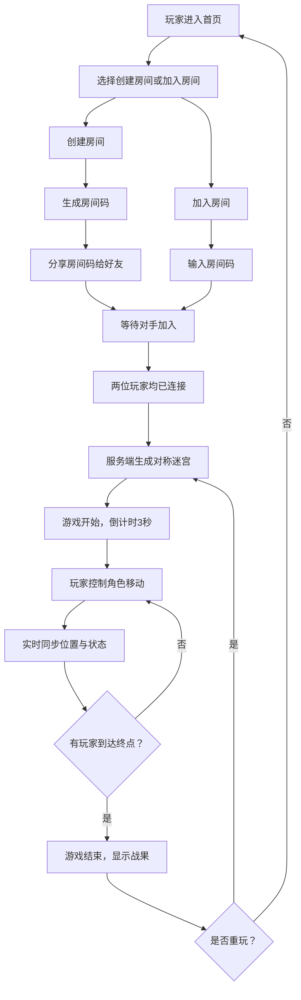

## 1. 产品概述

赛博朋克风格的双人实时迷宫竞速对战网页游戏，解决朋友之间无法在浏览器中快速开启一局公平的迷宫竞速对决的问题。

- 主要目的：提供一个即时、公平、有趣的双人迷宫对战体验
- 解决的问题：无需下载安装，通过浏览器即可快速与好友进行迷宫竞速
- 目标用户：喜欢休闲对战游戏的玩家群体
- 产品价值：轻量化、即时性、社交化的对战游戏体验

## 2. 核心功能

### 2.1 用户角色

| 角色 | 注册方式 | 核心权限 |
|------|----------|----------|
| 玩家 | 无需注册，通过房间码加入 | 创建房间、加入房间、进行游戏 |

### 2.2 功能模块

1. **房间匹配系统**：创建房间、生成房间码、分享房间码、加入房间、等待对手
2. **迷宫生成系统**：服务端生成15x15对称迷宫，保证唯一路径
3. **实时对战系统**：双人实时控制、碰撞检测、位置同步、游戏状态管理
4. **结果统计系统**：显示获胜者、用时、路径步数、一键重开
5. **跨端适配系统**：桌面端键盘控制、移动端虚拟摇杆

### 2.3 页面详情

| 页面名称 | 模块名称 | 功能描述 |
|----------|----------|----------|
| 首页/房间页 | 房间创建模块 | 输入昵称、创建房间、生成房间码、复制分享 |
| 首页/房间页 | 房间加入模块 | 输入房间码、加入房间、等待对手连接 |
| 游戏页面 | 迷宫渲染模块 | 15x15网格迷宫、发光墙壁、网格地面纹理 |
| 游戏页面 | 玩家控制模块 | WASD/方向键控制、虚拟摇杆、位置预测、碰撞检测 |
| 游戏页面 | 对战状态模块 | 玩家位置同步、移动方向显示、游戏倒计时 |
| 结果页面 | 战果统计模块 | 获胜者展示、用时统计、步数统计、闪电动画、粒子特效 |
| 结果页面 | 重玩控制模块 | 一键重开新迷宫、返回房间 |

## 3. 核心流程

## 4. 用户界面设计

### 4.1 设计风格

- **主色调**：深紫色 `#0d0221` 作为背景色
- **强调色**：霓虹蓝 `#00f0ff`（玩家1）、荧光粉 `#ff00ff`（玩家2）
- **辅助色**：深灰 `#1a0a2e`、中紫 `#2d1b4e`
- **按钮风格**：直角边框、发光描边、悬停色彩过渡动画
- **字体**：采用Orbitron等赛博朋克风格字体作为标题，搭配简洁的等宽字体
- **布局风格**：居中对称布局，突出游戏区域，UI控件悬浮于游戏画布边缘
- **动效风格**：霓虹闪烁、呼吸光晕、闪电粒子、故障艺术(Glitch)效果

### 4.2 页面设计概述

| 页面名称 | 模块名称 | UI元素 |
|----------|----------|--------|
| 首页/房间页 | 房间创建 | 霓虹发光标题、昵称输入框（带发光边框）、创建房间按钮、房间码显示框（带复制按钮）、等待状态动画 |
| 首页/房间页 | 房间加入 | 房间码输入框、加入按钮、错误提示（抖动动画） |
| 游戏页面 | 迷宫渲染 | 发光线条墙壁、网格纹理地面、起点/终点发光标记、玩家发光圆点（带呼吸光晕） |
| 游戏页面 | HUD界面 | 玩家1状态（左上角，蓝色）、玩家2状态（右上角，粉色）、倒计时（顶部居中）、操作提示（底部） |
| 游戏页面 | 移动端控制 | 左下方虚拟摇杆（半透明发光）、右下方确认按钮 |
| 结果页面 | 战果展示 | 获胜者文字（大字号发光）、闪电切割动画、粒子爆炸特效、用时/步数统计卡片、重玩按钮 |

### 4.3 响应式

- **桌面端优先**：游戏画布居中，四周悬浮UI控件，键盘操作
- **移动端适配**：手机横屏模式，游戏画布占满屏幕，虚拟摇杆触摸控制
- **断点设计**：768px以下切换为移动端布局，隐藏不必要的装饰元素
- **触摸优化**：虚拟摇杆支持8方向移动，触摸区域放大，防止误触

### 4.4 视觉特效

- **迷宫墙壁**：使用霓虹发光线条，带有微妙的脉冲动画
- **玩家角色**：发光圆点，带有呼吸光晕动画（透明度0.6-1.0循环）
- **移动轨迹**：短暂的拖尾效果
- **胜利动画**：屏幕闪电动画 + 彩色粒子爆炸特效
- **按钮悬停**：边框颜色渐变、发光强度增强、轻微缩放
- **页面切换**：故障艺术(Glitch)转场效果
