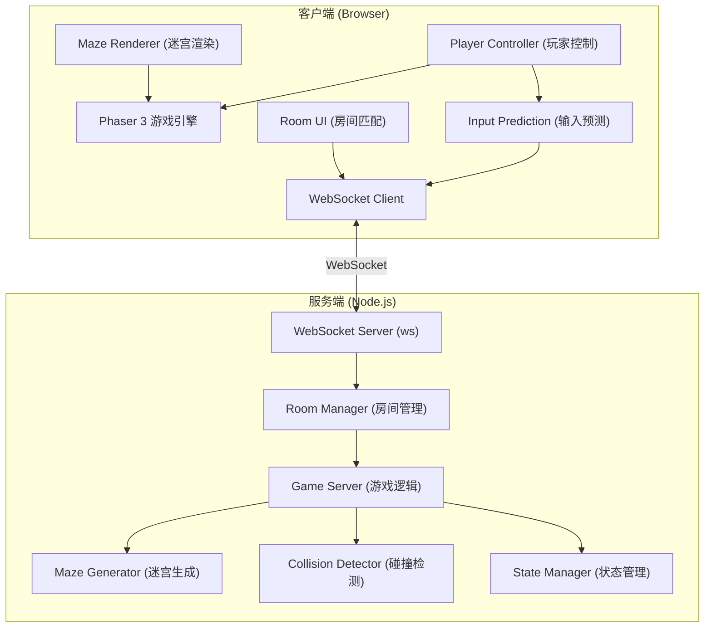
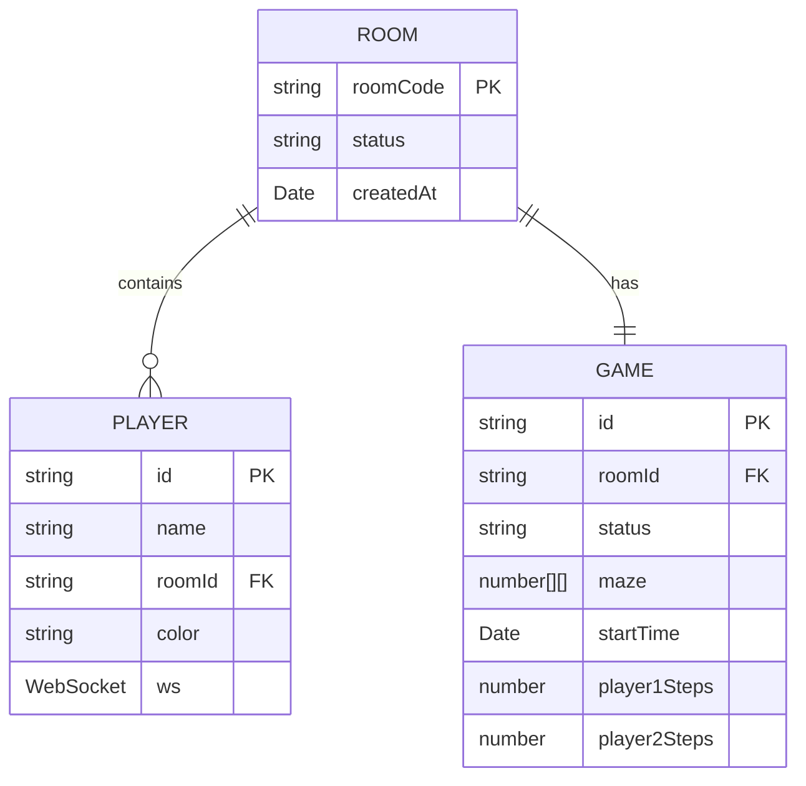

## 1. 架构设计



## 2. 技术描述

- **前端框架**：Phaser 3.70.x + TypeScript 5.x
- **构建工具**：Vite 5.x
- **后端框架**：Node.js + ws (WebSocket库)
- **开发语言**：TypeScript (严格模式, ES2020)
- **运行脚本**：`npm run dev` 同时启动前端开发服务器和后端WebSocket服务

## 3. 项目结构

```
auto5/
├── package.json
├── vite.config.js
├── tsconfig.json
├── index.html
└── src/
    ├── client/
    │   ├── main.ts              # Phaser游戏入口
    │   ├── maze.ts              # 迷宫渲染与管理
    │   ├── player.ts            # 玩家输入与控制
    │   ├── room.ts              # 房间匹配UI
    │   ├── scenes/
    │   │   ├── RoomScene.ts     # 房间场景
    │   │   ├── GameScene.ts     # 游戏场景
    │   │   └── ResultScene.ts   # 结果场景
    │   ├── types/
    │   │   └── game.ts          # 游戏类型定义
    │   └── utils/
    │       └── wsClient.ts      # WebSocket客户端封装
    └── server/
        ├── gameServer.ts        # WebSocket服务主模块
        ├── mazeGen.ts           # 迷宫生成算法
        ├── roomManager.ts       # 房间生命周期管理
        └── types/
            └── game.ts          # 服务端类型定义
```

## 4. API / WebSocket 消息定义

### 4.1 WebSocket 消息协议

```typescript
// 客户端 -> 服务端 消息类型
type ClientMessage = 
  | { type: 'CREATE_ROOM'; playerName: string }
  | { type: 'JOIN_ROOM'; roomCode: string; playerName: string }
  | { type: 'PLAYER_INPUT'; direction: Direction; timestamp: number }
  | { type: 'RESTART_GAME' }
  | { type: 'LEAVE_ROOM' };

// 服务端 -> 客户端 消息类型  
type ServerMessage =
  | { type: 'ROOM_CREATED'; roomCode: string; playerId: string }
  | { type: 'ROOM_JOINED'; roomCode: string; playerId: string; opponentName: string }
  | { type: 'WAITING_FOR_OPPONENT' }
  | { type: 'GAME_START'; maze: number[][]; player1Pos: Position; player2Pos: Position; countdown: number }
  | { type: 'GAME_STATE'; players: PlayerState[]; gameStatus: GameStatus }
  | { type: 'PLAYER_MOVE'; playerId: string; position: Position; direction: Direction }
  | { type: 'COLLISION'; playerId: string; position: Position }
  | { type: 'GAME_END'; winner: string; stats: GameStats }
  | { type: 'ERROR'; message: string };

// 共享类型定义
type Direction = 'up' | 'down' | 'left' | 'right' | 'none';
type Position = { x: number; y: number };
type GameStatus = 'waiting' | 'countdown' | 'playing' | 'ended';
type PlayerState = {
  id: string;
  name: string;
  position: Position;
  direction: Direction;
  color: 'blue' | 'pink';
  steps: number;
};
type GameStats = {
  winnerName: string;
  duration: number;
  winnerSteps: number;
  loserSteps: number;
};
```

### 4.2 迷宫数据格式

```typescript
// 15x15 二维数组
// 0 = 可通行路径
// 1 = 墙壁
// 迷宫左右镜像对称: maze[y][x] === maze[y][14-x]
type MazeData = number[][];
```

## 5. 服务端架构

```mermaid
graph TD
    A["WebSocket 连接层"] --> B["消息路由"]
    B --> C["房间管理器 RoomManager"]
    C --> D["房间实例 Room"]
    D --> E["游戏实例 Game"]
    E --> F["迷宫生成器 MazeGen"]
    E --> G["碰撞检测器 Collision"]
    E --> H["状态裁决器 StateJudge"]
    
    style A fill:#2d1b4e,stroke:#00f0ff,stroke-width:2px
    style F fill:#2d1b4e,stroke:#ff00ff,stroke-width:2px
    style H fill:#2d1b4e,stroke:#00f0ff,stroke-width:2px
```



### 5.1 核心模块职责

| 模块 | 职责 |
|------|------|
| gameServer.ts | WebSocket服务入口，消息路由，连接管理 |
| roomManager.ts | 创建/加入/销毁房间，房间码生成与校验，玩家分配 |
| mazeGen.ts | 递归回溯算法生成15x15对称迷宫，保证唯一连通路径 |
| game.ts | 游戏状态机，碰撞检测，位置同步，胜负裁决 |

## 6. 数据模型

### 6.1 房间数据模型



### 6.2 迷宫生成算法说明

**算法**: 递归回溯法 (Recursive Backtracking)

**特性**:
- 生成15x15的奇数尺寸迷宫
- 保证唯一连通路径从(0,0)到(14,14)
- 左右镜像对称: `maze[y][x] = maze[y][14-x]`
- 起点固定在左上角(0,0)和右下角(14,14)

**生成步骤**:
1. 初始化15x15网格，全部填充为墙(1)
2. 从中心列开始生成左半部分迷宫
3. 使用递归回溯打通路径
4. 镜像复制左半部分到右半部分
5. 打通中间列的连接点确保连通性
6. 验证起点到终点的路径存在

## 7. 性能指标

| 指标 | 目标 | 实现方式 |
|------|------|----------|
| 渲染帧率 | 60 FPS | Phaser 3 原生渲染循环 |
| 键盘输入延迟 | < 50ms | 客户端预测 + 服务端校正 |
| WebSocket消息延迟 | < 100ms (局域网) | 二进制消息 + 状态压缩 |
| 同步频率 | 30 Hz | 服务端30次/秒状态广播 |
| 迷宫生成时间 | < 10ms | 高效递归回溯算法 |

## 8. 依赖清单

```json
{
  "dependencies": {
    "phaser": "^3.70.0",
    "ws": "^8.14.2"
  },
  "devDependencies": {
    "typescript": "^5.2.2",
    "vite": "^5.0.0",
    "@types/ws": "^8.5.10",
    "ts-node": "^10.9.2",
    "concurrently": "^8.2.2"
  }
}
```
