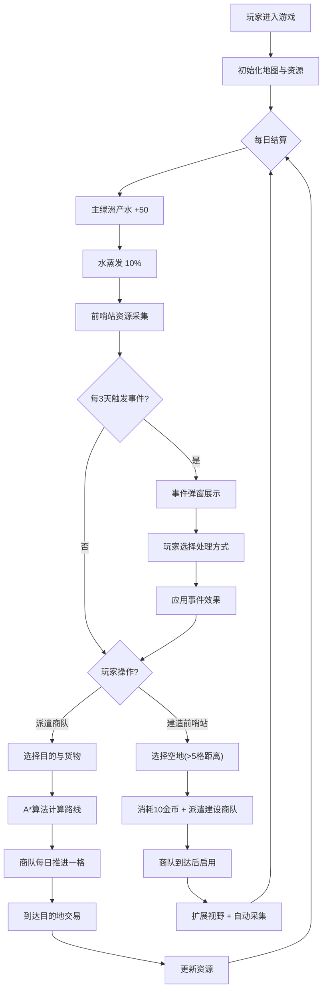

## 1. 产品概述

沙漠贸易路线规划与资源平衡模拟应用，玩家以沙漠游牧部落首领身份管理水井与绿洲资源，派遣商队在随机生成的贸易路线上交易物资，在建设前哨站、应对随机事件中保持部落生存与繁荣。

- 核心目标：通过资源管理、贸易路线规划、前哨站建设，在严酷沙漠环境中维持部落生存并扩张势力
- 目标用户：策略游戏爱好者、模拟经营玩家

## 2. 核心功能

### 2.1 用户角色

| 角色 | 注册方式 | 核心权限 |
|------|----------|----------|
| 玩家 | 直接进入游戏 | 全部游戏操作权限 |

### 2.2 功能模块

1. **地图面板**：60x40 网格沙漠地图 Canvas 渲染，含绿洲、前哨站、商队、路线、沙暴区域、迷雾系统
2. **控制面板**：资源条展示、商队派遣配置、前哨站建造
3. **事件系统**：随机事件弹窗（沙暴、绿洲干涸、游牧强盗）
4. **状态状态栏**：当前日期、存活天数展示

### 2.3 页面详情

| 页面名称 | 模块名称 | 功能描述 |
|----------|----------|----------|
| 游戏主界面 | 地图面板 | Canvas 绘制网格地图，展示各类实体与动画 |
| 游戏主界面 | 控制面板 | 资源条（水/食物/金币/士气）、商队配置、建造操作 |
| 游戏主界面 | 状态栏 | 日期与存活天数 |
| 游戏主界面 | 事件弹窗 | 全屏模糊背景 + 事件描述 + 选择按钮 |

## 3. 核心流程

玩家进入游戏 → 查看初始资源与地图 → 每日自动结算（主绿洲产水、水蒸发、前哨站采集）→ 每3天触发随机事件 → 选择派遣商队/建造前哨站 → 商队按 A* 算法路线每日推进一格 → 到达目的地交易 → 资源更新 → 循环

## 4. 用户界面设计

### 4.1 设计风格

- **主色调**：沙黄色 `#c2b280`（背景）
- **辅助色**：深棕 `#6b4226`（UI控件边框与文字）、金色 `#daa520`（点缀与高亮）
- **按钮风格**：圆角 6px，深棕描边，金色渐变背景，点击 0.1s 按压缩放动画
- **字体**：采用衬线体（如 'Cinzel' + 'Noto Serif SC'）营造沙漠游牧复古感
- **布局风格**：左侧地图 70% + 右侧控制面板 30%，底部状态栏
- **图标风格**：Emoji 图标系统（🏜️💧🍞🪙⚔️🐪⛺）

### 4.2 页面设计概述

| 页面名称 | 模块名称 | UI 元素 |
|----------|----------|---------|
| 游戏主界面 | 地图面板 | 60x40 网格 Canvas，绿洲（绿色圆点）、前哨站（帐篷图标）、商队（骆驼图标带粒子尾迹）、沙暴（橙色 3x3 区域）、路线（金色连线）、迷雾（深褐半透明覆盖） |
| 游戏主界面 | 控制面板 | 四个渐变资源条（带折线图与流动高光动画），商队配置表单（下拉选择目的站、货物类型），预计消耗/收益展示，出发按钮；前哨站建造按钮 |
| 游戏主界面 | 状态栏 | 沙黄色背景条，左侧显示日期📅，右侧存活天数⏱️ |
| 游戏主界面 | 事件弹窗 | 全屏 `backdrop-blur` 模糊，居中卡片（深棕边框+金色渐变），事件标题、描述图标、两个选择按钮 |

### 4.3 响应式

- 桌面端（≥768px）：左地图 70% + 右面板 30% 横向布局
- 移动端（<768px）：地图在上、面板在下纵向布局，地图自适应全屏宽度
- 触摸优化：按钮最小 44px 触控区域

### 4.4 动画与特效

- 商队移动：缓动动画每日推进一格，20颗浅蓝粒子尾迹（2秒消失）
- 到达目的地：金色+白色礼花粒子特效
- 资源条变化：数值滚动动画 + 从右向左流动高光
- 前哨站采集：左上角浮动资源数字动画
- 按钮点击：0.1s scale(0.95) 缩放 + AudioContext 合成 click 音效
