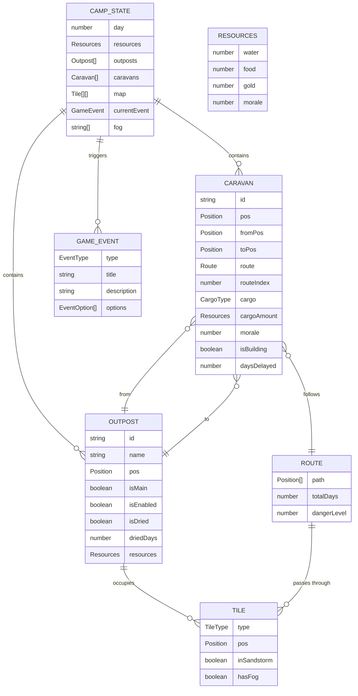

## 1. 架构设计

```mermaid
graph TD
    subgraph UI层
        A["MapPanel.tsx<br/>(Canvas地图渲染)"]
        B["ControlPanel.tsx<br/>(资源条+商队配置+建造)"]
        C["EventModal.tsx<br/>(随机事件弹窗)"]
        D["StatusBar.tsx<br/>(日期状态栏)"]
    end
    subgraph 状态层
        E["store.ts (Zustand)<br/>全局状态聚合与分发"]
    end
    subgraph 逻辑层
        F["resource.ts<br/>资源消耗/再生/贸易计算"]
        G["route.ts<br/>A*路径算法+路线生成"]
        H["event.ts<br/>随机事件触发与处理"]
    end
    subgraph 类型层
        I["types.ts<br/>CampState/Caravan/Route/Resource"]
    end
    I --> F
    I --> G
    I --> H
    I --> E
    F --> E
    G --> E
    H --> E
    E --> A
    E --> B
    E --> C
    E --> D
```



**数据流向说明**：
1. `types.ts` 定义所有核心数据结构，被全模块引用
2. `logic/` 目录下各模块（resource/route/event）为纯函数逻辑，接收状态数据输入、输出计算结果
3. `store.ts`（Zustand）聚合所有逻辑模块的计算结果，维护全局单一状态源
4. `ui/` 目录下各组件订阅 store 中的对应状态切片，渲染视图并通过 store 方法触发状态更新

## 2. 技术描述

- **前端框架**：React 18 + TypeScript
- **构建工具**：Vite 5 + @vitejs/plugin-react
- **状态管理**：Zustand 4
- **UI 样式**：原生 CSS + CSS 变量（沙漠主题配色系统），不引入 Tailwind
- **地图渲染**：HTML5 Canvas API（60x40 网格）
- **路径算法**：A* 搜索算法（自研实现）
- **音效**：Web Audio API（AudioContext 合成）
- **动画**：CSS transition/animation + Canvas requestAnimationFrame

## 3. 路由定义

| 路由 | 用途 |
|------|------|
| `/` | 游戏主界面（单页应用，无多路由） |

## 4. 文件结构与调用关系

```
src/
├── types.ts              # 核心类型定义（被所有模块引用）
├── store.ts              # Zustand 全局状态（引用 types + logic/*）
├── logic/
│   ├── resource.ts       # 资源计算模块（引用 types，被 store 调用）
│   ├── route.ts          # 路线算法模块（引用 types，被 store 调用）
│   └── event.ts          # 事件逻辑模块（引用 types，被 store 调用）
├── ui/
│   ├── MapPanel.tsx      # 地图面板（引用 store）
│   ├── ControlPanel.tsx  # 控制面板（引用 store）
│   ├── EventModal.tsx    # 事件弹窗（引用 store）
│   └── StatusBar.tsx     # 状态栏（引用 store）
├── utils/
│   ├── audio.ts          # 音效工具（AudioContext 封装）
│   └── animation.ts      # 动画辅助工具
├── main.tsx              # 应用入口
└── index.css             # 全局样式与 CSS 变量
```

## 5. 数据模型

### 5.1 数据模型定义



### 5.2 关键算法说明

**A* 路径搜索**（`logic/route.ts`）：
- 启发函数：曼哈顿距离 `|x1-x2| + |y1-y2|`
- 代价函数：基础移动代价 1，沙暴区域代价 3，绿洲边缘代价 0.5
- 开放集合：最小堆按 f = g + h 排序
- 输出：路径坐标数组 + 预计天数 + 危险等级

**资源每日结算**（`logic/resource.ts`）：
- 主绿洲产水：`water += 50`
- 水蒸发：`water = floor(water * 0.9)`
- 前哨站采集：每3天扫描周围1格，绿洲 → +水，绿洲边缘 → +食物
- 商队消耗：每日基础消耗水/食物，途经沙暴则 ×3

**性能保障**：
- Canvas 地图渲染使用离屏缓存（脏矩形重绘），帧率 ≥ 30fps
- 商队动画使用 requestAnimationFrame，帧间隔 ≤ 50ms
- Zustand 选择器订阅精确切片，资源更新响应 < 100ms
