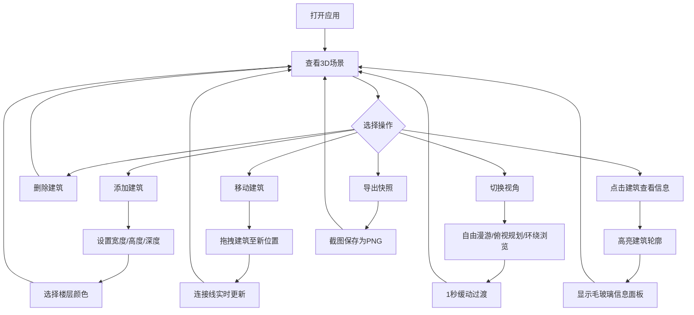

## 1. 产品概述

城市天际线三维建模器是一个交互式3D应用，旨在解决传统城市地图仅展示二维平面、缺乏对城市建筑布局立体感知与交互探索的问题。用户可以通过直观的右侧面板添加、删除和移动建筑方块，在3D场景中自由构建自定义的城市天际线，并支持多种视角模式浏览、建筑信息查看和场景快照导出。

- 目标用户：城市规划爱好者、建筑设计师、教育工作者及对3D城市建模感兴趣的普通用户
- 核心价值：将二维城市规划概念转化为可交互的三维体验，降低城市空间理解的门槛

## 2. 核心功能

### 2.1 用户角色

| 角色 | 注册方式 | 核心权限 |
|------|----------|----------|
| 普通用户 | 无需注册 | 完整使用所有功能 |

### 2.2 功能模块

1. **主页面**：3D视口 + 工具配置面板，包含建筑管理、视角控制、快照导出等全部功能

### 2.3 页面详情

| 页面名称 | 模块名称 | 功能描述 |
|----------|----------|----------|
| 主页面 | 3D视口区域 | 展示城市天际线三维场景，支持自由漫游/俯视规划/环绕浏览三种视角模式，建筑点击选中高亮，天空盒动态背景 |
| 主页面 | 建筑管理面板 | 添加/删除建筑，设置宽度(1-5)、高度(1-10)、深度(1-5)，12色色板选择楼层颜色，拖拽移动建筑 |
| 主页面 | 视角控制 | 三种视角模式下拉菜单切换，视角切换带1秒缓动过渡动画 |
| 主页面 | 快照导出 | 一键导出当前城市布局截图为PNG格式 |
| 主页面 | 建筑信息面板 | 点击建筑后显示浮动毛玻璃面板，展示建筑编号、高度、占地面积、楼层数，面板边缘发光动画 |

## 3. 核心流程

用户打开应用后，在深色主题界面中通过右侧面板添加建筑方块，设置尺寸和颜色参数，在3D场景中拖拽移动建筑位置，建筑间自动生成半透明连接线。用户可切换三种视角模式浏览城市，点击建筑查看详情，并随时导出场景快照。

## 4. 界面设计

### 4.1 设计风格

- 主背景色：#1a1a2e（深蓝紫），辅助色：#16213e（深海蓝），强调色：#e94560（玫红）
- 按钮风格：圆角矩形，悬停时颜色加深，带0.2秒淡入工具提示
- 字体：显示字体使用 Orbitron（科技未来感），正文字体使用 Rajdhani（清晰可读）
- 布局风格：左右分栏，左侧3D视口占75%，右侧工具面板占25%
- 图标风格：线性图标，与深色主题协调

### 4.2 页面设计概览

| 页面名称 | 模块名称 | UI元素 |
|----------|----------|--------|
| 主页面 | 3D视口 | 深色背景，动态天空盒（正午蓝→傍晚橙红渐变，30秒循环），建筑方块（白色边框高亮选中），半透明连接线，毛玻璃信息面板 |
| 主页面 | 工具面板 | 深色半透明背景，添加/删除按钮，参数滑块（宽度1-5/高度1-10/深度1-5），12色色板网格（30x30px，选中白色边框脉冲），视角下拉菜单，导出按钮 |
| 主页面 | 信息面板 | 毛玻璃背景，白色文字，建筑编号/高度/占地面积/楼层数，边缘发光动画 |

### 4.3 响应式设计

- 桌面优先设计，左右分栏布局
- 宽度<768px时，右侧面板折叠为底部抽屉式菜单
- 触屏设备支持触摸拖拽建筑

### 4.4 3D场景指引

- 环境：动态天空盒背景，正午蓝色→傍晚橙红色渐变，30秒周期循环
- 灯光：环境光 + 方向光，营造建筑立体感
- 摄像机：三种模式（自由漫游WASD/俯视60度/环绕旋转），切换1秒缓动
- 构图：场景中央为建筑群，连接线构建空间关系
- 交互：点击建筑选中高亮，拖拽移动建筑，连接线实时更新
- 性能预算：30栋建筑时帧率≥25FPS
