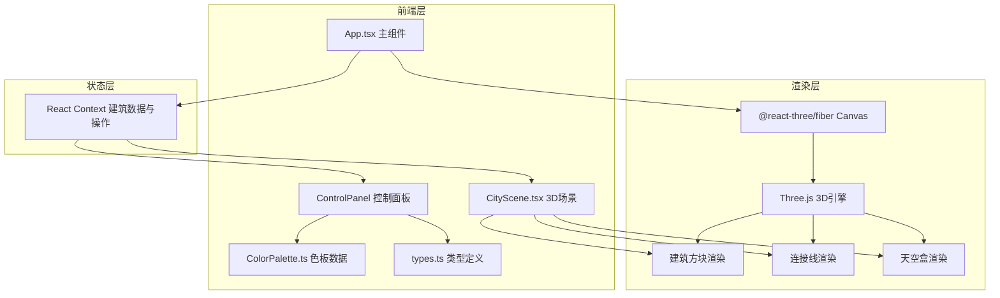

## 1. 架构设计



## 2. 技术说明

- 前端：React@18 + Three.js + @react-three/fiber + @react-three/drei + Vite
- 初始化工具：vite-init (react-ts模板)
- 后端：无
- 数据库：无（纯前端状态管理）
- 状态管理：React Context（建筑数据与操作方法传递）

### 核心依赖

| 依赖 | 版本 | 用途 |
|------|------|------|
| react | ^18 | UI框架 |
| react-dom | ^18 | DOM渲染 |
| three | latest | 3D引擎 |
| @react-three/fiber | latest | React Three.js绑定 |
| @react-three/drei | latest | Three.js辅助工具 |
| vite | latest | 构建工具 |
| @vitejs/plugin-react | latest | Vite React插件 |
| typescript | latest | 类型系统 |
| @types/react | latest | React类型定义 |
| @types/react-dom | latest | React DOM类型定义 |

## 3. 路由定义

| 路由 | 用途 |
|------|------|
| / | 主页面，包含3D视口和控制面板 |

## 4. 文件结构

```
├── package.json
├── index.html
├── vite.config.js
├── tsconfig.json
├── src/
│   ├── main.tsx
│   ├── App.tsx
│   ├── types.ts
│   ├── data/
│   │   └── ColorPalette.ts
│   └── components/
│       └── CityScene.tsx
```

### 各文件职责

| 文件 | 职责 |
|------|------|
| package.json | 项目依赖与启动脚本 |
| index.html | 入口页面，全屏样式 |
| vite.config.js | 构建配置 |
| tsconfig.json | TypeScript strict模式配置 |
| src/main.tsx | 入口，挂载React应用，初始化Canvas |
| src/App.tsx | 主组件，左右分栏布局，Context提供建筑数据 |
| src/types.ts | 建筑对象接口定义 |
| src/data/ColorPalette.ts | 12色色板数据与选择逻辑 |
| src/components/CityScene.tsx | 3D场景核心，渲染建筑/连接线/天空盒，视角模式，快照导出 |

## 5. 数据模型

### 5.1 建筑对象接口

```typescript
interface Building {
  id: string;
  position: { x: number; y: number; z: number };
  width: number;   // 1-5
  height: number;  // 1-10
  depth: number;   // 1-5
  color: string;   // 十六进制颜色值
  selected: boolean;
}
```

### 5.2 视角模式枚举

```typescript
type ViewMode = 'freeroam' | 'overhead' | 'orbit';
```

## 6. 性能策略

- 建筑数量上限30栋，帧率≥25FPS
- 连接线使用BufferGeometry减少draw calls
- 视角切换使用GSAP/TWEEN缓动动画（1秒过渡）
- 天空盒使用ShaderMaterial实现渐变，避免纹理加载开销
- 建筑使用InstancedMesh优化渲染（当建筑数量多时）
