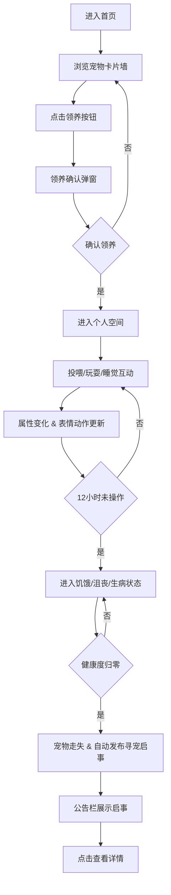

## 1. 产品概述

一款温馨可爱的线上虚拟宠物领养与照顾平台，用户可以从动物收容所领养像素风格虚拟宠物，通过定时投喂、玩耍和休息来维护宠物的饥饿度、快乐度、健康度三大属性，宠物会根据状态实时展现不同的表情和动作。若长期疏于照顾，宠物会生病甚至走失，用户需在社区公告栏发布寻宠启事寻求帮助。

- 目标用户：喜欢萌宠、养成类游戏的各年龄段用户
- 产品价值：提供低门槛、治愈系的线上养宠体验，培养用户责任感与社区互助意识

## 2. 核心功能

### 2.1 用户角色

| 角色 | 注册方式 | 核心权限 |
|------|----------|----------|
| 普通用户 | 自动生成匿名ID | 领养宠物、照顾宠物、发布/查看寻宠启事 |

### 2.2 功能模块

1. **首页（动物收容所）**：宠物卡片墙、随机宠物生成、领养确认弹窗
2. **个人空间**：Canvas像素房间、宠物精灵动画、三大属性状态条、互动操作按钮
3. **社区公告栏**：寻宠启事瀑布流、品种筛选、详情模态框

### 2.3 页面详情

| 页面名称 | 模块名称 | 功能描述 |
|----------|----------|----------|
| 首页 | 顶部导航 | Logo、页面切换按钮（首页/空间/公告栏） |
| 首页 | 宠物卡片墙 | 随机生成宠物卡片，悬停浮起+自我介绍气泡 |
| 首页 | 领养确认弹窗 | 淡入动画、领养确认/取消操作 |
| 个人空间 | Canvas主场景 | 像素房间背景、宠物行走/跳跃动画、状态粒子特效 |
| 个人空间 | 状态条区域 | 饥饿度/快乐度/健康度进度条、数值动画填充 |
| 个人空间 | 操作按钮区 | 投喂食物/陪它玩耍/哄它睡觉三个按钮、音效反馈 |
| 公告栏 | 筛选标签栏 | 猫/狗/兔/其他四分类标签、0.3s淡入淡出过渡 |
| 公告栏 | 瀑布流列表 | 时间倒序展示寻宠启事卡片、缩略图+基本信息 |
| 公告栏 | 详情模态框 | 联系方式、走失前最后状态快照展示 |

## 3. 核心流程

用户进入首页浏览宠物卡片 → 点击某只宠物的领养按钮 → 确认领养弹窗 → 宠物进入个人空间 → 用户通过投喂/玩耍/睡觉维护属性 → 属性影响宠物表情动作和背景色调 → 连续12小时未操作 → 宠物进入饥饿→沮丧→生病序列 → 健康度归零 → 宠物走失并自动发布寻宠启事到公告栏 → 用户/其他用户查看公告栏 → 点击启事查看详情

## 4. 用户界面设计

### 4.1 设计风格

- **主色调**：暖黄色 `#FFD93D` 与粉橘色 `#FF8C69` 搭配，营造温馨可爱氛围
- **背景色**：浅米色 `#FFF8E7`（首页）、淡蓝色 `#E8F4FD`（个人空间正常状态）
- **按钮样式**：渐变色背景（暖黄→粉橘）、大圆角 `16px`、按压时缩放至0.95倍
- **卡片设计**：暖色系圆角卡片（圆角`20px`）、浅米色背景、阴影柔和
- **字体**：使用圆润可爱的无衬线字体（如Nunito、Quicksand类风格）
- **图标风格**：像素风/萌系Emoji风格图标

### 4.2 页面设计概要

| 页面名称 | 模块名称 | UI元素 |
|----------|----------|----------|
| 首页 | 卡片墙 | 网格布局、悬停上浮+阴影加深、气泡自我介绍淡入、领养按钮渐变 |
| 个人空间 | Canvas场景 | 淡蓝背景渐变、彩色地毯像素块、宠物精灵居中随机移动、0.2s动作缓动 |
| 个人空间 | 状态条 | 彩色渐变填充、圆角条、数值变化动画、三段色（绿→黄→红） |
| 个人空间 | 操作按钮 | 图标+文字、渐变色、按压缩放动画、Web Audio叮咚音效 |
| 公告栏 | 瀑布流 | 两列（PC）/单列（移动）布局、卡片间距16px、时间倒序 |
| 公告栏 | 筛选栏 | 标签胶囊样式、选中态渐变背景、切换时淡入淡出0.3s |
| 全局 | 弹窗 | 遮罩层淡入、弹窗缩放淡入、圆角24px、暖色系边框 |

### 4.3 响应式设计

- 采用桌面优先（Desktop-first）设计，移动端自适应
- **断点**：768px为移动断点
- **个人空间**：PC端上下分栏（上Canvas下操作区），移动端保持上下分栏但状态条改为上下堆叠而非左右排列
- **首页卡片墙**：PC端4列→平板3列→移动端2列网格
- **公告栏**：PC端2列瀑布流→移动端单列
- **导航栏**：移动端改为底部Tab导航，PC端顶部导航

### 4.4 动效与反馈设计

- **宠物动画**：站立/走路/跳跃三态切换，0.2秒缓动过渡，Canvas 30fps+渲染
- **状态变化**：进度条宽度过渡0.5s ease-out，数值跳动
- **粒子特效**：饥饿时灰色粒子上飘，生病时红色粒子脉动
- **背景变化**：正常淡蓝→饥饿灰蓝→生病深灰蓝，1小时内渐变过渡
- **按钮反馈**：hover时轻微上移+阴影加深，click时scale(0.95)回弹
