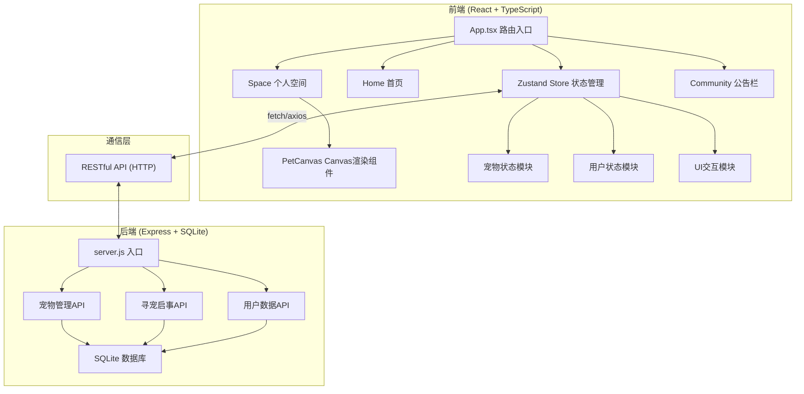
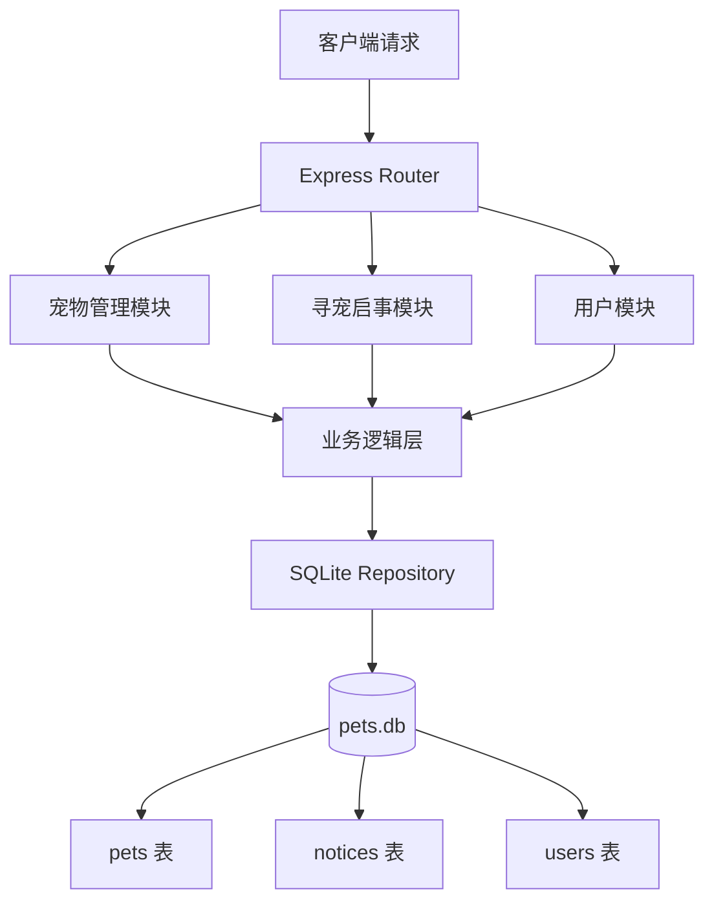

## 1. 架构设计



## 2. 技术说明

- **前端**：React 18 + TypeScript 5 + Vite 5，前端代码存放于 `frontend/src/`
- **状态管理**：Zustand 4，拆分宠物、用户、UI三个状态切片
- **路由**：React Router DOM 6，三个主页面路由
- **Canvas渲染**：原生Canvas 2D API实现像素风宠物与房间
- **音频**：Web Audio API 合成短促叮咚音效
- **后端**：Node.js + Express 4，入口文件为根目录 `server.js`
- **数据库**：better-sqlite3，本地文件存储，无需额外数据库服务
- **初始化工具**：Vite脚手架创建React+TS项目

## 3. 路由定义

| 路由 | 页面 | 用途 |
|------|------|------|
| `/` | Home.tsx | 动物收容所首页，宠物卡片墙与领养 |
| `/space` | Space.tsx | 个人空间，Canvas主场景与互动 |
| `/community` | Community.tsx | 社区公告栏，寻宠启事列表与筛选 |

后端API路由：

| 方法 | 路由 | 用途 |
|------|------|------|
| GET | `/api/pets/random` | 获取随机生成的待领养宠物列表 |
| POST | `/api/pets/adopt` | 确认领养宠物 |
| GET | `/api/pets/mine` | 获取当前用户已领养的宠物 |
| PUT | `/api/pets/:id/action` | 执行互动操作（feed/play/sleep） |
| PUT | `/api/pets/:id/decay` | 模拟属性自然衰减 |
| GET | `/api/notices` | 获取寻宠启事列表（支持?type筛选） |
| POST | `/api/notices` | 发布寻宠启事（走失时自动触发） |
| GET | `/api/notices/:id` | 获取单条启事详情 |
| POST | `/api/user/init` | 初始化匿名用户，返回userId |

## 4. API类型定义

```typescript
// 宠物品种类型
type PetType = 'cat' | 'dog' | 'rabbit' | 'other';

// 宠物状态
interface Pet {
  id: string;
  name: string;
  type: PetType;
  avatar: string; // emoji或像素描述
  intro: string; // 自我介绍
  hunger: number; // 0-100
  happiness: number; // 0-100
  health: number; // 0-100
  adopted: boolean;
  adoptedAt?: string;
  lost: boolean;
  lostAt?: string;
  lastActionAt: string;
  createdAt: string;
}

// 寻宠启事
interface Notice {
  id: string;
  petId: string;
  petName: string;
  petType: PetType;
  petThumbnail: string;
  lostAt: string;
  contact: string;
  lastSnapshot: {
    hunger: number;
    happiness: number;
    health: number;
  };
  createdAt: string;
}

// 用户
interface User {
  id: string;
  nickname: string;
  createdAt: string;
}

// 互动操作
type ActionType = 'feed' | 'play' | 'sleep';
interface ActionPayload {
  petId: string;
  action: ActionType;
}
```

## 5. 服务端架构图



## 6. 数据模型

### 6.1 数据模型定义

```mermaid
erDiagram
    USERS ||--o{ PETS : owns
    PETS ||--o| NOTICES : generates

    USERS {
        string id PK
        string nickname
        datetime created_at
    }

    PETS {
        string id PK
        string user_id FK
        string name
        string type
        string avatar
        string intro
        int hunger
        int happiness
        int health
        boolean adopted
        datetime adopted_at
        boolean lost
        datetime lost_at
        datetime last_action_at
        datetime created_at
    }

    NOTICES {
        string id PK
        string pet_id FK
        string pet_name
        string pet_type
        string pet_thumbnail
        datetime lost_at
        string contact
        string last_snapshot JSON
        datetime created_at
    }
```

### 6.2 DDL语句

```sql
CREATE TABLE IF NOT EXISTS users (
  id TEXT PRIMARY KEY,
  nickname TEXT NOT NULL,
  created_at TEXT NOT NULL
);

CREATE TABLE IF NOT EXISTS pets (
  id TEXT PRIMARY KEY,
  user_id TEXT,
  name TEXT NOT NULL,
  type TEXT NOT NULL,
  avatar TEXT NOT NULL,
  intro TEXT NOT NULL,
  hunger INTEGER NOT NULL DEFAULT 80,
  happiness INTEGER NOT NULL DEFAULT 80,
  health INTEGER NOT NULL DEFAULT 100,
  adopted INTEGER NOT NULL DEFAULT 0,
  adopted_at TEXT,
  lost INTEGER NOT NULL DEFAULT 0,
  lost_at TEXT,
  last_action_at TEXT NOT NULL,
  created_at TEXT NOT NULL,
  FOREIGN KEY (user_id) REFERENCES users(id)
);

CREATE TABLE IF NOT EXISTS notices (
  id TEXT PRIMARY KEY,
  pet_id TEXT NOT NULL,
  pet_name TEXT NOT NULL,
  pet_type TEXT NOT NULL,
  pet_thumbnail TEXT NOT NULL,
  lost_at TEXT NOT NULL,
  contact TEXT NOT NULL,
  last_snapshot TEXT NOT NULL,
  created_at TEXT NOT NULL,
  FOREIGN KEY (pet_id) REFERENCES pets(id)
);

CREATE INDEX IF NOT EXISTS idx_pets_user_id ON pets(user_id);
CREATE INDEX IF NOT EXISTS idx_pets_adopted ON pets(adopted);
CREATE INDEX IF NOT EXISTS idx_notices_pet_type ON notices(pet_type);
CREATE INDEX IF NOT EXISTS idx_notices_created_at ON notices(created_at DESC);
```

### 6.3 初始数据

启动时自动生成12只随机待领养宠物（猫/狗/兔各3只，其他3只），用于首页卡片墙展示。每个宠物包含随机名字、emoji头像和俏皮的自我介绍。
