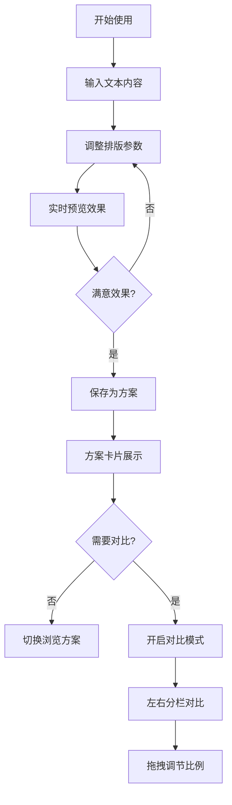

## 1. 产品概述

FontLab排版工坊是一款面向设计师和非专业用户的在线字体排版工具，解决用户在网页上快速尝试字体组合、文字间距和配色方案时缺乏即时反馈和对比功能的痛点。

- 主要用途：设计师在设计工作流中快速预览和对比不同排版方案，非专业用户通过可视化操作获得专业级排版效果
- 核心价值：提供即时可视化反馈，支持方案保存与对比，降低排版设计门槛

## 2. 核心功能

### 2.1 用户角色
无需注册，所有用户均为匿名访客，可使用全部功能。

### 2.2 功能模块
1. **排版控制面板**：文本输入、字体选择、字号/行高/字间距调节、文字颜色设置
2. **实时预览区域**：段落样式预览、字符精细排版演示（含网格背景与辅助线）
3. **方案管理面板**：方案卡片墙展示、缩略图生成、方案切换
4. **方案对比功能**：左右分栏对比、拖拽分隔条调节比例

### 2.3 页面详情
| 页面名称 | 模块名称 | 功能描述 |
|---------|---------|---------|
| 主页面 | 排版控制面板 | 500字符多行文本输入，5种内置字体选择，字号12-120px滑块，行高0.8-3.0滑块，字间距-5px-20px滑块，16进制颜色输入，保存按钮 |
| 主页面 | 实时预览区 | 上半部分段落预览（浅灰网格背景），下半部分字符精细演示（首字母放大+垂直辅助线） |
| 主页面 | 方案列表 | 卡片墙展示已保存方案，每张卡片含200x60缩略图、名称、时间戳，hover放大1.1倍+投影 |
| 主页面 | 对比模式 | 点击对比按钮后预览区分左右两栏，拖拽分隔条调节比例，显示百分比，拖拽时蓝色高亮 |

## 3. 核心流程

用户在左侧面板输入文本并调整排版参数 → 右侧实时预览效果 → 满意后点击保存为方案 → 方案以卡片形式展示在底部 → 可点击切换方案或开启对比模式同时查看两个方案。

## 4. 用户界面设计

### 4.1 设计风格
- **主背景色**：#1a1a2e
- **卡片背景**：#16213e
- **强调色**：#0f3460
- **文字强调色**：#e94560
- **控件圆角**：6px
- **过渡动画**：0.2秒平滑过渡
- **字体选择**：内置5种网络字体（衬线、无衬线、手写体、等宽、装饰）

### 4.2 页面设计概述
| 页面名称 | 模块名称 | UI元素 |
|---------|---------|---------|
| 主页面 | 整体布局 | 双栏布局（左320px控制面板+右侧预览区），1px实线分隔，底部方案列表 |
| 主页面 | 控制面板 | 深色背景卡片，圆角滑块，下拉选择框，颜色输入框，保存按钮 |
| 主页面 | 预览区域 | 浅灰色10x10点阵网格背景，段落预览在上，字符精细演示在下含垂直辅助线 |
| 主页面 | 方案卡片 | 卡片悬停放大1.1倍+轻微投影，缩略图居上，名称与时间戳居下 |
| 主页面 | 对比分隔条 | 灰色默认，拖拽时变蓝，显示当前百分比 |

### 4.3 响应式设计
采用桌面优先设计，当屏幕宽度小于768px时：
- 左侧控制面板折叠为顶部可折叠工具栏
- 汉堡图标控制展开/收起
- 预览区域占满屏幕宽度

### 4.4 性能要求
- 滑块调整时预览延迟 ≤ 50ms
- 双方案对比时内存占用 ≤ 80MB
- 网格背景缩放/滚动时无闪烁
