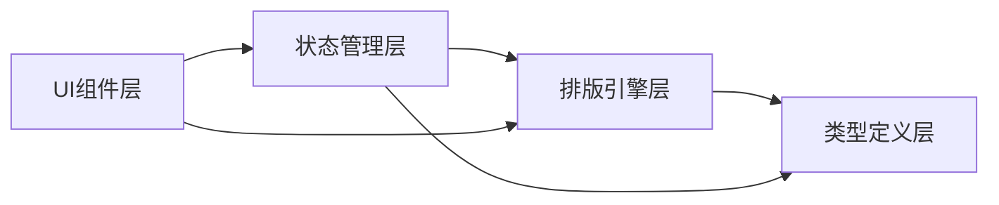

## 1. 架构设计



## 2. 技术栈说明
- **前端框架**：React 18 + TypeScript
- **构建工具**：Vite（端口3000）
- **状态管理**：Zustand
- **样式方案**：原生CSS + CSS变量（深色主题）

## 3. 模块结构

```
src/
├── modules/
│   ├── typography/
│   │   ├── types.ts          # 类型定义
│   │   └── engine.ts         # 排版引擎
│   ├── state/
│   │   └── store.ts          # Zustand状态管理
│   └── ui/
│       ├── ToolPanel.tsx     # 控制面板
│       ├── PreviewArea.tsx   # 预览区域
│       └── SchemeList.tsx    # 方案列表
├── App.tsx                   # 根组件
└── main.tsx                  # 入口
```

## 4. 类型定义

### ITypographyParams
```typescript
interface ITypographyParams {
  fontFamily: string;
  fontSize: number;
  lineHeight: number;
  letterSpacing: number;
  color: string;
}
```

### ISavedScheme
```typescript
interface ISavedScheme {
  id: string;
  name: string;
  createdAt: number;
  text: string;
  params: ITypographyParams;
  thumbnail: string;
}
```

### IPreviewState
```typescript
interface IPreviewState {
  text: string;
  paramsList: ITypographyParams[];
  compareMode: boolean;
  selectedIndex: number;
  compareIndex: number;
}
```

## 5. 核心API

### engine.ts
- `applyTypography(params: ITypographyParams): React.CSSProperties` — 根据参数生成CSS样式对象
- `generatePreviewUrl(element: HTMLElement, width: number, height: number): Promise<string>` — 将预览区域导出为base64缩略图

### store.ts
- `useStore` — Zustand钩子，暴露：
  - `text: string` — 当前文本内容
  - `currentParams: ITypographyParams` — 当前排版参数
  - `schemes: ISavedScheme[]` — 已保存方案列表
  - `compareMode: boolean` — 对比模式开关
  - `selectedIndex: number` — 主选方案索引
  - `compareIndex: number` — 对比方案索引
  - Actions: `setText`, `setParams`, `saveScheme`, `deleteScheme`, `toggleCompareMode`, `setSelectedIndex`, `setCompareIndex`
