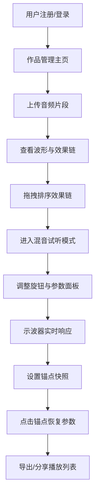

## 1. 产品概述

电子音乐人作品管理与混音试听平台，面向独立电子音乐创作者，提供音频上传、波形可视化、效果器链管理、实时混音试听与参数快照锚点功能，解决音乐人碎片化创作中混音参数难以记录和复用的问题。

## 2. 核心功能

### 2.1 用户角色

| 角色 | 注册方式 | 核心权限 |
|------|----------|----------|
| 音乐人 | 邮箱注册 | 上传作品、管理效果链、混音试听、创建锚点快照、生成播放列表 |

### 2.2 功能模块

1. **登录/注册页**：用户身份认证入口
2. **作品管理主页**：作品列表 + 波形展示 + 效果链编辑 + 播放控制
3. **混音试听详情页**：双通道示波器 + 旋钮控制 + 效果参数面板 + 锚点时间轴

### 2.3 页面详情

| 页面名称 | 模块名称 | 功能描述 |
|----------|----------|----------|
| 登录/注册页 | 认证表单 | 邮箱密码注册登录，JWT令牌鉴权 |
| 作品管理主页 | 作品列表 | 左侧卡片式列表展示作品名、时长、上传日期，点击切换当前作品 |
| 作品管理主页 | 波形展示 | Canvas绘制深蓝→紫罗兰渐变波形，鼠标悬停显示时间点与频率强度，播放时实时滚动+进度条 |
| 作品管理主页 | 效果链 | 波形下方展示音量/均衡器/混响效果卡片，支持拖拽排序 |
| 混音试听详情页 | 双通道示波器 | 页面中央圆形区域，左声道+右声道Lissajous图形，暖橙→冷蓝渐变，1.5px线条实时跳动 |
| 混音试听详情页 | 旋钮控制 | 示波器四周4个可拖动圆形旋钮（音量/低频/中频/高频），带刻度标记和实时数值 |
| 混音试听详情页 | 效果参数面板 | 右侧面板展示所有效果参数，调整即时反映到示波器 |
| 混音试听详情页 | 锚点时间轴 | 横向带刻度标尺，三角形锚点标记可拖拽，最多5个，点击恢复参数快照（0.2s淡入），锚点间渐变连线表示参数变化趋势 |

## 3. 核心流程

用户注册登录 → 进入作品管理主页 → 上传音频片段 → 点击作品卡片查看波形 → 编辑效果链（拖拽排序） → 进入混音试听模式 → 调整旋钮和参数面板 → 在时间轴上设置锚点快照 → 点击锚点恢复参数 → 导出/分享播放列表

## 4. 用户界面设计

### 4.1 设计风格

- 主色调：背景色 `#1a1a2e`，卡片背景 `#16213e`，强调色 `#e94560`
- 按钮样式：圆角矩形，hover时0.3秒平滑过渡
- 字体：标题使用 Orbitron（科技感显示字体），正文使用 Rajdhani（现代几何无衬线体）
- 布局：桌面端三栏（左20% 作品列表 + 中60% 示波器 + 右20% 参数面板），移动端纵向折叠
- 图标风格：线条图标，使用 lucide-react

### 4.2 页面设计概览

| 页面名称 | 模块名称 | UI元素 |
|----------|----------|--------|
| 登录/注册页 | 认证表单 | 深色背景+霓虹强调色按钮，居中卡片表单，0.3s过渡动画 |
| 作品管理主页 | 作品列表 | 左侧垂直卡片列，圆角矩形，hover放大+发光边框 |
| 作品管理主页 | 波形展示 | Canvas全宽绘制，深蓝→紫罗兰渐变填充，鼠标十字准线提示 |
| 作品管理主页 | 效果链 | 水平排列圆角矩形卡片，拖拽手柄，参数值数字 |
| 混音试听详情页 | 示波器 | 圆形Canvas区域，Lissajous曲线，暖橙→冷蓝渐变线条 |
| 混音试听详情页 | 旋钮 | 圆形SVG旋钮，外圈刻度，拖动实时数值反馈 |
| 混音试听详情页 | 锚点时间轴 | 横向刻度尺，三角形标记，半透明渐变连线 |

### 4.3 响应式设计

- 桌面优先设计，三栏布局（20%+60%+20%）
- 移动端自动折叠为纵向布局：列表与面板在上，示波器在下
- 所有交互元素触控优化，旋钮支持触摸拖拽

### 4.4 动效设计

- 所有交互元素悬停/点击0.3秒CSS过渡
- 锚点恢复参数时0.2秒淡入过渡动画
- 示波器Lissajous图形随音频实时跳动
- 波形播放时实时滚动+进度条动画
