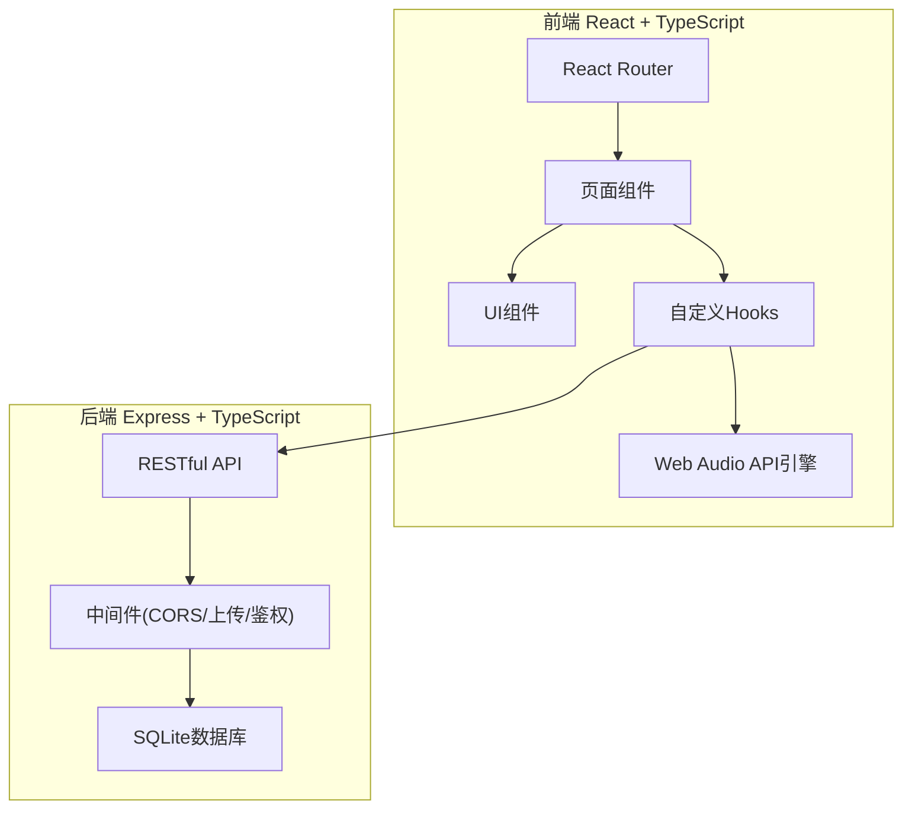
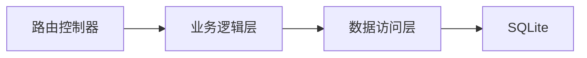
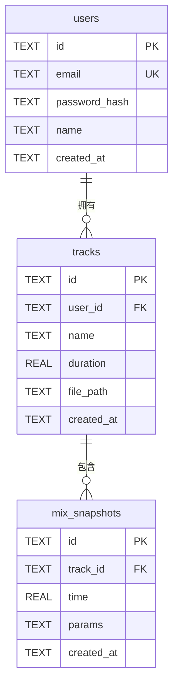

## 1. 架构设计



## 2. 技术说明

- 前端：React@18 + TypeScript + TailwindCSS@3 + Vite
- 初始化工具：vite-init（react-express-ts模板）
- 后端：Express@4 + TypeScript
- 数据库：SQLite（better-sqlite3）
- 音频处理：Web Audio API（浏览器原生）
- 状态管理：Zustand
- HTTP客户端：Axios

## 3. 路由定义

| 路由 | 用途 |
|------|------|
| `/login` | 登录/注册页面 |
| `/` | 作品管理主页（需登录） |
| `/mix/:trackId` | 混音试听详情页（需登录） |

## 4. API定义

### 4.1 用户认证

```typescript
POST /api/auth/register
Body: { email: string; password: string; name: string }
Response: { token: string; user: { id: string; email: string; name: string } }

POST /api/auth/login
Body: { email: string; password: string }
Response: { token: string; user: { id: string; email: string; name: string } }
```

### 4.2 作品管理

```typescript
POST /api/tracks
Body: FormData { file: File; name: string }
Headers: { Authorization: string }
Response: { id: string; name: string; duration: number; createdAt: string }

GET /api/tracks
Headers: { Authorization: string }
Response: Array<{ id: string; name: string; duration: number; createdAt: string; filePath: string }>

GET /api/tracks/:id
Headers: { Authorization: string }
Response: { id: string; name: string; duration: number; createdAt: string; filePath: string }
```

### 4.3 混音快照

```typescript
POST /api/tracks/:trackId/snapshots
Body: { time: number; params: { volume: number; eq: { low: number; mid: number; high: number }; reverb: number; effectOrder: string[] } }
Headers: { Authorization: string }
Response: { id: string; time: number; params: object }

GET /api/tracks/:trackId/snapshots
Headers: { Authorization: string }
Response: Array<{ id: string; time: number; params: object }>

PUT /api/snapshots/:id
Body: { time?: number; params?: object }
Headers: { Authorization: string }
Response: { id: string; time: number; params: object }

DELETE /api/snapshots/:id
Headers: { Authorization: string }
Response: { success: boolean }
```

## 5. 服务器架构图



## 6. 数据模型

### 6.1 数据模型定义



### 6.2 数据定义语言

```sql
CREATE TABLE IF NOT EXISTS users (
    id TEXT PRIMARY KEY,
    email TEXT UNIQUE NOT NULL,
    password_hash TEXT NOT NULL,
    name TEXT NOT NULL,
    created_at TEXT DEFAULT (datetime('now'))
);

CREATE TABLE IF NOT EXISTS tracks (
    id TEXT PRIMARY KEY,
    user_id TEXT NOT NULL REFERENCES users(id) ON DELETE CASCADE,
    name TEXT NOT NULL,
    duration REAL DEFAULT 0,
    file_path TEXT NOT NULL,
    created_at TEXT DEFAULT (datetime('now'))
);
CREATE INDEX IF NOT EXISTS idx_tracks_user_id ON tracks(user_id);

CREATE TABLE IF NOT EXISTS mix_snapshots (
    id TEXT PRIMARY KEY,
    track_id TEXT NOT NULL REFERENCES tracks(id) ON DELETE CASCADE,
    time REAL NOT NULL,
    params TEXT NOT NULL,
    created_at TEXT DEFAULT (datetime('now'))
);
CREATE INDEX IF NOT EXISTS idx_snapshots_track_id ON mix_snapshots(track_id);
```
