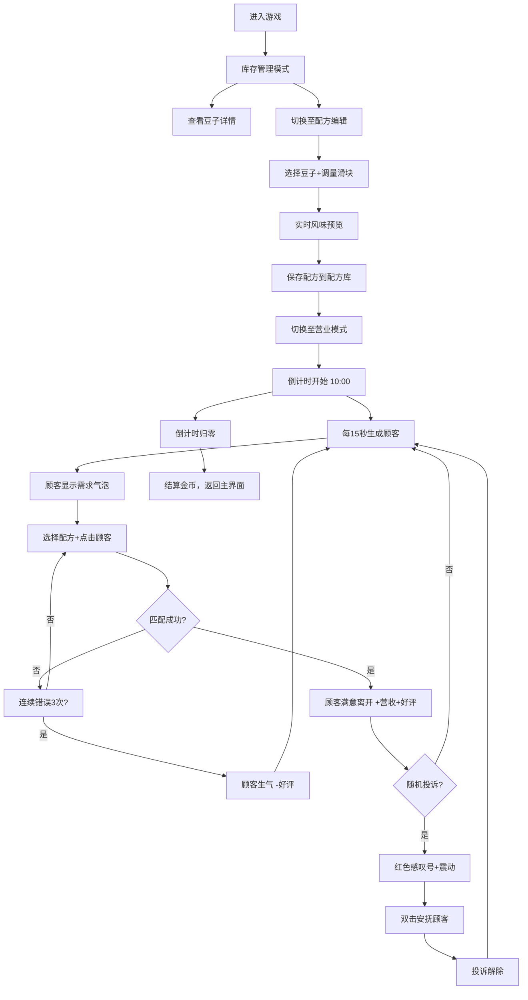

## 1. 产品概述
线上桌面咖啡厅经营模拟器，玩家扮演咖啡厅店主，通过咖啡豆库存管理、饮品配方调配、顾客服务及突发状况处理赚取金币，并解锁新设备和装饰。

- 目标用户：喜欢经营模拟类游戏的休闲玩家
- 核心价值：沉浸式咖啡厅经营体验，策略性配方调配与实时顾客服务的紧张感平衡

## 2. 核心功能

### 2.1 用户角色
| 角色 | 注册方式 | 核心权限 |
|------|----------|----------|
| 玩家 | 无需注册，本地运行 | 全部游戏功能：库存管理、配方编辑、营业模拟 |

### 2.2 功能模块
1. **库存管理模式（吧台）**：展示四种咖啡豆卡片、库存克数、市场价格波动，点击豆子查看风味详情弹窗
2. **配方编辑模式**：选择原料豆子（最多3种）+ 滑块调量（10-50g），实时显示风味值（酸度/苦度/甜度）和能量值，保存至配方库
3. **营业模拟模式**：10分钟倒计时，每15秒生成顾客，顾客显示需求气泡，匹配配方服务顾客，满意度增减，随机投诉事件
4. **配方库**：卡片网格展示已保存配方，咖啡色渐变背景，快速应用制作

### 2.3 页面详情
| 页面/模式 | 模块名称 | 功能描述 |
|-----------|----------|----------|
| 库存管理 | 咖啡豆卡片网格 | 4种豆子（巴西/哥伦比亚/埃塞俄比亚/危地马拉），显示名称、库存克数、当日售价（市场价波动） |
| 库存管理 | 豆子详情弹窗 | 风味简介、烘焙程度，Portal渲染，关闭时0.2秒缩放淡出动画 |
| 配方编辑 | 原料选择区 | 左侧豆子列表，勾选最多3种，每种滑块调量10-50克 |
| 配方编辑 | 风味预览区 | 右侧实时酸度/苦度/甜度数值条（各满分100），能量值自动计算 |
| 配方编辑 | 配方库 | 卡片网格，浅驼色到深棕色渐变，显示配方名+出杯数，点击快速应用 |
| 营业模拟 | 俯视咖啡厅场景 | CSS Grid+绝对定位拼接吧台、桌椅、咖啡机、工作区 |
| 营业模拟 | 顾客队列 | 每15秒从门口走入，emoji头像，聊天气泡显示需求（风味偏好） |
| 营业模拟 | 服务匹配 | 选择配方+点击顾客，匹配成功增加营收好评，连续3次错误扣好评 |
| 营业模拟 | 投诉事件 | 随机触发，红色感叹号+0.3秒屏幕震动，双击安抚解除 |
| 营业模拟 | 状态栏 | 顶部倒计时（10分钟）、满意度条（绿增红减）、金币显示 |

## 3. 核心流程
玩家打开页面 → 进入库存管理模式查看豆子 → 切换至配方编辑模式调配并保存配方 → 切换至营业模式开始10分钟营业 → 顾客陆续进入 → 选择匹配配方点击顾客服务 → 处理随机投诉事件 → 时间结束结算金币 → 循环

## 4. 用户界面设计

### 4.1 设计风格
- **主色**：#8B4513（深棕色），**辅色**：#D2B48C（浅驼色），**背景**：#FFF8DC（米色）
- **按钮风格**：圆角矩形，悬停时颜色加深并上浮2px（transform: translateY(-2px)），0.15s过渡
- **字体**：显示字体用 "Playfair Display"（优雅衬线体），正文字体用 "Nunito"（圆润无衬线体）
- **布局**：卡片式布局，主内容居中，顶部导航切换三种模式
- **图标/头像**：顾客头像使用手绘风格emoji（😊满意、😕犹豫、😡生气），豆子卡片使用emoji☕

### 4.2 页面设计概述
| 页面/模式 | 模块 | UI元素 |
|-----------|------|--------|
| 全局 | 顶部导航栏 | 三标签切换：库存/配方/营业，活跃标签棕色下划线，背景米色，悬停加深 |
| 库存管理 | 豆子卡片 | Grid 2x2，每张卡片米色背景+棕色边框圆角8px，hover上浮2px，显示豆子emoji、名称、克数、市场价 |
| 库存管理 | 详情弹窗 | Portal挂载到body，背景半透明模糊（backdrop-filter: blur(4px)），弹窗米色圆角16px，0.3s从中心scale(0.8)放大至1，关闭时0.2s scale(1.05)后淡出 |
| 配方编辑 | 左侧原料区 | 垂直排列的豆子选择项，勾选框+滑块（原生range，深棕色轨道和滑块），数值实时显示 |
| 配方编辑 | 右侧风味区 | 三个水平进度条（酸绿/苦棕/甜黄），进度动画0.3s ease；能量值用🔥图标+数字 |
| 配方编辑 | 配方库 | Grid响应式列（每列240px），卡片background: linear-gradient(135deg, #D2B48C, #8B4513)，白色文字，底部显示名称和出杯数，hover放大1.03 |
| 营业模拟 | 场景容器 | 固定宽高比4:3，CSS Grid布局（8列x6行），各区域grid-area定位，木地板纹理背景（repeating-linear-gradient） |
| 营业模拟 | 顾客元素 | 绝对定位，emoji 48px，聊天气泡圆角20px米色+棕色小三角，需求文字棕色小字体 |
| 营业模拟 | 满意度条 | 圆角4px高度12px，渐变背景绿→红根据值变化，数值显示右端 |
| 营业模拟 | 咖啡蒸汽 | 杯口上方伪元素，keyframes steam: translateY(0) opacity(0.8) → translateY(-30px) opacity(0)，无限循环，延迟交错 |

### 4.3 响应式
- 桌面优先设计（1280px+）
- 中间尺寸（768-1280px）：缩小间距，营业场景自适应宽度
- 移动端（<768px）：单列布局，导航改为底部Tab栏

### 4.4 动画细节
- **模态框入场**：0.3s cubic-bezier(0.34, 1.56, 0.64, 1) 从中心scale(0.5)+opacity(0) → scale(1)+opacity(1)
- **模态框退场**：0.2s ease scale(1) → scale(0.95) + opacity(0)
- **按钮悬停**：transform: translateY(-2px); box-shadow: 0 4px 12px rgba(139,69,19,0.25); 过渡0.15s
- **顾客走入**：keyframes walkIn: translateX(-50px) → translateX(0)，0.5s ease-out
- **投诉震动**：keyframes shake: translateX(-5px) → 5px → -5px → 5px → 0，0.3s
- **蒸汽升腾**：keyframes steam，三层伪元素延迟0s/0.5s/1s，总循环2s
- **好评增减**：满意度条颜色transition 0.3s，数值跳动效果
