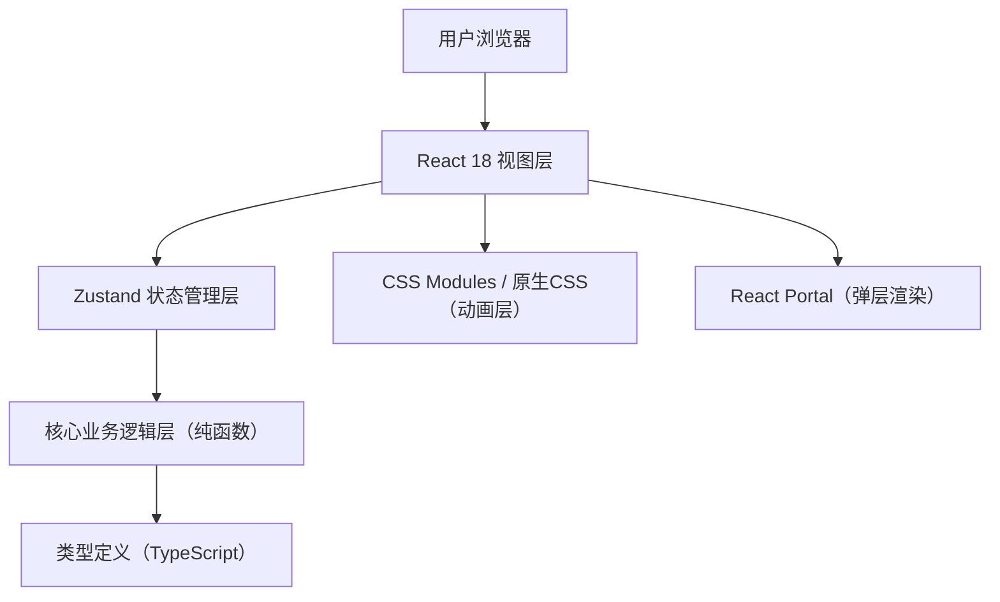
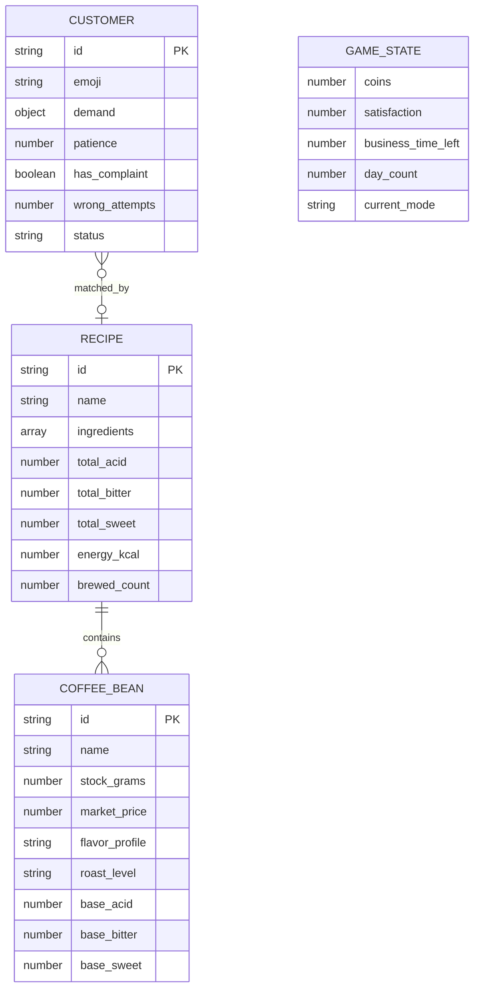

## 1. 架构设计



## 2. 技术说明
- **前端框架**：React 18 + TypeScript + Vite 5
- **状态管理**：Zustand 4（轻量、无Provider嵌套、支持订阅选择器）
- **样式方案**：原生CSS + CSS变量主题系统 + CSS Keyframes动画
- **弹层方案**：React Portal（挂载到document.body，避免层级问题）
- **无后端**：纯前端本地运行，数据存在Zustand store中
- **构建工具**：Vite（极速HMR，ESBuild编译TS）

## 3. 路由与模式切换
| 模式/视图 | 切换方式 | 对应组件 |
|-----------|----------|----------|
| 库存管理模式 | 顶部Tab点击或初始默认 | CoffeeStand + BeanDetailModal |
| 配方编辑模式 | 顶部Tab点击 | RecipeEditor |
| 营业模拟模式 | 顶部Tab点击 | GameScene |

- 不使用React Router，采用App内useState + 条件渲染，切换成本低
- mode类型：'inventory' | 'recipe' | 'business'

## 4. 数据模型

### 4.1 ER图



### 4.2 核心类型定义（对应src/types.ts）
- `CoffeeBean`: id, name, stockGrams, marketPrice, flavorProfile, roastLevel, baseAcid, baseBitter, baseSweet
- `RecipeIngredient`: beanId, grams
- `Recipe`: id, name, ingredients[], totalAcid, totalBitter, totalSweet, energyKcal, brewedCount
- `CustomerDemand`: preferredBeans[], maxBitter?, minAcid?, minSweet?, keyword
- `Customer`: id, emoji, demand, patience, hasComplaint, wrongAttempts, status, x, y
- `GameStatus`: coins, satisfaction (0-100), businessTimeLeft (秒), dayCount, currentMode
- StoreActions: 增减金币、添加配方、生成顾客、匹配服务、处理投诉、市场价波动等

## 5. 目录结构

```
src/
├── main.tsx              # 入口，挂载App
├── App.tsx               # 主组件，模式切换，导航栏
├── types.ts              # 全部类型定义
├── store.ts              # Zustand store：状态+动作
├── components/
│   ├── CoffeeStand.tsx   # 吧台+豆子卡片+详情弹窗Portal
│   ├── RecipeEditor.tsx  # 配方编辑+风味预览+配方库
│   └── GameScene.tsx     # 营业场景+顾客队列+倒计时+投诉
└── styles/
    └── globals.css       # 全局变量、重置、keyframes动画
```

## 6. 性能优化策略

### 6.1 交互延迟 < 50ms
- **Zustand选择器**：各组件仅订阅所需状态切片，避免全量重渲染
  - 例：`const coins = useStore(s => s.coins)` 而非整个state
- **受控滑块throttle**：风味预览计算用useMemo缓存，滑块onChange不throttle（现代浏览器range事件性能足够）
- **Portal弹窗**：mount/unmount而非display切换，避免无意义渲染

### 6.2 倒计时每秒更新
- 使用独立useEffect + setInterval，清理函数clearInterval
- timeLeft存在store中，每秒减1，至0触发营业结束结算
- 显示组件仅订阅timeLeft，避免其他组件每秒重绘

### 6.3 顾客队列渲染不卡顿
- 顾客使用稳定id作为key（uuid或时间戳+索引）
- 顾客对象扁平，避免深层嵌套
- 顾客位置变化使用CSS transform（GPU加速），避免top/left触发布局
- 新顾客入场动画用transform: translateX，走合成线程
- 顾客上限（如同时最多8位），超出排队

### 6.4 动画性能
- 全部CSS动画仅使用transform和opacity（合成层属性）
- backdrop-filter降级处理（不支持的浏览器用半透明背景）
- 蒸汽动画使用3层伪元素+will-change: transform提示浏览器

## 7. 关键算法

### 7.1 风味值计算
给定配方原料（beanId + grams）：
```
totalGrams = sum(grams)
totalAcid = sum(bean.baseAcid * grams) / totalGrams   // 加权平均
totalBitter = sum(bean.baseBitter * grams) / totalGrams
totalSweet = sum(bean.baseSweet * grams) / totalGrams
energyKcal = totalGrams * 0.8  // 每克约0.8大卡
```

### 7.2 顾客需求匹配算法
顾客demand = { preferredBeans: string[], maxBitter?, minAcid?, keyword }
匹配度评分：
```
score = 0
// 豆子匹配：配方中含顾客偏好的豆子，每个+30
for bean in recipe.ingredients:
  if bean.beanId in demand.preferredBeans: score += 30
// 苦度约束：配方苦度 ≤ maxBitter +20，否则-50
if maxBitter and recipe.totalBitter <= maxBitter: score += 20
else if maxBitter: score -= 50
// 酸度底线：配方酸度 ≥ minAcid +20，否则-30
if minAcid and recipe.totalAcid >= minAcid: score += 20
else if minAcid: score -= 30
// 成功阈值：score >= 50
```

### 7.3 市场价每日波动
```
newPrice = basePrice * (1 + random(-0.15, +0.15))
// 保留2位小数，范围 ±15%
```
