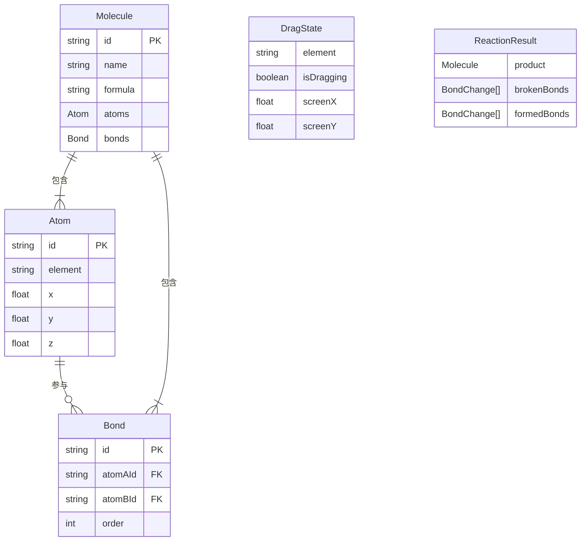

## 1. 架构设计

```mermaid
flowchart TD
    subgraph "前端层"
        "React入口 (main.tsx)"
        "分子编辑器 (moleculeEditor.tsx)"
        "元素面板 (atomPanel.tsx)"
    end
    subgraph "状态层"
        "Zustand Store (moleculeStore.ts)"
    end
    subgraph "逻辑层"
        "化学反应引擎 (chemicalReaction.ts)"
    end
    subgraph "渲染层"
        "Three.js / R3F 场景"
    end

    "React入口 (main.tsx)" --> "分子编辑器 (moleculeEditor.tsx)"
    "React入口 (main.tsx)" --> "元素面板 (atomPanel.tsx)"
    "元素面板 (atomPanel.tsx)" --> "Zustand Store (moleculeStore.ts)"
    "分子编辑器 (moleculeEditor.tsx)" --> "Zustand Store (moleculeStore.ts)"
    "分子编辑器 (moleculeEditor.tsx)" --> "化学反应引擎 (chemicalReaction.ts)"
    "分子编辑器 (moleculeEditor.tsx)" --> "Three.js / R3F 场景"
    "Zustand Store (moleculeStore.ts)" --> "分子编辑器 (moleculeEditor.tsx)"
    "Zustand Store (moleculeStore.ts)" --> "元素面板 (atomPanel.tsx)"
```

## 2. 技术说明

- 前端：React@18 + TypeScript + Three.js + @react-three/fiber + @react-three/drei
- 构建工具：Vite
- 状态管理：Zustand
- 样式：CSS Modules + Tailwind CSS
- 无后端：纯前端应用

## 3. 路由定义

| 路由 | 用途 |
|------|------|
| / | 主编辑页面，包含3D场景、元素面板、分子架 |

## 4. 数据模型

### 4.1 数据模型定义



### 4.2 核心类型定义

```typescript
interface Atom {
  id: string;
  element: string;
  position: [number, number, number];
}

interface Bond {
  id: string;
  atomAId: string;
  atomBId: string;
  order: 1 | 2 | 3;
}

interface Molecule {
  id: string;
  name: string;
  formula: string;
  atoms: Atom[];
  bonds: Bond[];
}

interface BondChange {
  bondId: string;
  atomAId: string;
  atomBId: string;
  order: number;
}

interface ReactionResult {
  product: Molecule;
  brokenBonds: BondChange[];
  formedBonds: BondChange[];
}
```

## 5. 文件组织

| 文件 | 职责 |
|------|------|
| package.json | 依赖管理，启动脚本 |
| index.html | 入口HTML |
| vite.config.js | Vite构建配置 |
| tsconfig.json | TypeScript严格模式配置 |
| src/main.tsx | React根节点初始化 |
| src/atomPanel.tsx | 元素周期表面板，原子拖拽 |
| src/moleculeEditor.tsx | 3D场景编辑器，原子/键操作 |
| src/chemicalReaction.ts | 化学反应规则引擎 |
| src/moleculeStore.ts | Zustand状态管理 |
