## 1. 架构设计

```mermaid
graph TD
    subgraph "前端层 (React + TypeScript)"
        A["App.tsx 主组件"]
        B["ResourcePanel 资源面板"]
        C["ExpeditionPanel 探险面板"]
        D["UpgradePanel 升级面板"]
        E["Header 日志头部"]
    end

    subgraph "状态管理层 (Zustand)"
        F["useGameStore.ts 全局状态仓库"]
    end

    subgraph "数据层"
        G["游戏配置常量<br>区域数据、设施数据、初始值"]
        H["工具函数<br>随机数、时间格式化、成功率计算"]
    end

    B -->|订阅状态| F
    C -->|订阅状态 / dispatch action| F
    D -->|订阅状态 / dispatch action| F
    E -->|订阅状态| F
    F -->|读取配置| G
    F -->|调用工具| H

    style A fill:#1a365d,stroke:#60a5fa
    style F fill:#1e3a2f,stroke:#34d399
```



**数据流向**：UI组件 dispatch action → Zustand store 更新状态 → 触发所有订阅组件重新渲染

## 2. 技术说明

- **前端框架**：React@18 + TypeScript@5
- **构建工具**：Vite@5 + @vitejs/plugin-react
- **状态管理**：Zustand@4
- **样式方案**：原生CSS（CSS Modules风格类名）+ CSS变量 + CSS动画
- **初始化方式**：npm create vite-init . --template react-ts --force

## 3. 文件结构与调用关系

```
auto62/
├── index.html                          # 入口页面，标题"Deep Diver"
├── package.json                        # 依赖配置，npm run dev启动
├── vite.config.js                      # Vite配置（使用react插件）
├── tsconfig.json                       # TS strict模式，允许JSX
└── src/
    ├── main.tsx                        # React入口，渲染App
    ├── App.tsx                         # 主组件：组合Header+ResourcePanel+ExpeditionPanel+UpgradePanel
    ├── index.css                       # 全局样式：渐变背景、CSS变量、动画关键帧
    ├── store/
    │   └── useGameStore.ts             # Zustand仓库：管理所有状态与actions
    ├── components/
    │   ├── Header.tsx                  # 顶部：游戏标题 + 探险日志滚动
    │   ├── ResourcePanel.tsx           # 资源面板：氧气/能量进度条 + 矿物数字
    │   ├── ExpeditionPanel.tsx         # 探险面板：4个区域卡片 + 派遣逻辑
    │   ├── ExpeditionCard.tsx          # 子组件：单个探险区域卡片
    │   ├── UpgradePanel.tsx            # 升级面板：4个设施卡片 + 升级逻辑
    │   ├── UpgradeCard.tsx             # 子组件：单个设施升级卡片
    │   ├── ToastBubble.tsx             # 子组件：右侧滑入结果气泡
    │   └── GameOverModal.tsx           # 子组件：游戏结束弹窗
    ├── config/
    │   └── gameConfig.ts               # 游戏配置：区域、设施、常量参数
    └── utils/
        └── helpers.ts                  # 工具函数：随机数、格式化、计算逻辑
```

**调用关系**：
- `main.tsx` → `App.tsx`
- `App.tsx` → `Header.tsx`, `ResourcePanel.tsx`, `ExpeditionPanel.tsx`, `UpgradePanel.tsx`, `GameOverModal.tsx`, `ToastBubble.tsx`
- `ExpeditionPanel.tsx` → `ExpeditionCard.tsx`
- `UpgradePanel.tsx` → `UpgradeCard.tsx`
- 所有组件 → `useGameStore.ts`（订阅状态 + 调用actions）
- `useGameStore.ts` → `gameConfig.ts`（读取配置），`helpers.ts`（调用工具）

## 4. 状态仓库定义 (useGameStore)

### 4.1 State 接口

```typescript
interface GameState {
  // 资源
  oxygen: number;          // 0-100
  energy: number;          // 0-100
  minerals: number;        // 0-999

  // 氧气归零计时器（秒）
  zeroOxygenTime: number;  // 超过10触发结束
  isGameOver: boolean;

  // 设施等级 Lv.1-5
  facilities: {
    oxygenPurifier: number;   // 氧气净化器：氧气消耗-10%/级
    thrusterEnhancer: number; // 推进器增强：成功率+10%/级
    sonarSystem: number;      // 声呐系统：矿物+15%/级
    defenseShield: number;    // 防御护盾：失败氧气损失-20%/级
  };

  // 探险区域状态
  expeditions: Record<string, ExpeditionStatus>;

  // 探险日志（最近5条）
  logs: LogEntry[];

  // Toast气泡队列
  toasts: ToastEntry[];
}

interface ExpeditionStatus {
  isActive: boolean;
  startTime: number;
  duration: number;        // 3000-8000 ms
  zoneKey: string;
}

interface LogEntry {
  id: string;
  time: string;
  message: string;
  type: 'success' | 'fail';
}

interface ToastEntry {
  id: string;
  message: string;
  type: 'success' | 'fail' | 'info';
}
```

### 4.2 Actions 接口

```typescript
interface GameActions {
  // 资源操作
  reduceOxygen: (amount: number) => void;
  consumeEnergy: (amount: number) => void;
  addMineral: (amount: number) => void;

  // 时间驱动：RAF循环中调用
  tickResourceConsumption: (deltaMs: number) => void;

  // 探险操作
  startExpedition: (zoneKey: string) => boolean;
  completeExpedition: (zoneKey: string) => void;

  // 升级操作
  upgradeFacility: (facilityKey: FacilityKey) => boolean;

  // 日志与Toast
  addLog: (entry: Omit<LogEntry, 'id' | 'time'>) => void;
  addToast: (entry: Omit<ToastEntry, 'id'>) => void;
  removeToast: (id: string) => void;

  // 游戏重置
  resetGame: () => void;
}
```

## 5. 游戏配置常量 (gameConfig.ts)

```typescript
// 区域配置
export const ZONES = {
  shallow: {
    name: '浅海', depth: '0-200m', minerals: '铁矿、铜矿',
    threatLevel: 1, baseSuccess: 0.7
  },
  middle: {
    name: '中层', depth: '200-1000m', minerals: '银矿、锌矿',
    threatLevel: 2, baseSuccess: 0.6
  },
  deep: {
    name: '深海', depth: '1000-4000m', minerals: '金矿、锰结核',
    threatLevel: 2, baseSuccess: 0.5
  },
  trench: {
    name: '海沟', depth: '4000-11000m', minerals: '稀土、稀有金属',
    threatLevel: 3, baseSuccess: 0.4
  }
} as const;

// 设施配置
export const FACILITIES = {
  oxygenPurifier:   { name: '氧气净化器', desc: '氧气消耗速度降低10%/级', effect: '-10%氧气消耗/级' },
  thrusterEnhancer: { name: '推进器增强', desc: '探险成功率提升10%/级',   effect: '+10%成功率/级' },
  sonarSystem:      { name: '声呐系统',   desc: '探险获得矿物+15%/级',     effect: '+15%矿物/级' },
  defenseShield:    { name: '防御护盾',   desc: '失败氧气损失减少20%/级',  effect: '-20%损失/级' },
} as const;

// 升级消耗（Lv.1→Lv.2 基础，每级递增20%）
export const UPGRADE_COST_BASE = { mineral: 30, energy: 20 };
export const UPGRADE_GROWTH_RATE = 1.2;

// 游戏常量
export const INITIAL_OXYGEN = 100;
export const INITIAL_ENERGY = 100;
export const INITIAL_MINERALS = 0;
export const MINERAL_CAP = 999;
export const BASE_CONSUME_INTERVAL = 2000; // ms
export const BASE_CONSUME_AMOUNT = 1;
export const OXYGEN_ZERO_GAMEOVER_SEC = 10;
export const EXPEDITION_MIN_MS = 3000;
export const EXPEDITION_MAX_MS = 8000;
export const BASE_SUCCESS_RATE = 0.5;
export const MINERAL_MIN = 10;
export const MINERAL_MAX = 30;
export const FAIL_OXYGEN_LOSS = 10;
export const FAIL_ENERGY_LOSS = 5;
```

## 6. 工具函数 (helpers.ts)

```typescript
// 范围随机整数
export function randInt(min: number, max: number): number;
// 毫秒级随机探险时间
export function randomExpeditionDuration(): number;
// 格式化当前时间 HH:mm:ss
export function formatTime(): string;
// 计算升级消耗 (mineral, energy)
export function calcUpgradeCost(currentLevel: number): { mineral: number; energy: number };
// 计算探险成功率（基础50% + 推进器等级×10%，上限90%）
export function calcSuccessRate(thrusterLevel: number, zoneBase: number): number;
// 计算矿物收益（10-30随机 × (1 + 声呐等级×15%)）
export function calcMineralGain(sonarLevel: number): number;
// 计算失败氧气损失（10 × (1 - 护盾等级×20%)，至少0）
export function calcOxygenLoss(shieldLevel: number): number;
// 生成唯一ID
export function genId(): string;
```

## 7. RAF循环机制

- `App.tsx` 通过 `useEffect` 启动 `requestAnimationFrame` 循环
- 每帧调用 `store.tickResourceConsumption(deltaMs)`，累计delta超过2000ms×净化器系数时消耗1氧气+1能量
- 每帧检查各探险区域是否到期，调用 `completeExpedition`
- 每帧检查氧气是否为0，累计 `zeroOxygenTime`，超过10秒设置 `isGameOver = true`
- 组件卸载时取消RAF

## 8. 动画实现

| 动画名称 | 实现方式 | 时长 |
|----------|----------|------|
| 资源进度条过渡 | CSS `transition: width 0.5s ease-in-out` | 0.5s |
| 探险进度环 | SVG `stroke-dashoffset` + RAF更新 | 3-8s |
| 升级按钮脉冲 | CSS `@keyframes pulse-scale` + `transform: scale()` | 0.3s |
| 资源不足抖动 | CSS `@keyframes shake-red` + `border-color` | 0.3s |
| Toast气泡滑入 | CSS `@keyframes slideInRight` → `fadeOut` | 入0.3s/出0.3s |
| 日志淡入 | CSS `@keyframes fadeInDown` + `animation-delay` | 0.3s |
| 游戏结束缩放 | CSS `@keyframes shrinkFade` → `expandFadeIn` | 各0.5s |
