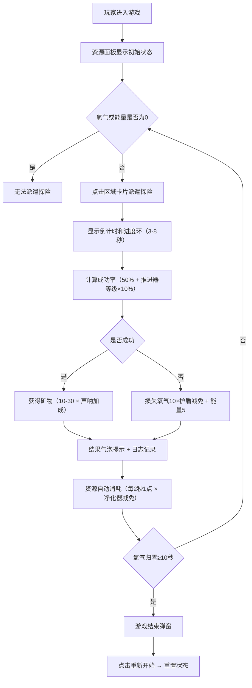

## 1. 产品概述

深海潜水探险模拟游戏是一款轻度资源管理类网页游戏，玩家通过管理氧气、能量和矿物资源，派遣潜水器探索不同深海区域，并升级基地设施来提升探险效率。目标用户为喜欢休闲策略类游戏的玩家，产品价值在于提供沉浸式的深海探险体验与资源策略平衡的游戏乐趣。

## 2. 核心功能

### 2.1 用户角色
| 角色 | 注册方式 | 核心权限 |
|------|----------|----------|
| 玩家 | 无需注册，直接进入 | 管理资源、派遣探险、升级设施、查看日志、重新开始游戏 |

### 2.2 功能模块
1. **资源面板**：显示氧气值、能量值进度条和矿物储量，实时更新数值并带动画过渡
2. **探险调度面板**：展示四个深度区域卡片，支持派遣潜水器探险，显示倒计时和进度环
3. **升级面板**：展示四项基地设施卡片，支持消耗资源升级设施，显示等级效果
4. **探险日志**：滚动显示最近5次探险结果，淡入淡出动画
5. **游戏结束机制**：氧气归零10秒后触发结束弹窗，支持重新开始

### 2.3 页面详情
| 页面名称 | 模块名称 | 功能描述 |
|----------|----------|----------|
| 主页面 | 顶部Header | 显示游戏标题和探险日志滚动区域 |
| 主页面 | ResourcePanel | 顶部固定60px高度资源栏，显示氧气💧、能量⚡、矿物⛏️，进度条0.5秒平滑过渡 |
| 主页面 | ExpeditionPanel | 四个区域卡片（浅海/中层/深海/海沟），点击派遣探险，显示3-8秒倒计时和进度圆环，结果气泡从右侧滑入 |
| 主页面 | UpgradePanel | 四个设施卡片（氧气净化器/推进器增强/声呐系统/防御护盾），升级按钮脉冲动画，资源不足红色抖动 |
| 主页面 | 游戏结束弹窗 | 氧气归零10秒后显示，整体缩放动画，点击重新开始重置游戏 |

## 3. 核心流程

玩家进入游戏后，初始状态氧气100、能量100、矿物0。资源每2秒自动消耗1点（受氧气净化器等级影响消耗速度）。玩家通过点击探险区域卡片派遣潜水器，探险持续3-8秒，倒计时结束后根据推进器等级计算成功率（基础50%，每级+10%，上限90%）。成功获得10-30矿物（受声呐系统等级加成），失败损失氧气10和能量5（受防御护盾等级减免）。玩家可使用资源升级四项设施，每项等级最高Lv.5。当氧气归零持续10秒，游戏结束，可点击重新开始。

## 4. 用户界面设计

### 4.1 设计风格
- **主色调**：深海垂直渐变（深蓝 → 墨绿），整体模拟深海氛围
- **卡片样式**：半透明深蓝背景 rgba(0,20,60,0.6)，浅蓝发光边框 1px solid rgba(100,200,255,0.3)，圆角12px，间距16px
- **按钮样式**：主色青色 #00d4ff，悬停亮蓝 #40e0ff，0.2秒过渡
- **字体**：资源数值白色18px粗体，日志淡蓝色，图标使用emoji（💧⚡⛏️🦈）
- **动画**：所有动画≤0.5秒，ease-in-out缓动；进度条0.5秒平滑过渡；升级0.3秒缩放脉冲；资源不足红色抖动

### 4.2 页面设计概览
| 页面名称 | 模块名称 | UI元素 |
|----------|----------|--------|
| 主页面 | 背景 | 垂直渐变深蓝→墨绿，整体深海色调 |
| 主页面 | ResourcePanel | 顶部固定60px，三个资源并排：氧气进度条💧、能量进度条⚡、矿物数字⛏️ |
| 主页面 | 探险日志 | Header下方，半透明背景，淡蓝字体，最近5条记录淡入淡出滚动 |
| 主页面 | ExpeditionPanel | 2×2卡片网格（小屏自动2列），每卡含区域名、深度范围、矿物种类、🦈威胁等级图标、倒计时进度环 |
| 主页面 | UpgradePanel | 2×2设施卡片网格，每卡含设施名、Lv.X等级、升级消耗（矿物/能量）、效果描述、升级按钮 |
| 主页面 | 结果气泡 | 页面右侧滑入，停留2秒淡出，显示成功/失败信息 |
| 主页面 | 游戏结束弹窗 | 居中显示，页面整体0.5秒收缩淡出→展开淡入 |

### 4.3 响应式
- 桌面优先设计，最小宽度支持320px设备
- 卡片网格在小屏幕自动变为2列布局
- 资源面板在小屏保持完整显示，数值自适应缩放

### 4.4 性能要求
- 所有UI重绘≤16ms（60FPS）
- 探险倒计时精度±100ms
- 资源消耗使用requestAnimationFrame而非setInterval确保帧同步
