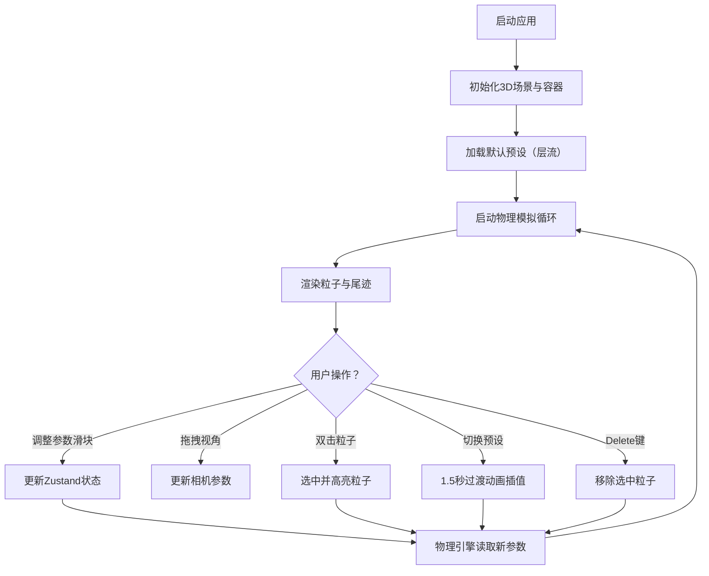

## 1. 产品概述

流体力学粒子系统3D可视化应用，旨在解决传统物理教学中流体运动抽象、难以直观展示涡流、层流和湍流形态变化的问题。通过交互式3D粒子系统，让物理学习者和研究人员能够直观地观察和调整流体运动特性。

- 核心价值：将抽象的流体力学概念转化为可交互、可调节的沉浸式3D可视化体验
- 目标用户：物理教师、学生、科研人员、流体力学爱好者

## 2. 核心功能

### 2.1 用户角色
| 角色 | 注册方式 | 核心权限 |
|------|----------|----------|
| 普通用户 | 无需注册 | 访问全部可视化功能、调整参数、切换预设场景 |

### 2.2 功能模块
1. **3D渲染场景区**：立方体容器、粒子球体渲染、尾迹线条、选中粒子高亮与速度向量显示
2. **参数控制面板**：粒子数量滑块、涡流强度滑块、粘滞系数滑块、初始流速矢量控制盘、预设场景切换按钮
3. **交互系统**：轨道环绕视角、平移视角、缩放视角、粒子选中与删除
4. **物理模拟引擎**：粒子运动算法、边界碰撞检测、尾迹数据更新、预设场景插值过渡

### 2.3 页面详情
| 页面名称 | 模块名称 | 功能描述 |
|-----------|-------------|---------------------|
| 主页面 | 3D场景渲染区 | 左侧70%区域，实时渲染粒子系统，支持鼠标交互 |
| 主页面 | 参数控制面板 | 右侧280px区域，包含所有参数调节控件和预设按钮 |
| 主页面 | FPS性能指示器 | 场景内实时显示当前帧率 |

## 3. 核心流程

## 4. 用户界面设计

### 4.1 设计风格
- **主色调**：深空蓝 #0a0e27
- **高亮色**：青蓝 #00d4ff、紫罗兰 #9b59b6
- **辅助色**：粒子渐变色 - 深蓝→青绿→橙红
- **按钮风格**：圆角设计，悬停放大1.1倍，点击涟漪反馈
- **滑块风格**：圆角设计，渐变进度条，实时数值显示
- **面板风格**：深色半透明背景 + 毛玻璃效果（backdrop-filter: blur）
- **字体**：现代无衬线字体（Inter/Space Grotesk），标题半粗体，正文常规
- **布局**：固定分栏布局（70%场景 + 280px控制面板）

### 4.2 页面设计概述
| 页面名称 | 模块名称 | UI元素 |
|-----------|-------------|-------------|
| 主页面 | 3D场景区 | 半透立方体容器、彩色粒子球体、渐隐尾迹线条、FPS计数器、OrbitControls交互 |
| 主页面 | 控制面板 | 毛玻璃背景面板、带数值滑块（4个）、二维矢量圆盘、3个预设场景按钮 |

### 4.3 响应式
- 桌面端优先设计，1920×1080为基准分辨率
- 最小支持分辨率：1280×720
- 触屏设备：支持双指缩放和滑动旋转

### 4.4 3D场景指引
- **环境**：纯深空蓝背景，无HDRI，突出粒子本身
- **光照**：环境光 + 两盏方向光（青蓝与紫罗兰色），营造科技氛围
- **相机**：透视相机，初始距离容器15单位，看向原点
- **构图**：容器位于场景中心，粒子充满容器内部
- **交互**：OrbitControls（左键旋转/右键平移/滚轮缩放），双击射线拾取粒子
- **后处理**：轻微Bloom发光效果增强尾迹与粒子视觉
- **性能预算**：3000粒子时FPS ≥ 30，常规500粒子时FPS ≥ 45
