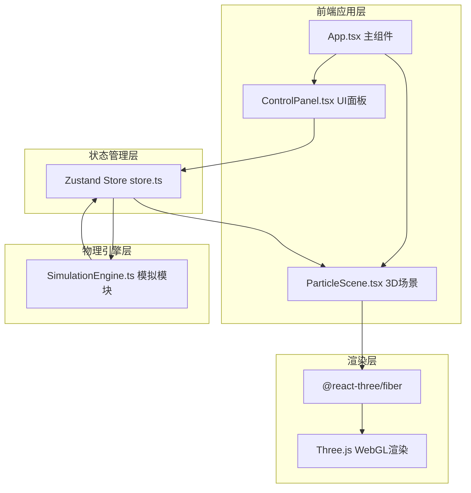

## 1. 架构设计



## 2. 技术描述
- **前端框架**：React@18 + TypeScript
- **构建工具**：Vite@5 + @vitejs/plugin-react
- **3D渲染**：Three.js + @react-three/fiber + @react-three/drei
- **状态管理**：Zustand
- **样式方案**：原生CSS（CSS Variables + 类选择器），无需Tailwind
- **后端**：无（纯前端应用）

## 3. 路由定义
| 路由 | 用途 |
|-------|---------|
| / | 主页面，包含3D场景与控制面板 |

## 4. 文件结构
```
auto64/
├── package.json
├── index.html
├── vite.config.js
├── tsconfig.json
└── src/
    ├── App.tsx              主组件，组合场景和UI
    ├── main.tsx             入口文件
    ├── index.css            全局样式
    ├── store.ts             Zustand全局状态仓库
    ├── SimulationEngine.ts  物理引擎模块
    ├── ParticleScene.tsx    3D场景渲染组件
    └── ControlPanel.tsx     右侧控制面板组件
```

## 5. 数据模型（Zustand Store）
### 5.1 状态定义

```typescript
interface ParticleState {
  particleCount: number      // 500-3000
  vortexStrength: number     // 0-10
  viscosity: number          // 0.1-2.0
  initialVelocity: { x: number; y: number }  // 二维向量
  selectedParticleId: number | null
  activePreset: 'laminar' | 'vortex' | 'turbulent' | null
  presetTransitioning: boolean
  
  // 方法
  setParticleCount: (n: number) => void
  setVortexStrength: (n: number) => void
  setViscosity: (n: number) => void
  setInitialVelocity: (x: number, y: number) => void
  selectParticle: (id: number | null) => void
  removeSelectedParticle: () => void
  applyPreset: (preset: 'laminar' | 'vortex' | 'turbulent') => void
}
```

### 5.2 粒子数据结构

```typescript
interface Particle {
  id: number
  position: [number, number, number]   // 当前位置
  velocity: [number, number, number]   // 当前速度
  trail: [number, number, number][]    // 尾迹历史点（固定长度）
}
```

## 6. 物理引擎算法概要

### 6.1 运动更新
1. 应用涡流力：基于位置计算角速度 → 添加切向速度
2. 应用粘滞阻尼：velocity *= (1 - viscosity * deltaTime * 0.5)
3. 积分位置：position += velocity * deltaTime
4. 边界碰撞：检测容器边界（±4单位），弹性反射，能量损失系数0.8

### 6.2 预设场景初始化
- **层流**：position 随机分布，velocity = [initialVelocity.x, initialVelocity.y, 0] × 均匀系数
- **涡流**：position 随机分布，velocity = 垂直于位置向量的切向 × vortexStrength
- **湍流**：position 随机分布，velocity = 随机噪声方向 × 随机大小

### 6.3 过渡动画
切换预设时，对每个粒子的position和velocity做线性插值（lerp），时长1.5秒。

### 6.4 性能优化
- 使用TypedArray（Float32Array）存储位置和速度数据
- 使用InstancedMesh渲染3000个粒子球体，减少Draw Call
- 尾迹使用BufferGeometry + LineSegments，每帧更新attribute
