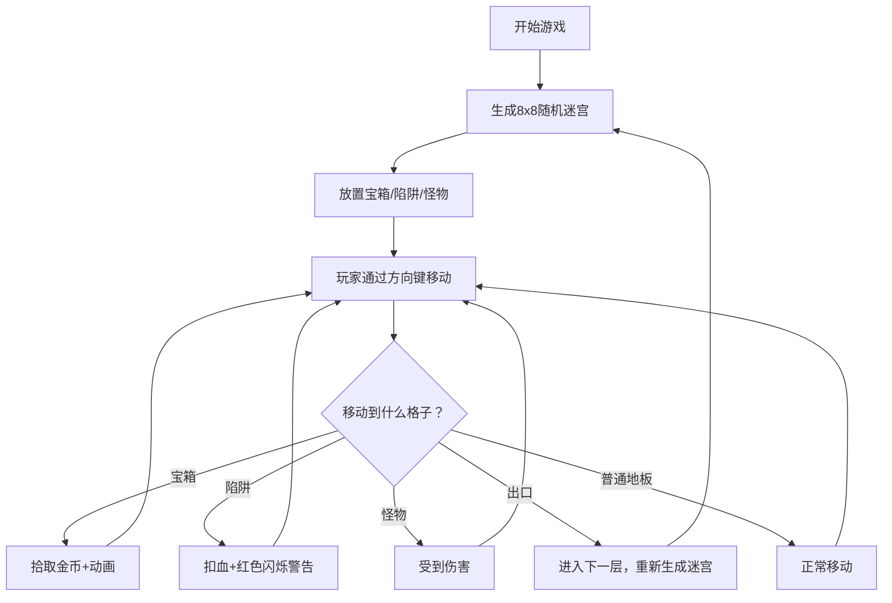

## 1. 产品概述

「像素遗迹」是一款复古像素风格的地下城探险网页游戏。玩家操作像素冒险者在程序生成的8x8网格迷宫中探索，收集宝箱、避开陷阱、击败怪物，逐层深入遗迹。

- 核心玩法：回合制格子移动，随机生成迷宫，收集与探索
- 目标用户：喜欢休闲像素游戏的网页玩家
- 产品价值：提供轻量化、易上手的地牢探险体验

## 2. 核心功能

### 2.1 功能模块

1. **游戏主界面**：8x8 迷宫地图、角色、怪物、宝箱、陷阱渲染
2. **玩家控制系统**：方向键移动，边界与碰撞检测
3. **迷宫生成系统**：DFS 递归回溯算法随机生成迷宫
4. **怪物 AI 系统**：巡逻移动 + 玩家靠近时追逐
5. **宝箱系统**：自动拾取 + 金币飘字动画
6. **陷阱系统**：伤害检测 + 红色闪烁警告
7. **计分与状态系统**：金币数、当前层数、生命值
8. **消息提示系统**：底部消息栏淡入淡出动画

### 2.2 页面详情

| 页面名称 | 模块名称 | 功能描述 |
|-----------|-------------|---------------------|
| 游戏主界面 | 迷宫地图 | 8x8 CSS Grid 网格，石墙/地板/出口随机生成 |
| 游戏主界面 | 角色系统 | 像素风格冒险者，方向键控制移动 |
| 游戏主界面 | 怪物系统 | 史莱姆/骷髅怪物，巡逻+追逐AI |
| 游戏主界面 | 宝箱系统 | 3-5个随机分布，拾取金币飘向计分板 |
| 游戏主界面 | 陷阱系统 | 尖刺/火焰陷阱，踩中扣血+红色闪烁 |
| 游戏主界面 | 计分板 | 左上角显示金币数和当前层数 |
| 游戏主界面 | 消息栏 | 底部显示游戏提示文字 |
| 游戏主界面 | 控制按钮 | 开始/重新开始按钮 |

## 3. 核心流程

玩家进入游戏 → 生成随机迷宫 → 使用方向键移动角色 → 探索迷宫收集宝箱 → 避开陷阱和怪物 → 找到出口进入下一层 → 层数增加，难度提升

## 4. 用户界面设计

### 4.1 设计风格

- **整体风格**：复古像素风 (Retro Pixel Art)
- **主色调**：深蓝黑渐变背景 (#0f0c29 → #302b63)
- **强调色**：金色（宝箱、出口）、红色（伤害、警告）、绿色（生命值）
- **字体**：Press Start 2P (Google Fonts) 像素字体
- **按钮风格**：4px 厚边框，8px 圆角，点击时 scale(0.95) 按压效果
- **地图网格**：1px 浅灰色虚线

### 4.2 页面设计概述

| 页面名称 | 模块名称 | UI 元素 |
|-----------|-------------|----------|
| 游戏主界面 | 背景 | 深蓝黑垂直渐变 |
| 游戏主界面 | 迷宫地图 | 8x8 CSS Grid，石墙/地板纹理 |
| 游戏主界面 | 角色精灵 | 32x32px 像素冒险者，CSS 绘制 |
| 游戏主界面 | 怪物精灵 | 32x32px 史莱姆/骷髅，CSS 绘制 |
| 游戏主界面 | 宝箱 | 金色宝箱，开盖动画 |
| 游戏主界面 | 计分板 | 左上角，金币图标+数字，层数显示 |
| 游戏主界面 | 消息栏 | 底部，淡入淡出文字提示 |
| 游戏主界面 | 控制按钮 | 开始/重玩，像素风格按钮 |

### 4.3 响应式设计

- 桌面端：地图居中显示，正常尺寸
- 移动端：地图宽度缩小至 96%，适配小屏
- 使用 CSS Grid + min-width 实现自适应
- 按钮和文字尺寸在移动端适当调整

### 4.4 动画效果

- **宝箱开启**：0.4秒弹跳+淡出，金币飘向计分板
- **伤害闪烁**：屏幕边缘红色边框，0.3秒两次闪烁
- **伤害飘字**：-1HP 红色数字向上飘动，1秒后消失
- **消息提示**：淡入0.2秒，停留1.5秒，淡出
- **按钮点击**：transform: scale(0.95)，0.1秒过渡
