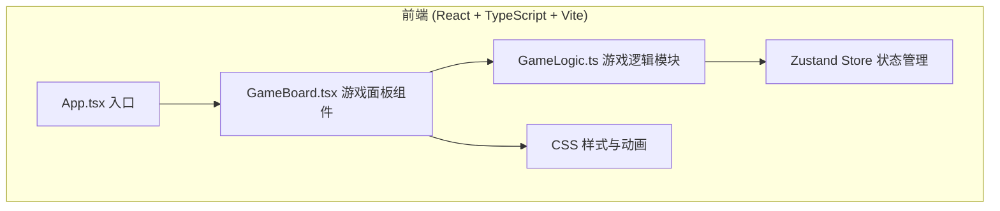

## 1. 架构设计



## 2. 技术说明

- **前端框架**：React 18 + TypeScript
- **构建工具**：Vite 5
- **状态管理**：Zustand
- **样式方案**：纯 CSS (CSS Modules / 内联样式结合 keyframes 动画)
- **字体**：Google Fonts - Press Start 2P
- **迷宫算法**：DFS 递归回溯算法

## 3. 目录结构

```
.
├── index.html              # 入口 HTML
├── package.json            # 项目依赖
├── vite.config.js          # Vite 配置
├── tsconfig.json           # TypeScript 配置
└── src/
    ├── main.tsx            # React 入口
    ├── App.tsx             # 根组件
    ├── index.css           # 全局样式
    ├── components/
    │   └── GameBoard.tsx   # 游戏面板组件
    ├── logic/
    │   └── GameLogic.ts    # 游戏逻辑与 Zustand store
    └── types/
        └── game.ts         # 类型定义
```

## 4. 状态管理 (Zustand)

### 4.1 GameState 类型

```typescript
interface Position {
  x: number;
  y: number;
}

type CellType = 'wall' | 'floor' | 'exit';
type TrapType = 'spike' | 'fire';
type MonsterType = 'slime' | 'skeleton';

interface Monster {
  id: number;
  position: Position;
  type: MonsterType;
  patrolPath: Position[];
  patrolIndex: number;
  isChasing: boolean;
}

interface Chest {
  id: number;
  position: Position;
  collected: boolean;
}

interface Trap {
  id: number;
  position: Position;
  type: TrapType;
}

interface GameState {
  maze: CellType[][];           // 8x8 迷宫地图
  player: Position;             // 玩家位置
  playerHP: number;             // 玩家生命值
  coins: number;                // 金币数量
  floor: number;                // 当前层数
  monsters: Monster[];          // 怪物列表
  chests: Chest[];              // 宝箱列表
  traps: Trap[];                // 陷阱列表
  message: string;              // 底部消息
  isDamageFlash: boolean;       // 是否显示伤害闪烁
  gameStatus: 'idle' | 'playing' | 'gameover';
  
  // Actions
  initGame: () => void;
  movePlayer: (dx: number, dy: number) => void;
  nextFloor: () => void;
}
```

## 5. 核心模块说明

### 5.1 迷宫生成 (GameLogic.ts)
- 使用 DFS 递归回溯算法生成完美迷宫
- 8x8 网格，确保起点到出口可达
- 随机放置宝箱(3-5个)、陷阱(2-3个)、怪物(2-3个)

### 5.2 角色移动 (GameLogic.ts)
- 边界检测：不能移出地图范围
- 碰撞检测：不能穿过石墙
- 拾取检测：移动到宝箱格自动拾取
- 伤害检测：移动到陷阱格扣血
- 出口检测：移动到出口进入下一层

### 5.3 怪物 AI (GameLogic.ts)
- 巡逻模式：按预设路径来回移动
- 追逐模式：玩家在相邻格时转向追逐
- 每3帧移动一次，控制移动速度

### 5.4 渲染层 (GameBoard.tsx)
- 使用 CSS Grid 渲染 8x8 网格
- 订阅 Zustand store 获取游戏状态
- CSS 绘制像素精灵和地图元素
- CSS keyframes 实现各种动画效果

## 6. 性能指标

- 迷宫生成时间：< 16ms
- 角色移动响应：< 16ms
- 渲染帧率：60 FPS
- 使用 React.memo 优化重渲染
- Zustand 选择器避免不必要的订阅
