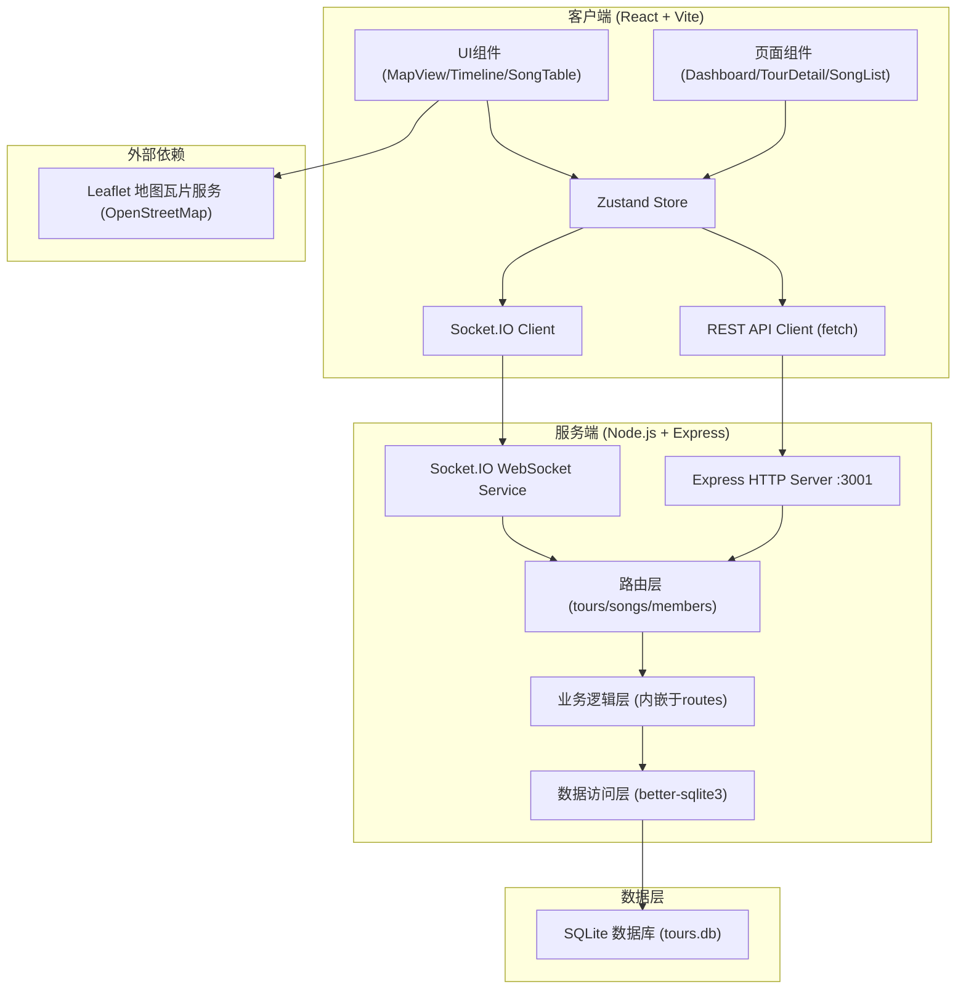
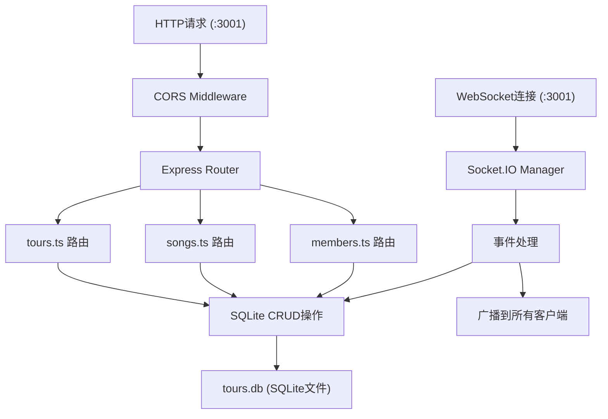
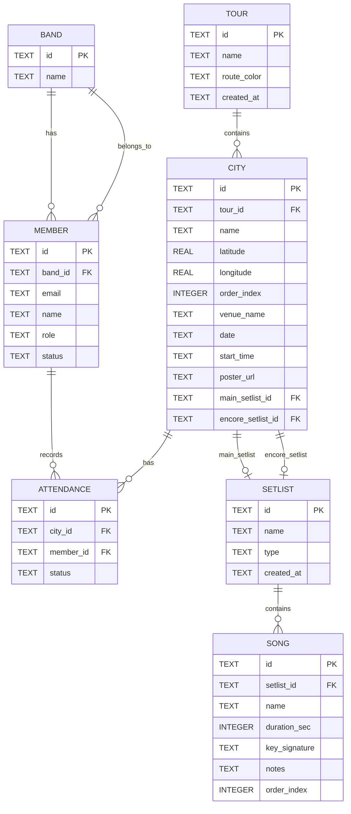

## 1. 架构设计



## 2. 技术说明

- **前端**：React@18 + TypeScript@5 + Vite@5 + Zustand@4 + react-router-dom@6 + react-leaflet@4 + socket.io-client@4
- **构建工具**：Vite 5（@vitejs/plugin-react），CSS模块 + 原生CSS变量
- **后端**：Express@4 + TypeScript@5 + better-sqlite3@9 + Socket.IO@4 + uuid@9 + cors@2
- **数据库**：SQLite（better-sqlite3驱动，文件存储于 `server/data/tours.db`）
- **通信方式**：RESTful API（数据CRUD）+ WebSocket/Socket.IO（排期状态实时同步）
- **地图**：Leaflet + react-leaflet，瓦片服务使用 OpenStreetMap 公共瓦片

## 3. 路由定义

| 前端路由 | 用途 |
|----------|------|
| `/` | 成员仪表盘首页（Dashboard） |
| `/tour/:id` | 巡演路线编辑/详情页（TourDetail） |
| `/songs` | 歌单管理页面（SongSetlists） |
| `/settings` | 成员个人设置页 |

| 后端API路由 | 方法 | 用途 |
|-------------|------|------|
| `/api/tours` | GET | 获取所有巡演列表 |
| `/api/tours` | POST | 创建新巡演 |
| `/api/tours/:id` | GET | 获取巡演详情 |
| `/api/tours/:id` | PUT | 更新巡演基本信息 |
| `/api/tours/:id` | DELETE | 删除巡演 |
| `/api/tours/:id/cities` | POST | 添加城市节点 |
| `/api/tours/:id/cities/:cid` | PUT | 更新城市场次信息 |
| `/api/tours/:id/cities/:cid` | DELETE | 删除城市节点 |
| `/api/tours/:id/cities/:cid/setlist` | PUT | 绑定歌单到场次 |
| `/api/songs/setlists` | GET | 获取所有歌单 |
| `/api/songs/setlists` | POST | 创建新歌单 |
| `/api/songs/setlists/:sid` | PUT | 更新歌单信息 |
| `/api/songs/setlists/:sid` | DELETE | 删除歌单 |
| `/api/songs/setlists/:sid/songs` | GET | 获取歌单歌曲 |
| `/api/songs/setlists/:sid/songs` | POST | 向歌单添加歌曲 |
| `/api/songs/setlists/:sid/songs/reorder` | PUT | 重新排序歌曲 |
| `/api/songs/:songId` | PUT | 更新歌曲信息 |
| `/api/songs/:songId` | DELETE | 删除歌曲 |
| `/api/members` | GET | 获取乐队所有成员 |
| `/api/members/invite` | POST | 邀请新成员（邮箱） |
| `/api/members/:mid` | PUT | 更新成员角色/状态 |
| `/api/members/:mid/schedule` | GET | 获取成员排期状态 |
| `/api/tours/:id/cities/:cid/attendance` | GET | 获取场次成员出席状态 |
| `/api/tours/:id/cities/:cid/attendance/:mid` | PUT | 更新成员出席状态 |

## 4. Socket.IO 事件定义

| 事件名 | 方向 | 载荷 | 说明 |
|--------|------|------|------|
| `attendance:update` | Client → Server | `{tourId, cityId, memberId, status}` | 成员更新出席状态 |
| `attendance:changed` | Server → All Clients | `{tourId, cityId, memberId, status}` | 广播出席状态变更 |
| `tour:updated` | Server → All Clients | `{tourId}` | 巡演数据更新通知 |
| `setlist:updated` | Server → All Clients | `{setlistId}` | 歌单数据更新通知 |

## 5. 服务端架构



服务端启动入口 `server/src/index.ts` 负责：
1. 初始化SQLite数据库（建表、初始数据）
2. 创建Express App并挂载路由
3. 创建HTTP Server并挂载Socket.IO
4. 启动服务监听3001端口

## 6. 数据模型

### 6.1 ER图



### 6.2 DDL语句

```sql
CREATE TABLE IF NOT EXISTS bands (
  id TEXT PRIMARY KEY,
  name TEXT NOT NULL
);

CREATE TABLE IF NOT EXISTS tours (
  id TEXT PRIMARY KEY,
  name TEXT NOT NULL,
  route_color TEXT DEFAULT '#9b59b6',
  band_id TEXT REFERENCES bands(id),
  created_at TEXT DEFAULT CURRENT_TIMESTAMP
);

CREATE TABLE IF NOT EXISTS cities (
  id TEXT PRIMARY KEY,
  tour_id TEXT NOT NULL REFERENCES tours(id) ON DELETE CASCADE,
  name TEXT NOT NULL,
  latitude REAL NOT NULL,
  longitude REAL NOT NULL,
  order_index INTEGER NOT NULL,
  venue_name TEXT,
  date TEXT,
  start_time TEXT,
  poster_url TEXT,
  main_setlist_id TEXT REFERENCES setlists(id),
  encore_setlist_id TEXT REFERENCES setlists(id)
);

CREATE TABLE IF NOT EXISTS setlists (
  id TEXT PRIMARY KEY,
  name TEXT NOT NULL,
  type TEXT NOT NULL CHECK(type IN ('main','encore')),
  band_id TEXT REFERENCES bands(id),
  created_at TEXT DEFAULT CURRENT_TIMESTAMP
);

CREATE TABLE IF NOT EXISTS songs (
  id TEXT PRIMARY KEY,
  setlist_id TEXT NOT NULL REFERENCES setlists(id) ON DELETE CASCADE,
  name TEXT NOT NULL,
  duration_sec INTEGER NOT NULL,
  key_signature TEXT,
  notes TEXT,
  order_index INTEGER NOT NULL
);

CREATE TABLE IF NOT EXISTS members (
  id TEXT PRIMARY KEY,
  band_id TEXT REFERENCES bands(id),
  email TEXT UNIQUE NOT NULL,
  name TEXT NOT NULL,
  role TEXT CHECK(role IN ('主唱','吉他','贝斯','鼓','键盘','其他')),
  status TEXT DEFAULT '活跃' CHECK(status IN ('活跃','休息中'))
);

CREATE TABLE IF NOT EXISTS attendance (
  id TEXT PRIMARY KEY,
  city_id TEXT NOT NULL REFERENCES cities(id) ON DELETE CASCADE,
  member_id TEXT NOT NULL REFERENCES members(id) ON DELETE CASCADE,
  status TEXT DEFAULT '待定' CHECK(status IN ('参加','不参加','待定')),
  UNIQUE(city_id, member_id)
);

CREATE INDEX IF NOT EXISTS idx_cities_tour ON cities(tour_id);
CREATE INDEX IF NOT EXISTS idx_songs_setlist ON songs(setlist_id);
CREATE INDEX IF NOT EXISTS idx_attendance_city ON attendance(city_id);
CREATE INDEX IF NOT EXISTS idx_members_band ON members(band_id);
```

### 6.3 初始演示数据

服务端启动时自动插入一个默认乐队、示例成员、示例巡演和示例歌单，便于用户直接体验。

| 表 | 示例数据 |
|----|----------|
| bands | `{id: 'band-1', name: '极光乐队'}` |
| members | 5名成员（主唱/吉他/贝斯/鼓/键盘各1人） |
| tours | `{id: 'tour-1', name: '2026夏季全国巡演', route_color: '#9b59b6'}` |
| cities | 5个城市（北京→上海→广州→成都→武汉），含场地/日期信息 |
| setlists | 1个主歌单 + 1个安可歌单 |
| songs | 主歌单10首 + 安可歌单2首 |
| attendance | 各场次成员初始状态为"待定" |
