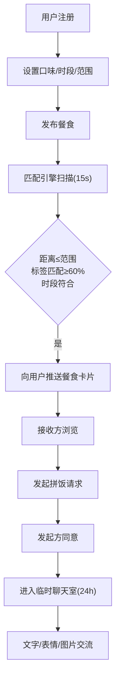

## 1. 产品概述

即时餐食速配分享平台是一款基于地理位置和口味偏好的邻里餐食共享应用，让用户上传自制餐食并与附近用户匹配，促成拼饭或交换试吃。

- 核心价值：解决独居人群用餐选择单一、外卖等待时间长、社区社交匮乏等痛点，通过邻里互助降低用餐成本，丰富饮食体验
- 目标用户：城市独居白领、家庭主妇、美食爱好者、退休人士等有做饭能力或用餐分享需求的人群

## 2. 核心功能

### 2.1 用户角色

| 角色 | 注册方式 | 核心权限 |
|------|----------|----------|
| 普通用户 | 手机号/用户名注册 | 发布餐食、匹配推荐、发起拼饭、聊天室交流 |

### 2.2 功能模块

1. **首页地图页**：餐食标记地图、位置显示、匹配推荐卡片
2. **发布餐食页**：菜名输入、口味标签选择、图片上传、数量/有效期设置
3. **匹配列表页**：推荐餐食列表、懒加载、下拉刷新、点赞评论
4. **消息页**：拼饭请求通知、临时聊天室、气泡对话
5. **个人中心页**：资料编辑、口味偏好设置、配送范围设置

### 2.3 页面详情

| 页面名称 | 模块名称 | 功能描述 |
|-----------|-------------|---------------------|
| 首页地图 | 地图视图 | 基于Leaflet显示用户位置和餐食标记，缩放点击交互 |
| 首页地图 | 推荐卡片浮层 | 显示匹配度最高的餐食卡片，支持滑动切换 |
| 发布餐食 | 图片上传 | 支持1-3张图片预览裁剪，自动压缩 |
| 发布餐食 | 标签选择 | 最多3个口味标签选择器 |
| 匹配列表 | 卡片列表 | 懒加载滚动、下拉刷新、点赞评论按钮 |
| 消息页 | 聊天列表 | 显示活跃聊天室、未读消息红点提示 |
| 消息页 | 聊天室 | 气泡对话、表情选择、图片发送、已读状态 |
| 个人中心 | 偏好设置 | 辣度、菜系、忌口多选、时段选择 |
| 个人中心 | 范围设置 | 1-5公里配送范围滑块 |

## 3. 核心流程

### 3.1 用户注册与设置流程
新用户注册 → 填写基本信息 → 设置口味偏好 → 设置可用时段 → 设置配送范围 → 上传头像 → 进入首页

### 3.2 餐食发布与匹配流程
用户进入发布页 → 填写菜名 → 选择口味标签 → 上传并裁剪图片 → 设置分享数量 → 设置有效期(30-60分钟) → 提交发布 → 匹配引擎每15秒扫描 → 计算距离和口味相似度 → 向符合条件用户推送通知

### 3.3 拼饭请求与交流流程
接收方浏览匹配卡片 → 点赞/评论/发起拼饭请求 → 发起方收到请求 → 同意请求 → 双方进入临时聊天室(24小时有效) → 发送文字/表情/图片 → 显示已读状态

## 4. 用户界面设计

### 4.1 设计风格

- **主色调**：橙黄色 (#FFB347) 到 浅珊瑚红 (#FF8A80) 渐变色
- **背景色**：白色 (#FFFFFF) + 浅灰色卡片背景 (#F8F9FA)
- **按钮样式**：圆角胶囊按钮，橙黄到浅珊瑚红线性渐变，hover时加深，点击时有缩放回弹动画
- **字体**：标题使用 "Nunito Sans" 字重700，正文使用 "Nunito Sans" 字重400-600
- **布局风格**：卡片式布局，圆角12-16px，微弱阴影 (0 2px 8px rgba(255,140,66,0.12))
- **图标风格**：Lucide React 线性图标，与主色调一致

### 4.2 页面设计概览

| 页面名称 | 模块名称 | UI元素 |
|-----------|-------------|-------------|
| 首页地图 | 地图容器 | 浅色调Leaflet地图，橙黄色标记点，点击弹出餐食预览 |
| 首页地图 | 底部卡片 | 圆角卡片，左侧缩略图，右侧菜名+标签+距离，淡入动画 |
| 发布餐食 | 图片区 | 虚线上传框，拖拽高亮，裁剪框带网格线 |
| 匹配列表 | 卡片组 | 交错淡入动画，悬浮上浮效果，点击缩放回弹 |
| 消息页 | 聊天气泡 | 左侧灰色对方气泡，右侧渐变己方气泡，时间戳淡灰色 |
| 消息页 | 输入区 | 圆角输入框，表情选择面板弹出动画 |
| 个人中心 | 设置表单 | 分组卡片，切换开关，范围滑块带刻度 |

### 4.3 响应式设计

- **桌面端(≥1024px)**：双栏布局，左侧地图/列表占65%，右侧详情/聊天占35%
- **平板端(768-1023px)**：单栏布局，底部标签栏导航，卡片两列网格
- **移动端(<768px)**：单栏全屏，底部导航，单列卡片列表，触摸优化目标尺寸≥44px
- **所有断点**：触控区域最小44×44px，关键操作按钮尺寸≥48×48px

### 4.4 动效规范

- **页面切换**：淡入 + 轻微Y轴位移(8px)，时长200ms
- **卡片点击**：scale(0.97) → scale(1)回弹，时长150ms ease-out
- **消息接收**：气泡从底部滑入 + 淡入，时长180ms
- **通知弹出**：从顶部滑入 + 轻微弹跳，时长300ms
- **图片加载**：模糊占位 → 清晰过渡，时长400ms
