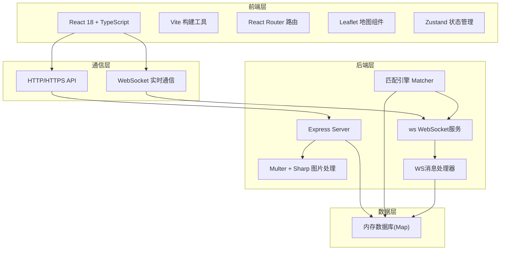
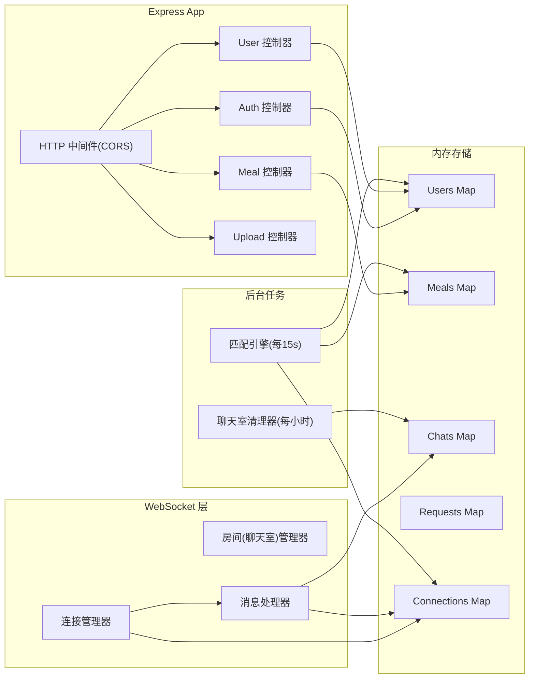
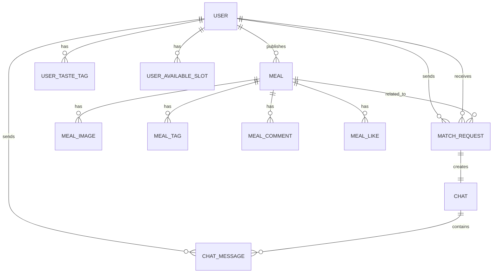

## 1. 架构设计



## 2. 技术说明

- **前端框架**：React 18 + TypeScript 5，严格模式开启
- **构建工具**：Vite 5 + @vitejs/plugin-react
- **路由管理**：React Router DOM v6
- **地图服务**：Leaflet 1.9 + react-leaflet
- **状态管理**：Zustand 4
- **后端框架**：Express 4 + TypeScript
- **实时通信**：ws 库 (WebSocket)
- **图片处理**：Multer (上传) + Sharp (压缩裁剪)
- **数据库**：内存 Map 存储（无持久化）
- **UI样式**：Tailwind CSS 3 + 自定义CSS变量

## 3. 路由定义

| 前端路由 | 页面组件 | 用途 |
|----------|----------|------|
| / | MapPage | 首页地图，展示餐食标记和推荐卡片 |
| /publish | PublishPage | 发布餐食页面 |
| /matches | MatchesPage | 匹配列表页，懒加载和下拉刷新 |
| /messages | MessagesPage | 消息列表页 |
| /messages/:chatId | ChatRoomPage | 临时聊天室页面 |
| /profile | ProfilePage | 个人中心，偏好设置 |
| /login | LoginPage | 用户登录注册页 |

| 后端API | 方法 | 用途 |
|----------|------|------|
| /api/auth/register | POST | 用户注册 |
| /api/auth/login | POST | 用户登录 |
| /api/users/:id | GET/PUT | 获取/更新用户资料 |
| /api/meals | POST | 发布餐食 |
| /api/meals | GET | 获取餐食列表 |
| /api/meals/:id | GET | 获取餐食详情 |
| /api/meals/:id/like | POST | 点赞餐食 |
| /api/meals/:id/comment | POST | 评论餐食 |
| /api/match-requests | POST | 发起拼饭请求 |
| /api/match-requests/:id/accept | POST | 接受拼饭请求 |
| /api/upload | POST | 上传图片 |

## 4. WebSocket 消息协议

### 4.1 客户端 → 服务端消息

```typescript
type WSClientMessage =
  | { type: 'CONNECT_USER'; userId: string }
  | { type: 'JOIN_CHAT'; chatId: string; userId: string }
  | { type: 'SEND_MESSAGE'; chatId: string; senderId: string; content: MessageContent }
  | { type: 'MARK_READ'; chatId: string; userId: string; messageId: string }
  | { type: 'LEAVE_CHAT'; chatId: string; userId: string }
```

### 4.2 服务端 → 客户端消息

```typescript
type WSServerMessage =
  | { type: 'MEAL_PUSH'; meal: MealWithUser; matchScore: number }
  | { type: 'NEW_MESSAGE'; chatId: string; message: ChatMessage }
  | { type: 'MESSAGE_READ'; chatId: string; messageId: string; readerId: string }
  | { type: 'MATCH_REQUEST'; request: MatchRequest }
  | { type: 'REQUEST_ACCEPTED'; chatId: string; partner: User }
  | { type: 'NOTIFICATION'; title: string; body: string }
```

## 5. 服务器架构图



## 6. 数据模型

### 6.1 ER 图



### 6.2 TypeScript 类型定义

```typescript
interface User {
  id: string;
  username: string;
  password: string;
  avatar: string;
  bio: string;
  location: { lat: number; lng: number };
  tastePrefs: {
    spiciness: 0 | 1 | 2 | 3;
    cuisines: string[];
    restrictions: string[];
  };
  availableSlots: ('breakfast' | 'lunch' | 'dinner' | 'supper')[];
  deliveryRadius: number;
  createdAt: number;
}

interface Meal {
  id: string;
  publisherId: string;
  name: string;
  description: string;
  tags: string[];
  images: string[];
  servings: number;
  remainingServings: number;
  location: { lat: number; lng: number };
  address: string;
  mealTime: 'breakfast' | 'lunch' | 'dinner' | 'supper';
  expiresAt: number;
  createdAt: number;
  likes: string[];
  comments: MealComment[];
}

interface MealComment {
  id: string;
  userId: string;
  content: string;
  createdAt: number;
}

interface MatchRequest {
  id: string;
  requesterId: string;
  receiverId: string;
  mealId: string;
  status: 'pending' | 'accepted' | 'rejected';
  createdAt: number;
}

interface Chat {
  id: string;
  requestId: string;
  participants: string[];
  expiresAt: number;
  messages: ChatMessage[];
}

interface ChatMessage {
  id: string;
  senderId: string;
  type: 'text' | 'emoji' | 'image';
  content: string;
  createdAt: number;
  readBy: string[];
}
```
