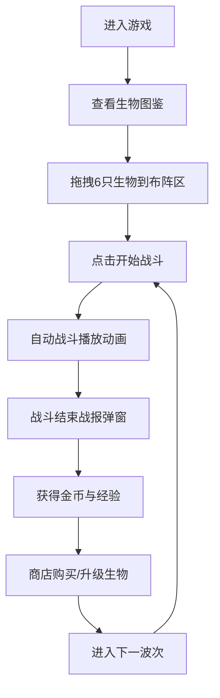

# 魔法生物军团对战策略游戏 - 产品需求文档

## 1. 产品概述
魔法生物军团是一款基于浏览器的轻量级自走棋策略游戏，玩家从生物图鉴中选取魔法生物组建军团，通过策略布阵和技能搭配与AI敌人进行自动对战。
- 解决传统自走棋游戏依赖客户端、缺乏轻量级网页版的问题
- 支持玩家自定义生物技能组合，提升策略深度
- 目标用户：休闲策略游戏爱好者、网页游戏玩家

## 2. 核心功能

### 2.1 用户角色
| 角色 | 注册方式 | 核心权限 |
|------|----------|----------|
| 玩家 | 直接进入 | 组建军团、布阵对战、商店购买、波次挑战 |

### 2.2 功能模块
1. **生物图鉴**：展示所有可收集的魔法生物及其属性技能
2. **布阵系统**：拖拽生物到6格棋盘布阵，支持查看详细属性
3. **战斗系统**：自动回合制战斗，技能特效动画，血条平滑变化
4. **商店系统**：刷新购买生物、升级生物、装备技能
5. **波次挑战**：递进难度的敌人波次，金币经验奖励
6. **战报系统**：战斗结束展示详细战报

### 2.3 页面详情
| 页面名称 | 模块名称 | 功能描述 |
|-----------|-------------|---------------------|
| 主界面 | 生物图鉴 | 展示9种魔法生物，支持拖拽选取 |
| 主界面 | 布阵战场 | 6格棋盘网格，拖拽放置生物，悬停高亮 |
| 主界面 | 战斗控制 | 开始战斗按钮，波次信息显示 |
| 主界面 | 商店面板 | 生物商品网格，购买/升级/刷新功能 |
| 主界面 | 战报弹窗 | 缩放淡入动画，展示战斗结果 |
| 主界面 | 玩家信息 | 金币、等级、经验、技能槽位显示 |

## 3. 核心流程
玩家进入游戏后，从生物图鉴中选择6种生物拖拽到布阵区，点击开始战斗后与AI敌人自动对战。战胜后获得金币和经验，可在商店购买或升级生物，解锁技能槽位。随着波次递增，敌人难度逐渐提升。

## 4. 用户界面设计

### 4.1 设计风格
- **主色调**：深空蓝紫渐变背景，暗色奇幻主题
- **我方阵营**：冰蓝色渐变卡片，蓝色辉光横幅
- **敌方阵营**：暗红色渐变卡片，红色辉光横幅
- **商店**：暖金色调卡片，圆形发光购买按钮
- **网格线**：银灰色发光线，悬停白色填充
- **字体**：使用奇幻风格衬线字体作为标题，现代无衬线字体作为正文
- **动画**：悬停放大、点击压弹、弹窗淡入淡出、技能特效、屏幕震动

### 4.2 页面设计概述
| 页面名称 | 模块名称 | UI元素 |
|-----------|-------------|-------------|
| 主界面 | 生物图鉴 | 卡片式布局，头像+名称+系别标识，拖拽半透明残影 |
| 主界面 | 布阵战场 | 6格棋盘网格，银灰色发光边线，生物头像+血条 |
| 主界面 | 战斗特效 | 火焰爆裂、冰晶碎裂、暗影爆散等粒子动画 |
| 主界面 | 商店面板 | 暖金卡片网格，圆形发光按钮，闪烁购买动画 |
| 主界面 | 战报弹窗 | 0.5秒缩放淡入，双方剩余生物、总伤害、金币收益 |
| 主界面 | 属性面板 | 点击生物弹出，详细属性和技能说明 |

### 4.3 响应式
- 桌面优先设计，适配1920x1080及以上分辨率
- 使用相对单位和弹性布局，支持中等屏幕缩放
- 关键交互区域保证最小点击尺寸

### 4.4 性能要求
- 浏览器运行FPS不低于45
- 战斗动画和特效播放期间无明显掉帧
- 使用CSS动画和transform优化渲染性能
