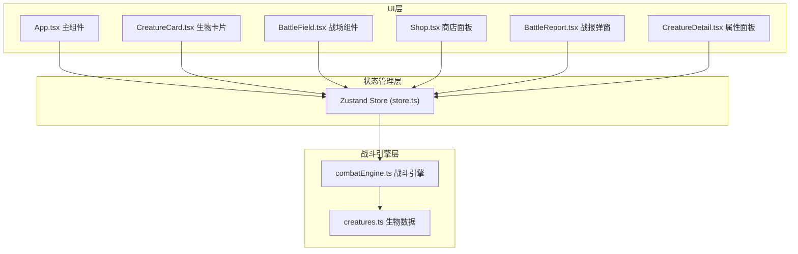

# 魔法生物军团对战策略游戏 - 技术架构文档

## 1. 架构设计



## 2. 技术描述
- **前端框架**：React 18 + TypeScript
- **构建工具**：Vite
- **状态管理**：Zustand
- **样式方案**：CSS Modules + 内联样式动画
- **动画实现**：CSS transitions/animations + requestAnimationFrame
- **图标方案**：Emoji + CSS渐变实现生物头像

## 3. 核心模块划分

### 3.1 战斗引擎模块 (src/combatEngine.ts)
- 生物属性计算
- 技能触发与冷却
- 伤害结算公式
- AI行为决策
- 战斗回合管理
- 战斗结果导出

### 3.2 UI交互模块
- **CreatureCard**：可拖拽生物卡片，展示头像、血条、悬停详情
- **BattleField**：6格棋盘布阵区，处理拖拽放置、战斗动画
- **Shop**：商店面板，网格卡片展示，购买/升级/刷新
- **BattleReport**：战报弹窗，缩放淡入动画
- **CreatureDetail**：生物属性详情面板

### 3.3 状态管理 (src/store.ts)
- 玩家队伍阵容
- 金币、等级、经验
- 当前波次
- 战场状态
- 商店商品列表
- 战斗结果数据

## 4. 数据模型

### 4.1 生物数据模型
```typescript
interface Skill {
  id: string;
  name: string;
  description: string;
  type: 'active' | 'passive';
  damage: number;
  cooldown: number;
  range: number;
  effect?: 'burn' | 'freeze' | 'poison' | 'heal' | 'buff' | 'debuff';
  effectValue?: number;
  effectDuration?: number;
}

interface Creature {
  id: string;
  name: string;
  element: 'fire' | 'ice' | 'thunder' | 'dark' | 'light' | 'wind' | 'earth' | 'water' | 'poison';
  maxHp: number;
  currentHp: number;
  attack: number;
  defense: number;
  speed: number;
  level: number;
  mainSkill: Skill;
  passiveSkill: Skill;
  equippedSkills: Skill[];
  position?: number;
  isEnemy?: boolean;
}
```

### 4.2 战斗结果模型
```typescript
interface BattleResult {
  victory: boolean;
  remainingAllies: Creature[];
  remainingEnemies: Creature[];
  totalDamageDealt: number;
  totalDamageTaken: number;
  goldReward: number;
  expReward: number;
  battleLog: BattleLogEntry[];
}
```

## 5. 文件结构
```
src/
├── creatures.ts          # 生物数据定义与技能配置
├── combatEngine.ts       # 战斗核心逻辑引擎
├── store.ts              # Zustand状态管理
├── App.tsx               # 主应用组件
├── index.css             # 全局样式
├── main.tsx              # 入口文件
└── components/
    ├── CreatureCard.tsx  # 生物卡片组件
    ├── BattleField.tsx   # 战场布阵组件
    ├── Shop.tsx          # 商店面板组件
    ├── BattleReport.tsx  # 战报弹窗组件
    └── CreatureDetail.tsx # 生物详情面板
```

## 6. 性能优化策略
- 使用 CSS transform 和 opacity 实现动画，触发 GPU 加速
- 战斗特效使用 requestAnimationFrame 控制帧率
- 避免频繁重排，使用绝对定位和 transform
- 状态更新批量处理，减少 React 重渲染
- 生物卡片使用 React.memo 优化
- CSS 变量统一管理颜色和动画参数
