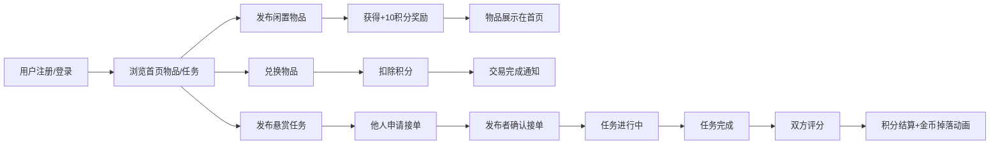

## 1. 产品概述

线上社区旧物交换与任务悬赏平台，通过积分互通机制促进社区互助。用户可发布闲置物品进行积分兑换，或发布悬赏任务寻求社区帮助，构建和谐互助的社区生态。

- 核心价值：盘活闲置资源、促进社区互助、建立信任机制
- 目标用户：社区居民、有闲置物品的用户、需要帮助的用户

## 2. 核心 Features

### 2.1 用户角色

| 角色 | 注册方式 | 核心权限 |
|------|----------|----------|
| 普通用户 | 用户名/密码注册 | 浏览物品、发布物品、发布任务、接取任务、积分交易、信誉评价 |

### 2.2 功能模块

1. **首页**：物品列表、任务列表、社区动态时间线、顶部横幅
2. **物品详情页**：物品放大图、详细描述、兑换按钮
3. **任务悬赏页**：任务列表、任务详情、接单功能
4. **个人主页**：积分展示、发布历史、交易记录、物品发布入口、信誉分展示
5. **用户认证**：注册、登录、JWT 鉴权

### 2.3 页面详情

| 页面名称 | 模块名称 | 功能描述 |
|-----------|-------------|---------------------|
| 首页 | 社区动态时间线 | 展示最近5条积分交易动态，新动态从右侧滑入 |
| 首页 | 物品卡片网格 | 4列响应式布局，悬停抬起效果，点击进入详情 |
| 首页 | 顶部横幅 | 渐变色背景，波浪动效 |
| 物品详情页 | 图片展示 | 放大图，图片预加载 |
| 物品详情页 | 兑换功能 | 积分扣除动画，物品入仓通知 |
| 物品发布页 | 发布表单 | 图片上传、名称、类别、描述，发布奖励+10积分 |
| 任务悬赏页 | 任务列表 | 按剩余时间倒序，即将截止任务脉动边框 |
| 任务详情页 | 接单功能 | 申请接单、确认完成、双方评分 |
| 个人主页 | 积分展示 | 积分余额，变化时浮动数字动画 |
| 个人主页 | 信誉分展示 | 信誉分变化颜色渐变动画 |
| 个人主页 | 发布历史 | 已发布物品和任务列表 |

## 3. 核心流程

## 4. 用户界面设计

### 4.1 设计风格

- **主色调**：灰蓝 #6A7C8F、暖米 #F5EFE6
- **辅助色**：浅蓝阴影、脉动红色边框
- **卡片背景**：纯白 #FFFFFF
- **文字颜色**：标题深灰 #333333、正文中灰 #666666
- **按钮风格**：灰蓝主色，圆角，悬停变深
- **字体**：优雅的无衬线字体，标题加粗，正文常规
- **布局风格**：卡片式网格布局，顶部导航栏
- **动画效果**：淡入过渡、悬停抬起、滑动进入、脉动边框、积分浮动动画

### 4.2 页面设计概述

| 页面名称 | 模块名称 | UI 元素 |
|-----------|-------------|-------------|
| 首页 | 顶部横幅 | 渐变色（灰蓝到浅灰）、波浪动效、毛玻璃导航栏 |
| 首页 | 社区动态 | 时间线布局、右侧滑入动画、淡入效果 |
| 首页 | 物品卡片 | 浅灰背景、圆角、悬停抬起6px、浅蓝阴影、网格布局 |
| 物品详情页 | 内容区 | 0.3秒淡入、放大图、积分扣除动画、入仓通知 |
| 个人主页 | 积分区域 | +10浮动数字动画、金币掉落动画 |
| 个人主页 | 信誉分 | 绿色上升/红色下降渐变动画 |
| 任务悬赏页 | 任务卡片 | 脉动红色边框（即将截止）、按时间倒序 |

### 4.3 响应式设计

- **桌面端**：4列卡片网格，完整导航栏
- **平板端**：2列卡片网格，简化导航
- **手机端**：单列卡片布局，汉堡菜单
- **所有页面**：0.3秒淡入过渡动画

## 5. 性能要求

- 首页列表加载时间 ≤ 1秒
- 物品详情页图片预加载
- 积分交易操作后数据刷新 ≤ 2秒
- 所有动画流畅不卡顿
