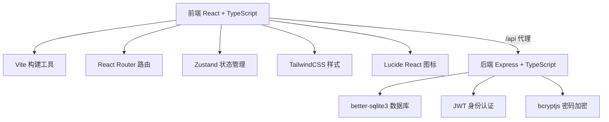
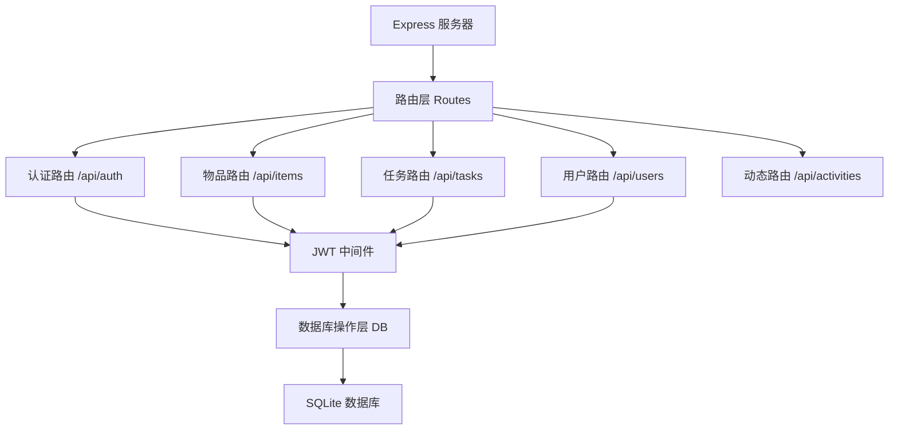

## 1. 架构设计



## 2. 技术栈说明

- **前端**：React 18 + TypeScript + Vite + React Router DOM + Zustand + TailwindCSS + Lucide React
- **后端**：Express 4 + TypeScript + better-sqlite3 + JWT + bcryptjs + uuid + cors
- **数据库**：SQLite (better-sqlite3)
- **构建工具**：Vite 5

## 3. 目录结构

```
auto73/
├── src/
│   ├── main.tsx              # React 入口
│   ├── App.tsx               # 路由配置
│   ├── index.css             # 全局样式
│   ├── components/           # 组件目录
│   │   ├── ItemCard.tsx      # 物品卡片
│   │   ├── TaskCard.tsx      # 任务卡片
│   │   ├── Profile.tsx       # 个人主页
│   │   ├── Navbar.tsx        # 导航栏
│   │   ├── ActivityFeed.tsx  # 社区动态
│   │   └── Modal.tsx         # 模态框组件
│   ├── pages/                # 页面目录
│   │   ├── Home.tsx          # 首页
│   │   ├── ItemDetail.tsx    # 物品详情
│   │   ├── Tasks.tsx         # 任务悬赏
│   │   ├── TaskDetail.tsx    # 任务详情
│   │   ├── Login.tsx         # 登录页
│   │   └── Register.tsx      # 注册页
│   ├── store/                # 状态管理
│   │   └── useStore.ts       # Zustand store
│   ├── utils/                # 工具函数
│   │   ├── api.ts            # API 封装
│   │   └── auth.ts           # 认证工具
│   ├── types/                # 类型定义
│   │   └── index.ts          # 共享类型
│   └── server/               # 后端代码
│       ├── index.ts          # Express 服务入口
│       ├── db.ts             # 数据库连接
│       ├── routes/           # 路由
│       │   ├── auth.ts       # 认证路由
│       │   ├── items.ts      # 物品路由
│       │   ├── tasks.ts      # 任务路由
│       │   └── users.ts      # 用户路由
│       └── middleware/       # 中间件
│           └── auth.ts       # JWT 认证中间件
├── package.json
├── vite.config.js
├── tsconfig.json
└── index.html
```

## 4. 路由定义

| 前端路由 | 页面 | 说明 |
|----------|------|------|
| / | Home | 首页，物品列表 + 社区动态 |
| /item/:id | ItemDetail | 物品详情页 |
| /tasks | Tasks | 任务悬赏列表 |
| /task/:id | TaskDetail | 任务详情页 |
| /profile | Profile | 个人主页 |
| /login | Login | 登录页 |
| /register | Register | 注册页 |

| API 路由 | 方法 | 说明 |
|----------|------|------|
| /api/auth/register | POST | 用户注册 |
| /api/auth/login | POST | 用户登录 |
| /api/items | GET | 获取物品列表 |
| /api/items | POST | 发布物品 |
| /api/items/:id | GET | 获取物品详情 |
| /api/items/:id/exchange | POST | 兑换物品 |
| /api/tasks | GET | 获取任务列表 |
| /api/tasks | POST | 发布任务 |
| /api/tasks/:id | GET | 获取任务详情 |
| /api/tasks/:id/apply | POST | 申请接单 |
| /api/tasks/:id/confirm | POST | 确认接单 |
| /api/tasks/:id/complete | POST | 完成任务并评分 |
| /api/users/me | GET | 获取当前用户信息 |
| /api/users/me/items | GET | 获取用户发布的物品 |
| /api/users/me/tasks | GET | 获取用户发布的任务 |
| /api/users/me/transactions | GET | 获取用户交易记录 |
| /api/activities | GET | 获取社区动态 |

## 5. API 类型定义

```typescript
// 用户类型
interface User {
  id: string;
  username: string;
  nickname: string;
  avatar: string;
  points: number;
  reputation: number;
  createdAt: string;
}

// 物品类型
interface Item {
  id: string;
  title: string;
  description: string;
  category: 'digital' | 'home' | 'books' | 'other';
  image: string;
  price: number;
  publisherId: string;
  publisher: User;
  status: 'available' | 'exchanged';
  createdAt: string;
}

// 任务类型
interface Task {
  id: string;
  title: string;
  description: string;
  reward: number;
  deadline: string;
  publisherId: string;
  publisher: User;
  accepterId: string | null;
  accepter: User | null;
  status: 'open' | 'in_progress' | 'completed' | 'cancelled';
  publisherRating: number | null;
  accepterRating: number | null;
  createdAt: string;
}

// 交易记录
interface Transaction {
  id: string;
  type: 'item_exchange' | 'task_reward' | 'publish_bonus';
  fromUserId: string;
  toUserId: string;
  amount: number;
  itemId: string | null;
  taskId: string | null;
  description: string;
  createdAt: string;
}

// 社区动态
interface Activity {
  id: string;
  type: 'exchange' | 'task_complete';
  description: string;
  createdAt: string;
}
```

## 6. 服务端架构



## 7. 数据模型

### 7.1 ER 图

```mermaid
erDiagram
    USER ||--o{ ITEM : publishes
    USER ||--o{ TASK : publishes
    USER ||--o{ TASK : accepts
    USER ||--o{ TRANSACTION : from
    USER ||--o{ TRANSACTION : to
    ITEM ||--o{ TRANSACTION : relates
    TASK ||--o{ TRANSACTION : relates

    USER {
        string id PK
        string username
        string password_hash
        string nickname
        string avatar
        int points
        int reputation
        datetime created_at
    }

    ITEM {
        string id PK
        string title
        string description
        string category
        string image
        int price
        string publisher_id FK
        string status
        datetime created_at
    }

    TASK {
        string id PK
        string title
        string description
        int reward
        datetime deadline
        string publisher_id FK
        string accepter_id FK
        string status
        int publisher_rating
        int accepter_rating
        datetime created_at
    }

    TRANSACTION {
        string id PK
        string type
        string from_user_id FK
        string to_user_id FK
        int amount
        string item_id FK
        string task_id FK
        string description
        datetime created_at
    }
```

### 7.2 DDL 语句

```sql
CREATE TABLE users (
  id TEXT PRIMARY KEY,
  username TEXT UNIQUE NOT NULL,
  password_hash TEXT NOT NULL,
  nickname TEXT NOT NULL,
  avatar TEXT DEFAULT '',
  points INTEGER DEFAULT 100,
  reputation INTEGER DEFAULT 100,
  created_at DATETIME DEFAULT CURRENT_TIMESTAMP
);

CREATE TABLE items (
  id TEXT PRIMARY KEY,
  title TEXT NOT NULL,
  description TEXT NOT NULL,
  category TEXT NOT NULL CHECK(category IN ('digital', 'home', 'books', 'other')),
  image TEXT NOT NULL,
  price INTEGER NOT NULL,
  publisher_id TEXT NOT NULL,
  status TEXT DEFAULT 'available' CHECK(status IN ('available', 'exchanged')),
  created_at DATETIME DEFAULT CURRENT_TIMESTAMP,
  FOREIGN KEY (publisher_id) REFERENCES users(id)
);

CREATE TABLE tasks (
  id TEXT PRIMARY KEY,
  title TEXT NOT NULL,
  description TEXT NOT NULL,
  reward INTEGER NOT NULL,
  deadline DATETIME NOT NULL,
  publisher_id TEXT NOT NULL,
  accepter_id TEXT,
  status TEXT DEFAULT 'open' CHECK(status IN ('open', 'in_progress', 'completed', 'cancelled')),
  publisher_rating INTEGER CHECK(publisher_rating BETWEEN 1 AND 5),
  accepter_rating INTEGER CHECK(accepter_rating BETWEEN 1 AND 5),
  created_at DATETIME DEFAULT CURRENT_TIMESTAMP,
  FOREIGN KEY (publisher_id) REFERENCES users(id),
  FOREIGN KEY (accepter_id) REFERENCES users(id)
);

CREATE TABLE transactions (
  id TEXT PRIMARY KEY,
  type TEXT NOT NULL CHECK(type IN ('item_exchange', 'task_reward', 'publish_bonus')),
  from_user_id TEXT NOT NULL,
  to_user_id TEXT NOT NULL,
  amount INTEGER NOT NULL,
  item_id TEXT,
  task_id TEXT,
  description TEXT NOT NULL,
  created_at DATETIME DEFAULT CURRENT_TIMESTAMP,
  FOREIGN KEY (from_user_id) REFERENCES users(id),
  FOREIGN KEY (to_user_id) REFERENCES users(id),
  FOREIGN KEY (item_id) REFERENCES items(id),
  FOREIGN KEY (task_id) REFERENCES tasks(id)
);

CREATE INDEX idx_items_status ON items(status);
CREATE INDEX idx_items_category ON items(category);
CREATE INDEX idx_tasks_status ON tasks(status);
CREATE INDEX idx_tasks_deadline ON tasks(deadline);
CREATE INDEX idx_transactions_user ON transactions(from_user_id, to_user_id);
```
