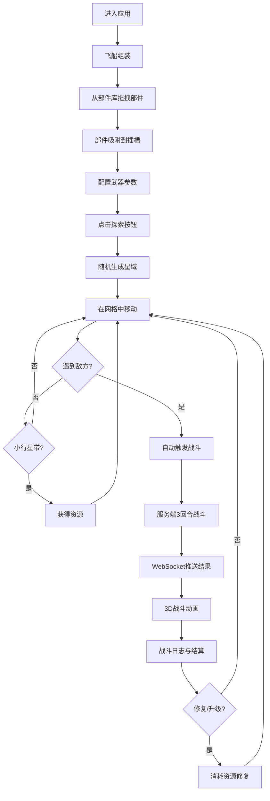

## 1. 产品概述

太空船组装与星域探险模拟应用——玩家在线拖拽部件组装飞船、配置武器系统，在随机生成的星域中与AI敌舰进行自动战斗。支持实时WebSocket通信同步飞船数据和战斗状态，3D可视化展示组装与战斗全过程。

- 目标用户：多人联机太空探险游戏玩家
- 核心价值：提供沉浸式飞船组装体验与策略性自动战斗模拟

## 2. 核心功能

### 2.1 用户角色
| 角色 | 注册方式 | 核心权限 |
|------|----------|----------|
| 玩家 | 直接进入 | 组装飞船、配置武器、探索星域、参与战斗、修复升级 |

### 2.2 功能模块
1. **飞船组装页面**：3D场景拖拽组装、部件库面板、武器配置面板
2. **星域探索页面**：4x4星域网格、飞船移动、事件触发
3. **战斗场景页面**：3D战斗动画、弹道可视化、伤害数字、战斗日志

### 2.3 页面详情
| 页面名称 | 模块名称 | 功能描述 |
|----------|----------|----------|
| 飞船组装 | 部件库面板 | 左侧面板展示4类12种部件，支持拖拽至3D场景 |
| 飞船组装 | 3D组装场景 | 中央3D场景展示飞船，部件吸附到对应插槽，实时外观更新 |
| 飞船组装 | 武器配置面板 | 点击武器部件弹出配置，设置射速/伤害/弹道颜色 |
| 星域探索 | 星域网格 | 4x4随机生成网格，含空域/小行星带/敌方飞船/资源点 |
| 星域探索 | 飞船移动 | 点击网格移动飞船，遇敌自动触发战斗 |
| 战斗场景 | 3D战斗动画 | 弹幕对射、弹道辉光尾迹、击中粒子爆炸、伤害数字飘字 |
| 战斗场景 | 战斗日志 | 虚拟滚动日志列表，每回合伤害统计 |
| 战后修复 | 修复升级面板 | 消耗资源修复/替换损失部件，显示资源余额 |

## 3. 核心流程

玩家进入应用后，首先在飞船组装页面从部件库拖拽部件到3D场景组装飞船，配置武器参数。组装完成后点击探索按钮，系统随机生成4x4星域网格。玩家在网格中移动飞船，遇到敌方飞船自动触发战斗。战斗由服务端计算3回合自动战斗，结果通过WebSocket推送，客户端用3D动画展示。战斗结束后显示日志，可消耗探索获得的资源修复或升级飞船。

## 4. 用户界面设计

### 4.1 设计风格
- 主色：深空蓝 `#0a0e27`
- 辅色：亮白 `#ffffff`、电光蓝 `#00d4ff`
- 强调色：战斗红 `#ff3366`、资源绿 `#33ff88`
- 按钮风格：发光边框效果（box-shadow glow）
- 字体：Orbitron（标题）、Rajdhani（正文）
- 布局：三栏网格（左侧面板 + 中央3D场景 + 右侧日志）
- 图标风格：科幻线条风格

### 4.2 页面设计概览
| 页面名称 | 模块名称 | UI元素 |
|----------|----------|--------|
| 飞船组装 | 部件库面板 | 深色半透明面板，部件卡片带呼吸光效，分类标签切换 |
| 飞船组装 | 3D组装场景 | 低多边形飞船模型，部件插槽高亮，拖拽半透明预览，放置脉冲光效 |
| 飞船组装 | 武器配置面板 | 浮层弹窗，滑块控件（射速/伤害），颜色选择器，保存按钮发光边框 |
| 星域探索 | 星域网格 | 4x4等距网格，每格图标+名称，当前飞船位置高亮 |
| 战斗场景 | 3D战斗动画 | 彩色弹道线+辉光尾迹，击中粒子爆炸，伤害数字上浮淡出 |
| 战斗场景 | 战斗日志 | 虚拟滚动列表，回合分隔标题，伤害/护盾数据高亮 |

### 4.3 响应式
- 桌面优先（≥1200px）：三栏网格布局
- 平板（768px-1199px）：两栏布局，日志面板折叠
- 手机（<768px）：3D场景缩小叠加在控制面板上方，面板切换使用0.4秒淡入淡出过渡

### 4.4 3D场景指导
- 环境/HDRI：深空星场背景，微弱星云雾效
- 灯光设置：环境光（深蓝色调）+ 定向光（冷白色）+ 点光源（部件呼吸光效）
- 相机：透视相机，组装场景可轨道控制旋转缩放，战斗场景固定跟随视角
- 构图：飞船居中，部件环绕，战斗场景双船对峙
- 交互：组装场景支持轨道控制，拖拽部件时高亮对应插槽
- 后处理：Bloom辉光效果（弹道、光效）
- 资源：低多边形几何体程序化生成，无外部模型依赖
- 性能预算：组装场景≥30FPS，战斗场景≥45FPS
