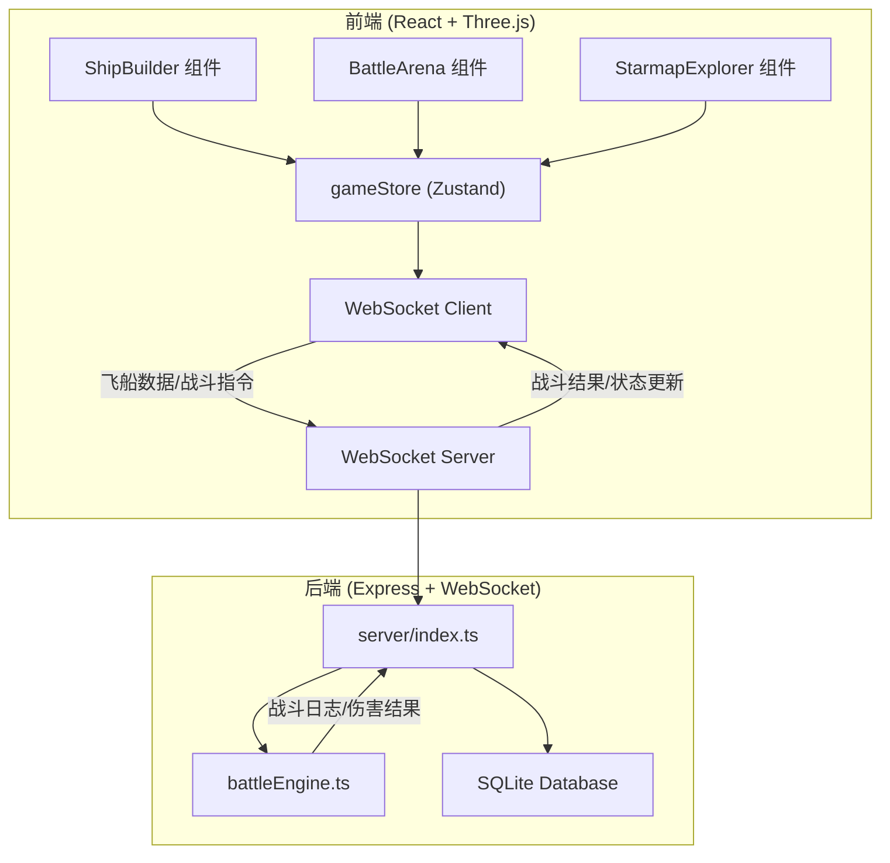
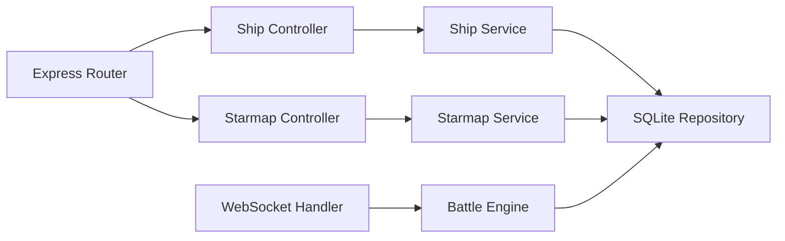
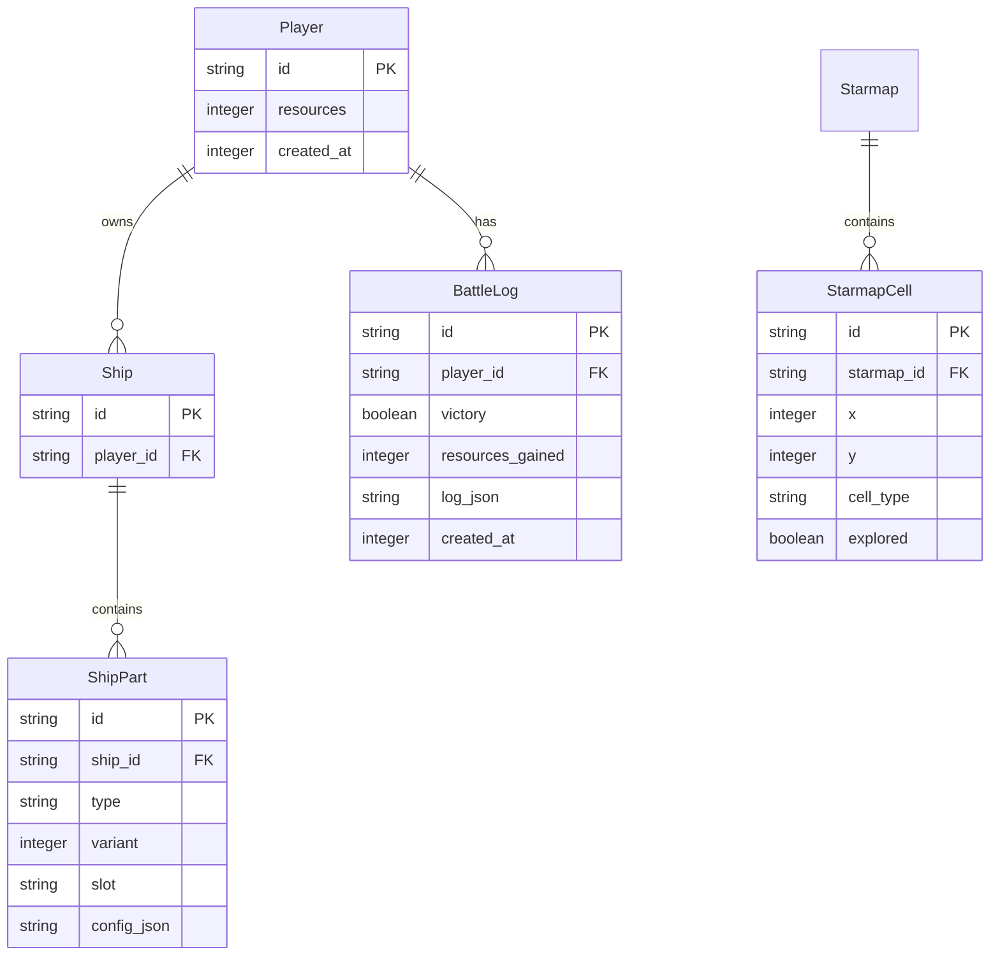

## 1. 架构设计



## 2. 技术说明
- 前端：React@18 + Three.js + @react-three/fiber + @react-three/drei + Zustand + Vite
- 初始化工具：vite-init (react-express-ts 模板)
- 后端：Express@4 + ws (WebSocket)
- 数据库：SQLite (better-sqlite3)
- 通信：WebSocket 实时双向通信

## 3. 路由定义
| 路由 | 用途 |
|------|------|
| / | 主页面，包含飞船组装、星域探索、战斗场景 |

## 4. API定义

### 4.1 WebSocket消息类型

```typescript
interface ShipPart {
  id: string;
  type: 'hull' | 'engine' | 'shield' | 'weapon';
  variant: number;
  slot: string;
  config?: WeaponConfig;
}

interface WeaponConfig {
  fireRate: number;
  damage: number;
  projectileColor: string;
}

interface ShipData {
  parts: ShipPart[];
}

interface StarmapCell {
  type: 'empty' | 'asteroid' | 'enemy' | 'resource';
  explored: boolean;
}

interface BattleAction {
  round: number;
  attacker: 'player' | 'enemy';
  weapon: string;
  damage: number;
  shieldAbsorbed: number;
  hullDamage: number;
}

interface BattleResult {
  victory: boolean;
  playerHullRemaining: number;
  enemyHullRemaining: number;
  log: BattleAction[];
  resourcesGained: number;
  partsLost: string[];
}

type WSMessage =
  | { type: 'ship:update'; data: ShipData }
  | { type: 'starmap:generate'; data: { grid: StarmapCell[][] } }
  | { type: 'starmap:move'; data: { x: number; y: number } }
  | { type: 'battle:start'; data: { enemyShip: ShipData } }
  | { type: 'battle:round'; data: BattleAction }
  | { type: 'battle:end'; data: BattleResult }
  | { type: 'repair:part'; data: { partId: string; resources: number } };
```

### 4.2 REST API
| 端点 | 方法 | 用途 |
|------|------|------|
| /api/ship | GET | 获取当前飞船数据 |
| /api/ship | POST | 保存飞船配置 |
| /api/starmap | GET | 获取当前星域数据 |
| /api/resources | GET | 获取玩家资源 |

## 5. 服务端架构图



## 6. 数据模型

### 6.1 数据模型定义



### 6.2 数据定义语言

```sql
CREATE TABLE IF NOT EXISTS players (
    id TEXT PRIMARY KEY,
    resources INTEGER DEFAULT 100,
    created_at INTEGER DEFAULT (strftime('%s','now'))
);

CREATE TABLE IF NOT EXISTS ships (
    id TEXT PRIMARY KEY,
    player_id TEXT NOT NULL REFERENCES players(id)
);

CREATE TABLE IF NOT EXISTS ship_parts (
    id TEXT PRIMARY KEY,
    ship_id TEXT NOT NULL REFERENCES ships(id) ON DELETE CASCADE,
    type TEXT NOT NULL CHECK(type IN ('hull','engine','shield','weapon')),
    variant INTEGER NOT NULL DEFAULT 1,
    slot TEXT NOT NULL,
    config_json TEXT DEFAULT '{}'
);

CREATE TABLE IF NOT EXISTS battle_logs (
    id TEXT PRIMARY KEY,
    player_id TEXT NOT NULL REFERENCES players(id),
    victory INTEGER NOT NULL DEFAULT 0,
    resources_gained INTEGER DEFAULT 0,
    log_json TEXT DEFAULT '[]',
    created_at INTEGER DEFAULT (strftime('%s','now'))
);

CREATE TABLE IF NOT EXISTS starmap_cells (
    id TEXT PRIMARY KEY,
    starmap_id TEXT NOT NULL,
    x INTEGER NOT NULL,
    y INTEGER NOT NULL,
    cell_type TEXT NOT NULL CHECK(cell_type IN ('empty','asteroid','enemy','resource')),
    explored INTEGER NOT NULL DEFAULT 0
);

CREATE INDEX IF NOT EXISTS idx_ship_parts_ship ON ship_parts(ship_id);
CREATE INDEX IF NOT EXISTS idx_battle_logs_player ON battle_logs(player_id);
CREATE INDEX IF NOT EXISTS idx_starmap_cells_starmap ON starmap_cells(starmap_id);
```
