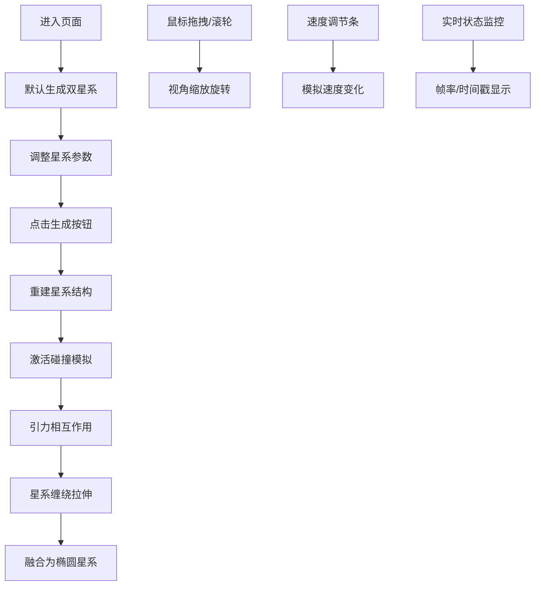

## 1. 产品概述

星系碰撞动态模拟器是一款基于WebGL的3D交互可视化应用，让用户能够直观地观察两个螺旋星系在引力作用下相互吸引、碰撞并最终合并的物理过程。

- 面向天文爱好者、教育工作者和学生，提供沉浸式的星系动力学可视化体验
- 支持参数化配置星系属性，实时呈现不同初始条件下的碰撞演化结果

## 2. 核心功能

### 2.1 用户角色

| 角色 | 注册方式 | 核心权限 |
|------|----------|----------|
| 普通用户 | 无需注册 | 调整参数、生成星系、运行模拟、观察碰撞过程 |

### 2.2 功能模块

1. **参数控制面板**：双星系参数配置、生成与重置控制
2. **3D碰撞场景**：星系粒子渲染、引力模拟、尾迹效果、颜色映射
3. **交互控制**：鼠标视角控制、模拟速度调节、实时状态显示
4. **性能监控**：帧率显示、时间戳、性能优化

### 2.3 页面详情

| 页面名称 | 模块名称 | 功能描述 |
|----------|----------|----------|
| 主页面 | 左侧控制面板 | 星系参数调节滑块、生成按钮、模拟开关 |
| 主页面 | 中央3D场景 | 星系粒子渲染、碰撞模拟、视角交互 |
| 主页面 | 顶部状态栏 | 实时帧率、模拟时间戳显示 |
| 主页面 | 右下角速度条 | 模拟速度调节滑块（0.1x - 3.0x） |

## 3. 核心流程

用户进入页面 → 查看默认生成的两个螺旋星系 → 调整星系参数（恒星数量、螺旋臂密度、旋转速度、总质量）→ 点击生成按钮重建星系 → 激活碰撞模拟 → 观察星系靠近、缠绕、融合过程 → 通过鼠标拖拽旋转视角、滚轮缩放 → 调节模拟速度 → 观察最终合并为椭圆星系

## 4. 用户界面设计

### 4.1 设计风格

- **主色调**：深空蓝黑色背景 `#0b0f1a`，营造宇宙深邃感
- **强调色**：青蓝色渐变 `#00d4ff` → `#0066ff`，用于滑块和按钮
- **视觉风格**：毛玻璃半透明控制面板 + 淡蓝色边框，科技感十足
- **动效设计**：0.3秒缓动过渡、按钮0.15秒缩放反馈、0.5秒淡入动画

### 4.2 页面设计概览

| 页面名称 | 模块名称 | UI元素 |
|----------|----------|--------|
| 主页面 | 左侧控制面板 | 半透明暗色玻璃效果、青蓝色滑块、渐变按钮、参数分组 |
| 主页面 | 3D场景 | 深空背景、发光粒子、速度色渐变、半透明尾迹 |
| 主页面 | 顶部状态栏 | 绿色帧率数字（<20FPS变红）、时间戳、固定定位 |
| 主页面 | 速度调节条 | 右下角悬浮、青蓝色渐变滑块 |

### 4.3 响应式

- 桌面端优先设计
- 控制面板固定宽度，3D场景自适应填充
- 状态信息固定定位，不随滚动变化

### 4.4 3D场景指引

- **环境**：纯深空黑背景，无额外光源，粒子自发光
- **粒子系统**：Points材质，Additive Blending，尺寸随距离衰减
- **尾迹效果**：每粒子保留20帧历史位置，透明度线性衰减
- **颜色映射**：速度从低到高映射为蓝色→青色→黄色→红色渐变
- **相机**：PerspectiveCamera，OrbitControls交互
- **性能预算**：2000粒子时稳定30FPS以上
