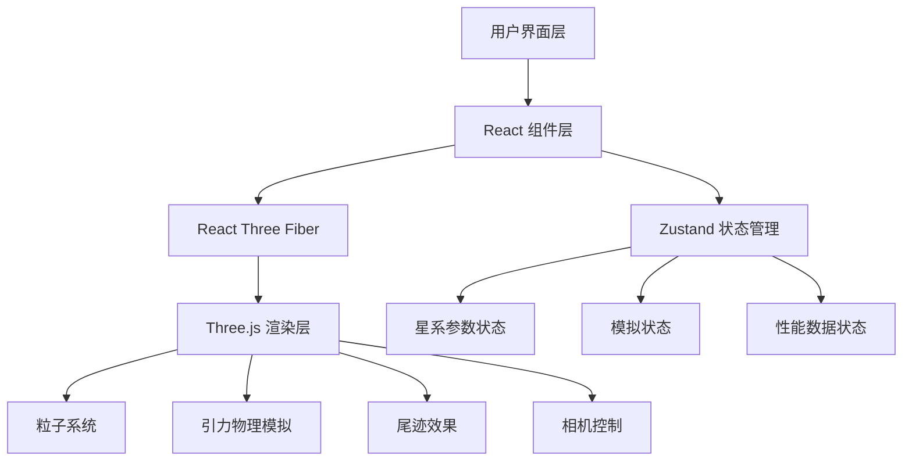

## 1. 架构设计



## 2. 技术描述

- **前端框架**：React 18 + TypeScript
- **构建工具**：Vite 5
- **3D渲染**：Three.js + @react-three/fiber + @react-three/drei
- **状态管理**：Zustand
- **样式方案**：原生CSS + CSS变量（毛玻璃效果、渐变）
- **物理模拟**：自定义牛顿引力计算（简化N体，粒子受对方星系整体引力影响）

## 3. 文件结构

| 文件路径 | 用途 |
|----------|------|
| `package.json` | 项目依赖与脚本配置 |
| `index.html` | 入口HTML页面 |
| `vite.config.js` | Vite构建配置 |
| `tsconfig.json` | TypeScript编译配置 |
| `src/main.tsx` | React应用入口 |
| `src/App.tsx` | 主应用组件，布局集成 |
| `src/store.ts` | Zustand全局状态管理 |
| `src/GalaxyControls.tsx` | 左侧参数控制面板组件 |
| `src/CollisionScene.tsx` | 3D碰撞场景组件 |

## 4. 数据模型

### 4.1 星系参数

```typescript
interface GalaxyParams {
  starCount: number;      // 恒星数量 500-3000
  armDensity: number;     // 螺旋臂密度 1-5
  rotationSpeed: number;  // 旋转速度 0.1-2.0
  totalMass: number;      // 总质量 1-10
}
```

### 4.2 模拟状态

```typescript
interface SimulationState {
  isRunning: boolean;     // 模拟是否运行
  speed: number;          // 模拟速度倍率 0.1-3.0
  time: number;           // 模拟时间戳
  fps: number;            // 当前帧率
}
```

### 4.3 粒子数据

```typescript
interface ParticleData {
  positions: Float32Array;   // 粒子位置 (x,y,z * count)
  velocities: Float32Array;  // 粒子速度 (vx,vy,vz * count)
  colors: Float32Array;      // 粒子颜色 (r,g,b * count)
  trail: Float32Array[];     // 尾迹历史位置
}
```

## 5. 核心算法

### 5.1 螺旋星系生成算法
- 基于对数螺旋线公式分布恒星
- 沿螺旋臂随机散布，密度由armDensity控制
- 初始速度根据半径和rotationSpeed计算圆周运动
- 星系中心质量集中，外围粒子速度递减

### 5.2 引力模拟算法
- 简化模型：每个粒子受对方星系整体质心引力影响
- 引力公式：F = G * M * m / r²
- 使用软化因子避免近距离爆炸
- 每帧更新粒子位置和速度

### 5.3 速度颜色映射
- 计算粒子速度模长
- 归一化映射到 [0, 1] 区间
- 使用蓝→青→黄→红四色渐变
- 实时更新粒子颜色

### 5.4 尾迹效果
- 每个粒子保留20帧历史位置
- 尾迹透明度从近到远线性衰减
- 使用LineGeometry渲染尾迹线段
- 性能优化：复用缓冲区，避免频繁分配

## 6. 性能优化策略

1. **粒子数据复用**：使用TypedArray存储粒子数据，避免GC
2. **帧间隔控制**：物理模拟固定时间步长，渲染与模拟解耦
3. **尾迹优化**：环形缓冲区存储历史位置，指针移动替代数组移位
4. **材质复用**：共享PointsMaterial和LineMaterial
5. **BufferGeometry更新**：使用needsUpdate标志控制重绘
6. **帧率监控**：低于20FPS时自动降低尾迹质量
