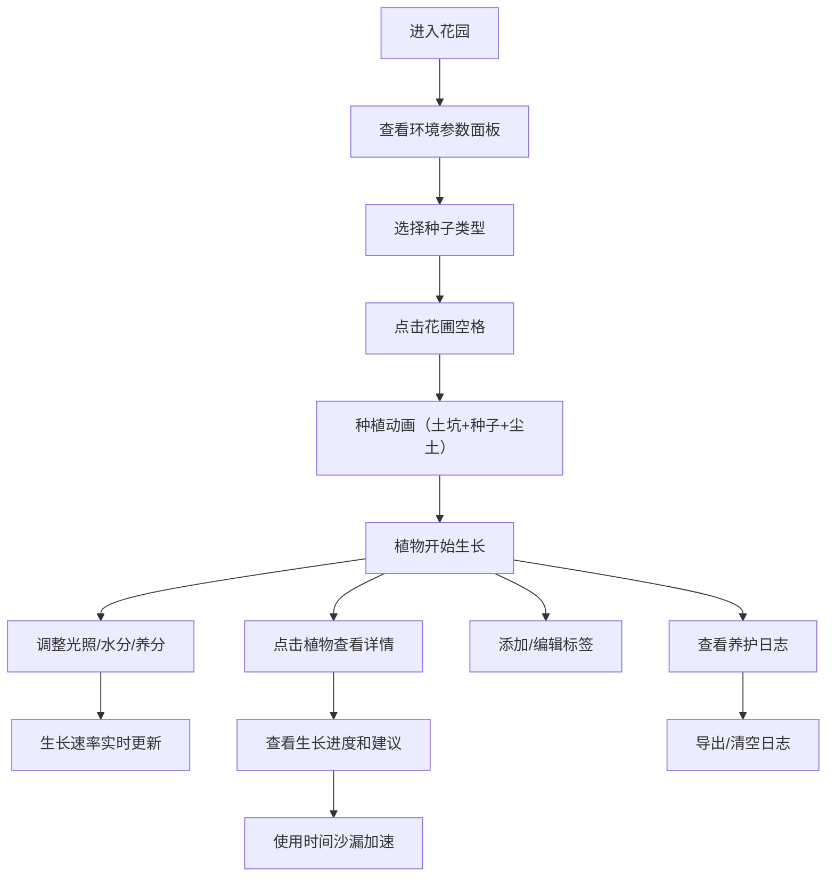

## 1. 产品概述

交互式植物生长模拟花园应用，用户可在虚拟花园中种植8种不同植物，通过调整光照、水分和土壤养分参数，观察植物从种子到开花的完整生长过程，并记录每日养护日志。

- 核心价值：提供沉浸式的虚拟园艺体验，让用户了解植物生长与环境因素的关系
- 目标用户：植物爱好者、休闲游戏玩家、教育场景用户

## 2. 核心功能

### 2.1 功能模块

1. **花园主界面**：6x4 方格花圃、环境参数面板、种子选择工具栏
2. **植物生长系统**：四阶段生长（种子→幼苗→成熟→开花/结果）、环境参数影响生长速率
3. **植物详情面板**：生长进度、养护建议、时间沙漏加速功能
4. **标签系统**：为植物添加个性化标签，支持编辑和悬停显示
5. **养护日志**：记录每日操作，支持倒序查看、清空和导出

### 2.2 页面详情

| 页面名称 | 模块名称 | 功能描述 |
|---------|---------|---------|
| 花园主页 | 环境参数面板 | 光照/水分/养分三个渐变滑块，实时显示数值，0.3秒平滑过渡动画 |
| 花园主页 | 花圃网格 | 6x4像素风格泥土方格，支持点击种植 |
| 花园主页 | 种子工具栏 | 8种植物种子卡片，显示缩略图、名称和所需环境等级 |
| 花园主页 | 植物详情侧边栏 | 植物信息、生长进度、养护建议、时间沙漏 |
| 花园主页 | 标签系统 | 浅黄色圆角标签，毛玻璃编辑框，20字符限制 |
| 花园主页 | 养护日志 | 可折叠毛玻璃卡片，倒序排列，支持清空和导出 |

## 3. 核心流程

用户进入花园 → 查看环境参数面板 → 选择种子 → 点击花圃空格种植 → 观察植物生长 → 调整环境参数 → 点击植物查看详情 → 使用时间沙漏加速 → 添加标签 → 查看养护日志

## 4. 用户界面设计

### 4.1 设计风格

- **整体风格**：柔和田园风格，像素风格花圃
- **主色调**：草绿 #7ec850、暖黄 #f5d78e、大地棕 #8b5a2b
- **卡片样式**：8px 圆角、浅阴影 `box-shadow: 0 2px 8px rgba(0,0,0,0.1)`
- **交互动效**：悬停上浮 `translateY(-2px)`、按压缩放 95%、过渡 0.2s ease
- **滑块渐变**：光照（暗黄→亮黄）、水分（深蓝→浅蓝）、养分（深绿→嫩绿）

### 4.2 页面设计概览

| 页面名称 | 模块名称 | UI 元素 |
|---------|---------|---------|
| 花园主页 | 环境参数面板 | 顶部横向排列，渐变轨道滑块，数值实时显示 |
| 花园主页 | 花圃网格 | 6列4行，浅棕色泥土纹理，像素风格 |
| 花园主页 | 种子工具栏 | 种子包图标展开，8张60x80px卡片 |
| 花园主页 | 详情侧边栏 | 右侧300px宽，深灰色背景，0.4秒滑入 |
| 花园主页 | 植物标签 | 左上角浅黄色圆角标签，毛玻璃编辑框 |
| 花园主页 | 养护日志 | 右下角可折叠，毛玻璃背景，圆角卡片 |

### 4.3 响应式设计

- 桌面端（768px以上）：正常布局展示
- 小屏幕：环境参数面板折叠为横向可滚动滑块组

### 4.4 动画效果

- 种植动画：土坑0.5秒缩放出现，种子落下，尘土粒子效果
- 阶段提示：气泡0.3秒从底部弹入，弹簧缓动，3秒后消散
- 侧边栏：右侧滑入0.4秒
- 生长进度条：0.3秒平滑过渡
- 悬停效果：上浮 + 阴影加深
- 时间沙漏：沙子从顶部漏到底部的流动动画
