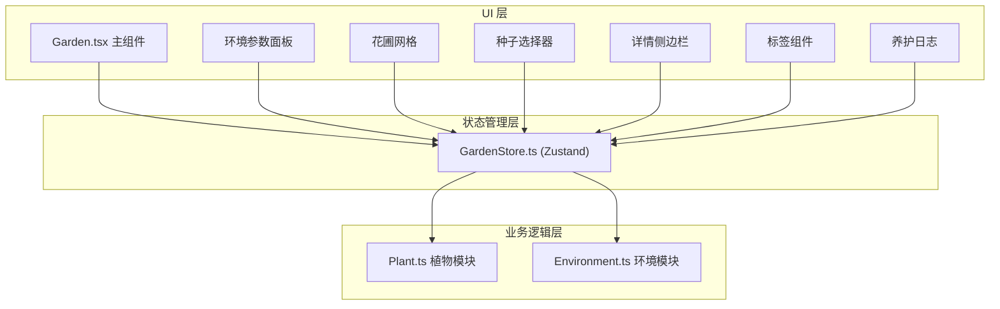

## 1. 架构设计



## 2. 技术栈说明

- **前端框架**：React 18 + TypeScript
- **构建工具**：Vite
- **状态管理**：Zustand
- **样式方案**：CSS Modules / 内联样式（动画用 CSS keyframes）
- **后端**：无（纯前端应用）
- **数据持久化**：localStorage（可选，用于保存花园状态）

## 3. 文件结构

```
├── package.json
├── vite.config.js
├── tsconfig.json
├── index.html
├── src/
│   ├── main.tsx          # 应用入口
│   ├── App.tsx           # 根组件
│   ├── Garden.tsx        # 主花园组件
│   ├── GardenStore.ts    # Zustand 状态管理
│   ├── Plant.ts          # 植物逻辑模块
│   ├── Environment.ts    # 环境参数模块
│   ├── components/       # 子组件目录
│   │   ├── EnvironmentPanel.tsx
│   │   ├── GardenGrid.tsx
│   │   ├── SeedSelector.tsx
│   │   ├── PlantDetail.tsx
│   │   ├── PlantTag.tsx
│   │   └── CareLog.tsx
│   └── styles/           # 样式文件
```

## 4. 核心模块设计

### 4.1 Plant.ts - 植物模块

**职责**：定义植物状态接口、生长阶段枚举，管理光合作用计算、生长周期计算

**核心类型**：
```typescript
enum GrowthStage { Seed, Sprout, Mature, Flowering }

interface PlantState {
  id: string;
  type: PlantType;
  stage: GrowthStage;
  growthProgress: number; // 0-100 当前阶段进度
  totalGrowthDays: number;
  health: number;
  tag?: string;
  plantedAt: number; // timestamp
}
```

**核心方法**：
- `calculateGrowthRate(envParams)`：根据环境参数计算生长速率
- `advanceGrowth(deltaTime)`：推进植物生长
- `getDailyCareAdvice(envParams)`：生成养护建议

### 4.2 Environment.ts - 环境模块

**职责**：管理光照、水分、养分三个参数的范围验证与更新，参数变化时触发生长回调

**核心类型**：
```typescript
interface EnvironmentParams {
  light: number;     // 0-100
  water: number;     // 0-100
  nutrients: number; // 0-100
}
```

**核心方法**：
- `validateParam(name, value)`：参数范围验证
- `updateParam(name, value)`：更新参数并触发回调
- `subscribe(callback)`：订阅参数变化

### 4.3 GardenStore.ts - Zustand Store

**职责**：维护所有植物实例列表和全局环境参数，提供增删植物、调整参数的动作函数

**State**：
- plants: Plant[]
- environment: EnvironmentParams
- selectedSeed: PlantType | null
- selectedPlantId: string | null
- logs: LogEntry[]

**Actions**：
- addPlant(type, gridIndex)
- removePlant(id)
- updateEnvironment(params)
- selectSeed(type)
- selectPlant(id)
- addLog(message)
- updatePlantTag(id, tag)
- advanceTime(hours)
- clearLogs()
- exportLogs()

## 5. 性能优化

- 使用 `requestAnimationFrame` 或 `setInterval` 每秒检查生长条件
- 植物生长计算不阻塞 UI 渲染
- 使用 CSS 动画而非 JS 动画保证流畅度
- React.memo 优化组件重渲染
- 避免不必要的状态更新

## 6. 动画实现方案

- **种植动画**：CSS scale + opacity 过渡 + 粒子效果（DOM元素动画）
- **生长进度条**：CSS transition width 0.3s ease
- **阶段提示气泡**：CSS transform + spring-like cubic-bezier
- **侧边栏滑入**：CSS transform: translateX() 过渡
- **时间沙漏**：CSS clip-path 或伪元素实现沙子流动效果
- **尘土粒子**：短暂的 DOM 粒子动画，完成后移除
