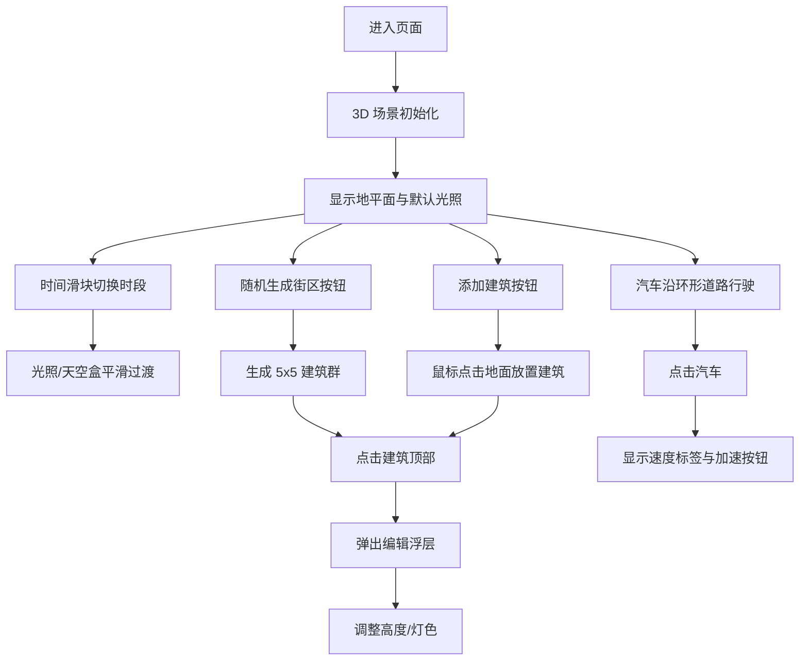

## 1. 产品概述

3D 城市天际线可视化应用，基于 React + Three.js 技术栈，允许用户在浏览器中创建和操控三维城市场景，模拟不同时间段（白天、黄昏、夜晚）的光影变化与建筑灯效，解决传统静态效果图无法交互、无法实时切换光照环境的问题。

- **核心用途**：城市规划展示、游戏场景概念设计、交互式建筑可视化
- **目标用户**：城市规划师、游戏场景设计师、建筑可视化从业者

## 2. 核心功能

### 2.1 功能模块

1. **主场景页面**：3D 场景展示、参数控制面板、建筑编辑浮层

### 2.2 页面详情

| 页面名称 | 模块名称 | 功能描述 |
|----------|----------|----------|
| 主场景页面 | 3D 场景容器 | 地平面、天空盒、光照系统、环形道路、建筑渲染、汽车模拟 |
| 主场景页面 | 参数控制面板 | 时间滑块（0-24h）、随机生成街区、添加建筑按钮、响应式折叠 |
| 主场景页面 | 建筑编辑浮层 | 建筑高度调节（10-100 滑块）、顶部灯效颜色选择（色盘）、毛玻璃效果 |
| 主场景页面 | 汽车交互标签 | 显示当前速度、加速按钮（3 秒临时加速） |

## 3. 核心流程

用户进入页面 → 看到平坦地平面与默认光照 → 通过时间滑块切换时段（光照平滑变化）→ 点击"随机生成街区"生成 5x5 建筑群 → 或点击"添加建筑"手动点击放置 → 点击建筑顶部弹出编辑浮层调整高度和灯色 → 观察环形道路上汽车行驶 → 点击汽车加速。

## 4. 用户界面设计

### 4.1 设计风格

- **主色调**：青蓝色 `#00bcd4`，辅以深灰 `#2a2a2a`
- **面板背景**：深灰半透明（透明度 0.85）
- **按钮设计**：圆角设计，悬停时右移 5px 并背景变亮，点击时 0.05s 下沉按压效果
- **弹窗效果**：毛玻璃（backdrop-filter: blur(10px)），出现时淡入放大回弹，关闭时缩小淡出
- **字体**：现代无衬线字体，清晰可读

### 4.2 页面设计概览

| 页面名称 | 模块名称 | UI 元素 |
|----------|----------|----------|
| 主场景 | 3D 场景 | 轨道控制器（左键旋转/右键平移/滚轮缩放），天空盒渐变背景，地平面，环形道路，建筑群，行驶汽车 |
| 主场景 | 右侧参数面板（300px） | 时间滑块（0-24，步长 0.5），随机生成街区按钮，添加建筑按钮，半透明深灰背景 |
| 主场景 | 建筑编辑浮层（280px） | 毛玻璃背景，高度滑块（10-100），色盘选择器，居中弹窗，动画淡入放大回弹 |
| 主场景 | 汽车标签 | 显示速度文本，加速按钮，浮于汽车上方 |

### 4.3 响应式设计

- **桌面端（≥1920x1080）**：整体居中布局，右侧面板固定宽度 300px
- **小屏幕（≤1366x768）**：参数面板折叠为可展开侧边图标，点击展开

### 4.4 3D 场景指导

- **环境与氛围**：时段驱动的动态天空盒渐变（白天浅蓝 → 黄昏橙红 → 夜晚深蓝紫），顶部保留深蓝区域
- **光照设置**：方向光模拟太阳，时段影响光色、强度、角度；夜晚环境光深蓝紫色，建筑顶部点光源/发光材质
- **相机设置**：轨道控制器，围绕场景中心，平滑阻尼
- **交互与动画**：建筑放置升起回弹动画（0.3s），灯效呼吸闪烁（0.5Hz），汽车匀速行驶（10 单位/秒，临时加速 20 单位/秒），光照/天空盒平滑过渡
- **性能要求**：40+ 建筑、15 辆汽车场景下 FPS ≥ 40，无卡顿跳帧
