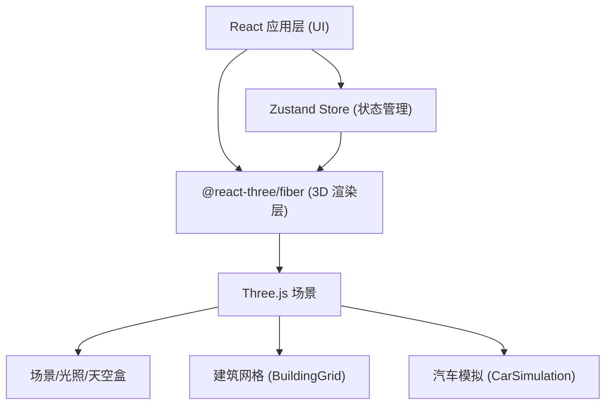

## 1. 架构设计



## 2. 技术说明

- **前端框架**：React 18 + TypeScript + Vite
- **3D 渲染**：Three.js + @react-three/fiber + @react-three/drei
- **状态管理**：Zustand
- **样式**：原生 CSS（内联样式 + CSS 变量）

## 3. 路由定义

| 路由 | 用途 |
|------|------|
| / | 主场景页面（单页应用，无路由切换） |

## 4. 数据模型

### 4.1 Zustand Store 状态

```typescript
interface Building {
  id: string;
  height: number;
  position: [number, number, number];
  width: number;
  topLightColor: string;
}

interface Car {
  id: string;
  position: [number, number, number];
  speed: number;
  baseSpeed: number;
  angle: number;
  color: string;
  boostEndTime?: number;
  selected?: boolean;
}

interface CityState {
  time: number;                    // 0-24
  buildings: Building[];
  cars: Car[];
  isAddingBuilding: boolean;
  selectedBuildingId: string | null;
  selectedCarId: string | null;
  setTime: (t: number) => void;
  addBuilding: (b: Omit<Building, 'id'>) => void;
  updateBuilding: (id: string, updates: Partial<Building>) => void;
  removeBuilding: (id: string) => void;
  generateRandomDistrict: () => void;
  setIsAddingBuilding: (v: boolean) => void;
  setSelectedBuildingId: (id: string | null) => void;
  setSelectedCarId: (id: string | null) => void;
  boostCar: (id: string) => void;
  initCars: () => void;
}
```

### 4.2 文件结构

```
src/
├── main.tsx                    # React 入口
├── App.tsx                     # 根组件
├── store.ts                    # Zustand 状态管理
├── styles.css                  # 全局样式
└── components/
    ├── Scene.tsx               # Three.js 场景容器
    ├── BuildingGrid.tsx        # 建筑网格与交互
    ├── CarSimulation.tsx       # 汽车环形行驶模拟
    └── ControlPanel.tsx        # 右侧参数面板 UI
```
