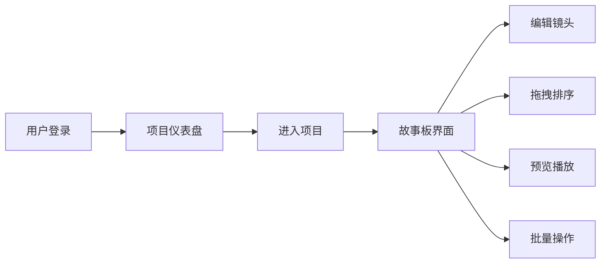

## 1. 产品概述

微短片镜头序列管理平台是面向独立动画师的协作工具，帮助动画师快速编排镜头顺序、设置时长备注、预览整体叙事节奏。

- **目标用户**：独立动画师、短片创作团队
- **核心价值**：提升分镜故事板管理效率，直观预览叙事节奏
- **解决问题**：传统分镜流程繁琐，缺乏动态预览和便捷排序能力

## 2. 核心功能

### 2.1 用户角色

| 角色 | 注册方式 | 核心权限 |
|------|----------|----------|
| 注册用户 | 邮箱+密码注册 | 创建/管理项目、编辑镜头序列、预览播放 |

### 2.2 功能模块

1. **用户认证模块**：注册、登录、JWT鉴权
2. **项目仪表盘**：项目列表展示、新建项目
3. **故事板管理**：镜头卡片网格、拖拽排序、增删改查
4. **镜头编辑器**：时长设置、描述编辑、缩略图上传
5. **预览播放器**：序列逐帧播放、进度条、暂停/继续
6. **批量操作**：多选镜头、批量删除、批量设时长

### 2.3 页面详情

| 页面名称 | 模块名称 | 功能描述 |
|----------|----------|----------|
| 登录/注册页 | 认证表单 | 邮箱密码登录/注册，表单验证，错误提示 |
| 项目仪表盘 | 项目列表 | 展示已有项目卡片，新建项目按钮，最后编辑时间 |
| 故事板主界面 | 镜头卡片区 | 左侧65%宽度，网格布局展示镜头卡片，支持拖拽排序、多选、悬停操作 |
| 故事板主界面 | 预览播放器 | 右侧35%宽度，逐帧播放镜头序列，进度条，播放控制 |
| 镜头编辑弹窗 | 编辑表单 | 时长输入、描述文本、缩略图上传，动画过渡 |
| 批量操作确认框 | 确认对话框 | 批量删除/设时长确认，缩放淡入动画 |

## 3. 核心流程

### 3.1 用户登录流程
用户打开应用 → 输入邮箱密码 → 后端验证 → 返回JWT → 跳转项目仪表盘

### 3.2 镜头编辑流程
双击镜头卡片 → 弹出编辑器 → 修改时长/描述/缩略图 → 保存 → 调用API → 刷新列表

### 3.3 拖拽排序流程
按住卡片拖拽 → 卡片跟随鼠标半透明 → 松开鼠标 → 弹性动画归位 → 调用reorder API → 更新后端顺序

### 3.4 预览播放流程
点击播放按钮 → 从第一帧开始 → 按duration逐帧停留 → 进度条推进 → 最后一帧停止 → 显示播放结束提示

## 4. 用户界面设计

### 4.1 设计风格

- **主背景色**：深灰蓝 #1a2332
- **卡片背景**：浅蓝灰 #2c3e50
- **主题色**：亮青 #00bcd4
- **文字颜色**：白色 #ffffff
- **设计调性**：专业沉稳的创作工具风格，深色系减少视觉疲劳
- **按钮风格**：圆角矩形，主题色填充/边框
- **字体**：无衬线现代字体，清晰易读
- **布局风格**：左右分栏，卡片网格，突出内容

### 4.2 页面设计概览

| 页面名称 | 模块名称 | UI元素 |
|----------|----------|--------|
| 登录页 | 认证卡片 | 居中白色卡片，输入框带图标，主题色按钮，平滑过渡动画 |
| 仪表盘 | 项目列表 | 网格布局项目卡片，悬停上浮效果，新建按钮悬浮右下角 |
| 故事板 | 镜头网格 | CSS Grid 3列布局，卡片半透明遮罩操作按钮，时长渐变背景 |
| 故事板 | 预览区 | 白色内容区，底部半透明控制栏，进度条细线条 |
| 编辑器 | 弹窗 | 中心缩放淡入，半透明遮罩，圆角白色面板，表单分区 |

### 4.3 响应式

- 桌面端：左右分栏（65% / 35%），卡片3列
- 平板（< 1024px）：卡片2列
- 移动端（< 768px）：预览区折叠到底部，卡片1列
- 触控优化：增大点击热区，支持触摸拖拽

### 4.4 动效设计

- 弹窗缩放淡入/淡出：0.3秒
- 卡片悬停上浮：4px位移，0.15秒过渡
- 操作按钮淡入：0.15秒
- 拖拽弹性动画：0.2秒
- 进度条平滑推进：线性过渡
