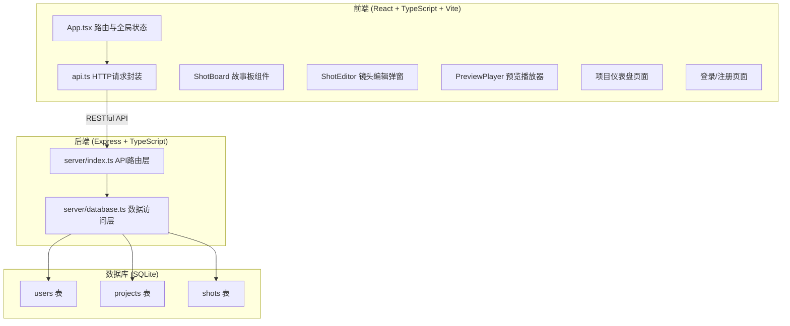
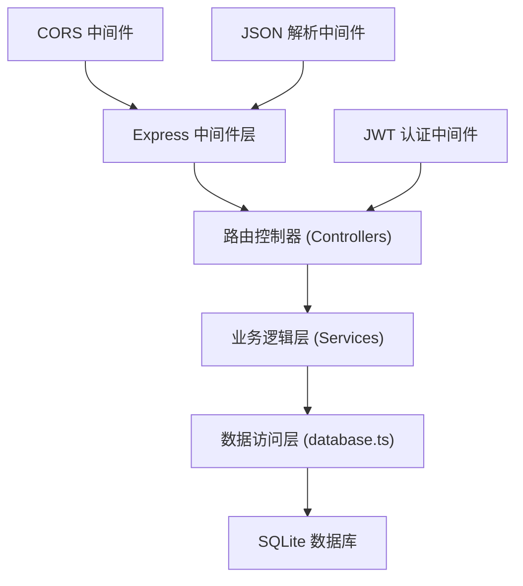
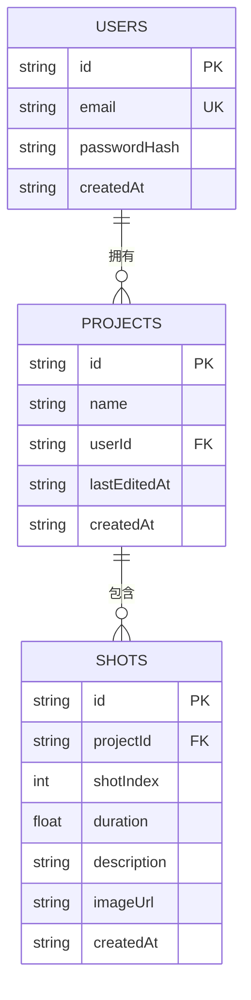

## 1. 架构设计



## 2. 技术说明

- **前端**：React 18 + TypeScript + Vite + React Router DOM
- **后端**：Express 4 + TypeScript + better-sqlite3
- **数据库**：SQLite（better-sqlite3 驱动）
- **认证**：JWT (jsonwebtoken) + bcryptjs 密码加密
- **构建工具**：Vite（前端） + ts-node / tsx（后端开发）
- **样式方案**：CSS Modules / 原生CSS，CSS变量主题系统

## 3. 路由定义

| 前端路由 | 页面组件 | 用途 |
|----------|----------|------|
| /login | LoginPage | 用户登录 |
| /register | RegisterPage | 用户注册 |
| /dashboard | DashboardPage | 项目仪表盘 |
| /project/:projectId | ShotBoardPage | 故事板主界面 |
| / | - | 重定向到登录或仪表盘 |

## 4. API定义

### 4.1 认证接口

```typescript
// POST /api/auth/register
interface RegisterRequest {
  email: string;
  password: string;
}
interface AuthResponse {
  token: string;
  user: { id: string; email: string };
}

// POST /api/auth/login
interface LoginRequest {
  email: string;
  password: string;
}
```

### 4.2 项目接口

```typescript
// GET /api/projects - 获取用户项目列表
// POST /api/projects - 创建新项目
interface Project {
  id: string;
  name: string;
  userId: string;
  lastEditedAt: string;
  createdAt: string;
}
```

### 4.3 镜头接口

```typescript
// GET /api/projects/:projectId/shots - 获取镜头列表
// POST /api/projects/:projectId/shots - 创建镜头
// PUT /api/shots/:shotId - 更新镜头
// DELETE /api/shots/:shotId - 删除镜头
// PUT /api/projects/:projectId/shots/reorder - 重排镜头

interface Shot {
  id: string;
  projectId: string;
  shotIndex: number;
  duration: number;
  description: string;
  imageUrl: string | null;
  createdAt: string;
}
```

### 4.4 批量操作接口

```typescript
// DELETE /api/shots/batch - 批量删除
// PUT /api/shots/batch/duration - 批量设置时长
interface BatchShotsRequest {
  shotIds: string[];
  duration?: number;
}
```

## 5. 服务端架构图



## 6. 数据模型

### 6.1 数据模型定义



### 6.2 DDL 语句

```sql
-- 用户表
CREATE TABLE users (
  id TEXT PRIMARY KEY,
  email TEXT UNIQUE NOT NULL,
  passwordHash TEXT NOT NULL,
  createdAt TEXT NOT NULL
);

-- 项目表
CREATE TABLE projects (
  id TEXT PRIMARY KEY,
  name TEXT NOT NULL,
  userId TEXT NOT NULL,
  lastEditedAt TEXT NOT NULL,
  createdAt TEXT NOT NULL,
  FOREIGN KEY (userId) REFERENCES users(id)
);

-- 镜头表
CREATE TABLE shots (
  id TEXT PRIMARY KEY,
  projectId TEXT NOT NULL,
  shotIndex INTEGER NOT NULL,
  duration REAL NOT NULL DEFAULT 1.0,
  description TEXT DEFAULT '',
  imageUrl TEXT,
  createdAt TEXT NOT NULL,
  FOREIGN KEY (projectId) REFERENCES projects(id)
);

CREATE INDEX idx_shots_project ON shots(projectId);
CREATE INDEX idx_projects_user ON projects(userId);
```
