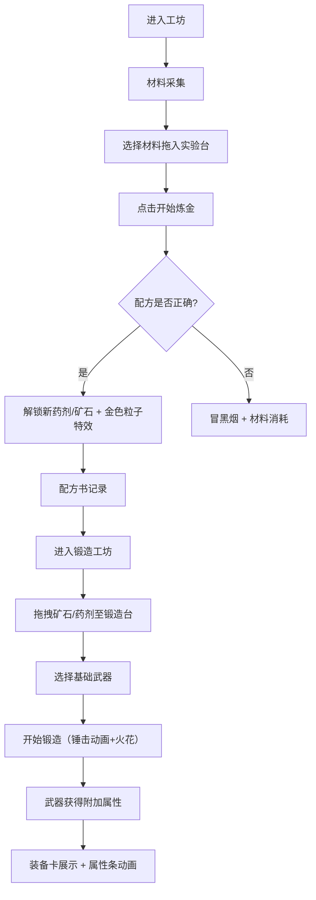

## 1. 产品概述

古代工坊炼金术配方探索与装备锻造模拟应用——玩家扮演炼金术士，在虚拟工坊中收集材料、实验发现配方，将炼制出的药剂或矿石用于锻造和强化武器装备。面向喜欢模拟经营与探索解谜的休闲游戏玩家，提供沉浸式中世纪炼金工坊体验。

## 2. 核心功能

### 2.1 用户角色

| 角色 | 注册方式 | 核心权限 |
|------|----------|----------|
| 炼金术士 | 首次进入自动创建 | 材料采集、配方实验、装备锻造、配方书查看 |

### 2.2 功能模块

1. **炼金工坊页**：材料架、实验台、配方书三个区域
2. **锻造工坊页**：矿石/药剂列表、锻造台、装备展示

### 2.3 页面详情

| 页面名称 | 模块名称 | 功能描述 |
|----------|----------|----------|
| 炼金工坊 | 材料架 | 展示10种基础炼金材料，材料卡片按稀有度着色，鼠标悬停显示传说与属性弹窗，点击"采集"按钮随机获得材料（2秒进度条） |
| 炼金工坊 | 实验台 | 拖拽最多3种材料放入坩埚，材料缩小为彩色液滴旋转融合，点击"开始炼金"后3秒内根据组合判定结果，正确则解锁配方（金色粒子特效），错误则冒黑烟并消耗材料 |
| 炼金工坊 | 配方书 | 以古卷轴样式展示已解锁配方，新配方解锁时卷轴展开，显示材料组合、产物名称和效果，可收藏5个常用配方到快捷栏 |
| 锻造工坊 | 矿石/药剂列表 | 展示已炼成的药剂和矿石，可拖拽至锻造台 |
| 锻造工坊 | 锻造台（3D） | 3D旋转展示台，拖入矿石/药剂+选择基础武器后锻造，锤击动画+火花粒子，成功后武器获得附加属性 |
| 锻造工坊 | 装备卡 | 展示锻造后的武器装备，属性条（彩虹渐变）动态填充 |

## 3. 核心流程

## 4. 用户界面设计

### 4.1 设计风格

- 主背景：深木色 #4a2c11
- 文本区域：羊皮纸 #f5e6c8
- 边框高光：金色 #d4af37
- 行动按钮/成功提示：火焰红 #e63946
- 稀有材料：暗影紫 #6a0572
- 按钮样式：按压时缩小至0.9并凹陷阴影
- 字体：手写体英文展示字体 + 可读性正文衬线字体
- 布局：左侧材料架 + 中央实验台/锻造台 + 右侧配方书（半透明浮层）
- 粒子特效：成功时金黄色上升粒子，失败时红色闪缩

### 4.2 页面设计概览

| 页面名称 | 模块名称 | UI元素 |
|----------|----------|--------|
| 炼金工坊 | 材料架 | 竖排深木色卡片，镶金边，稀有度对应边框颜色（银灰/淡紫/橙红），悬停半透明弹窗，采集按钮+进度条 |
| 炼金工坊 | 实验台 | 半透明圆形坩埚容器，液滴旋转融合动画，底部火焰升起动画，金色闪光/黑烟特效 |
| 炼金工坊 | 配方书 | 羊皮纸配色古卷轴，手写体字体，向右滚动展开，配方卡片（材料图标+产物+效果） |
| 锻造工坊 | 矿石/药剂列表 | 横排卡片列表，可拖拽 |
| 锻造工坊 | 锻造台 | CSS 3D旋转展示台，锤击动画（旋转+缩放），火花粒子效果 |
| 锻造工坊 | 装备卡 | 武器装备卡，属性条彩虹渐变动态填充 |

### 4.3 响应式设计

- 桌面端优先，全屏100vh布局
- 移动端材料卡片自动转为两列网格
- 触摸优化：拖拽操作支持触摸事件

### 4.4 3D场景指引

- 锻造台使用CSS 3D变换实现旋转效果
- 锤击动画：CSS旋转+缩放模拟锤子敲击
- 火花粒子：CSS动画粒子效果，确保不阻塞主线程
