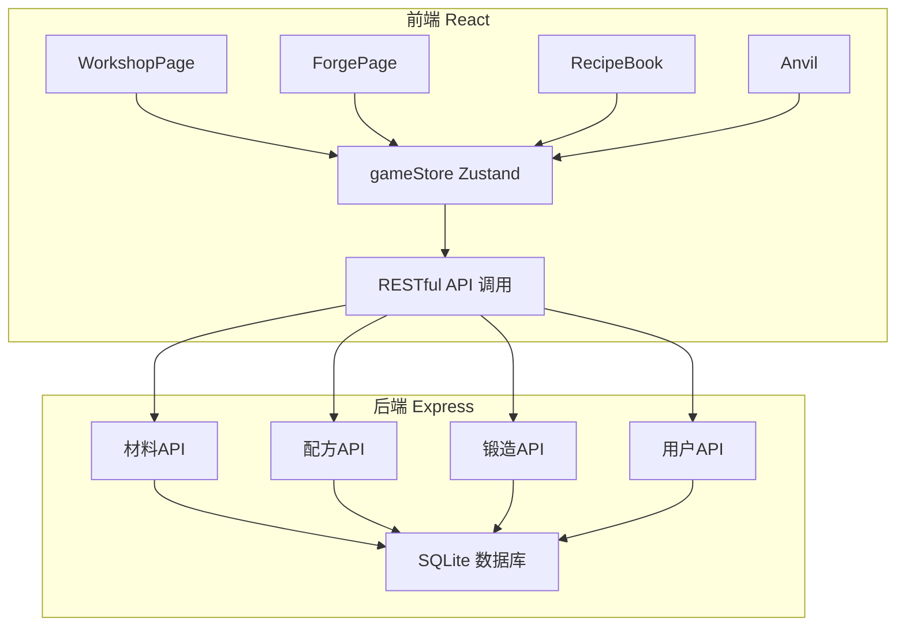
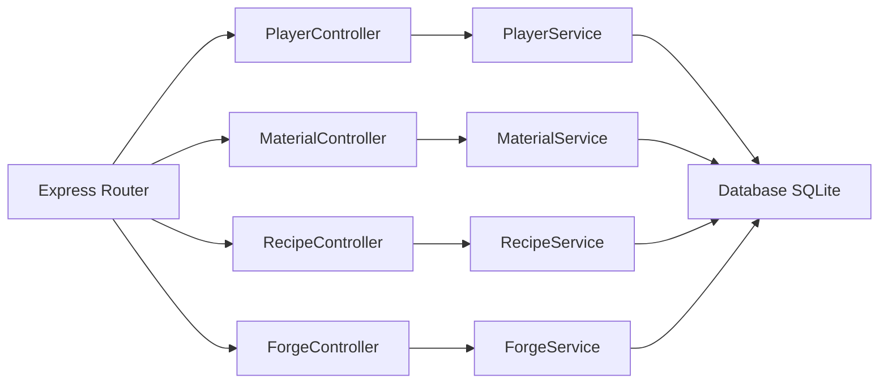
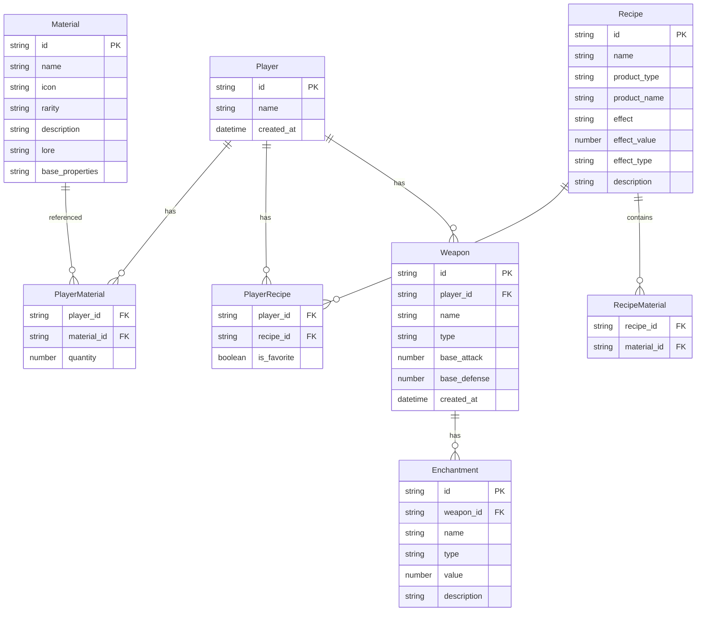

## 1. 架构设计



## 2. 技术说明

- 前端：React@18 + TypeScript + Zustand + Vite
- 初始化工具：vite-init（react-express-ts模板）
- 后端：Express@4 + TypeScript + better-sqlite3
- 数据库：SQLite（本地文件存储）
- 样式：CSS变量 + 自定义主题（中世纪炼金风格）
- 拖拽：原生HTML5 Drag & Drop API

## 3. 路由定义

| 路由 | 用途 |
|------|------|
| / | 炼金工坊主界面（材料架+实验台+配方书） |
| /forge | 锻造工坊界面（矿石/药剂列表+锻造台+装备展示） |

## 4. API定义

### 4.1 用户API

```typescript
POST /api/player
  Request: {}
  Response: { id: string, name: string, materials: Material[], recipes: Recipe[], weapons: Weapon[] }

GET /api/player/:id
  Response: { id: string, name: string, materials: Material[], recipes: Recipe[], weapons: Weapon[] }
```

### 4.2 材料API

```typescript
GET /api/materials
  Response: Material[]

POST /api/materials/gather
  Request: { playerId: string }
  Response: { material: Material, quantity: number }
```

### 4.3 配方API

```typescript
GET /api/recipes
  Response: Recipe[]

POST /api/recipes/experiment
  Request: { playerId: string, materialIds: string[] }
  Response: { success: boolean, recipe?: Recipe, message: string }

POST /api/recipes/favorite
  Request: { playerId: string, recipeId: string }
  Response: { favorites: string[] }
```

### 4.4 锻造API

```typescript
GET /api/weapons
  Response: Weapon[]

POST /api/forge
  Request: { playerId: string, weaponType: WeaponType, consumableId: string }
  Response: { success: boolean, weapon?: Weapon, message: string }

GET /api/weapons/:playerId
  Response: Weapon[]
```

### 4.5 类型定义

```typescript
type Rarity = "common" | "rare" | "epic"
type WeaponType = "sword" | "shield" | "bow" | "staff"

interface Material {
  id: string
  name: string
  icon: string
  rarity: Rarity
  description: string
  lore: string
  baseProperties: Record<string, number>
  quantity: number
}

interface Recipe {
  id: string
  name: string
  materialIds: string[]
  productType: "potion" | "ore"
  productName: string
  effect: string
  effectValue: number
  effectType: string
  description: string
  discovered: boolean
}

interface Weapon {
  id: string
  name: string
  type: WeaponType
  baseAttack: number
  baseDefense: number
  enchantments: Enchantment[]
  createdAt: string
}

interface Enchantment {
  name: string
  type: string
  value: number
  description: string
}
```

## 5. 服务器架构图



## 6. 数据模型

### 6.1 数据模型定义



### 6.2 数据定义语言

```sql
CREATE TABLE player (
  id TEXT PRIMARY KEY,
  name TEXT NOT NULL,
  created_at DATETIME DEFAULT CURRENT_TIMESTAMP
);

CREATE TABLE material (
  id TEXT PRIMARY KEY,
  name TEXT NOT NULL,
  icon TEXT NOT NULL,
  rarity TEXT NOT NULL CHECK(rarity IN ('common', 'rare', 'epic')),
  description TEXT NOT NULL,
  lore TEXT NOT NULL,
  base_properties TEXT NOT NULL
);

CREATE TABLE recipe (
  id TEXT PRIMARY KEY,
  name TEXT NOT NULL,
  product_type TEXT NOT NULL CHECK(product_type IN ('potion', 'ore')),
  product_name TEXT NOT NULL,
  effect TEXT NOT NULL,
  effect_value REAL NOT NULL,
  effect_type TEXT NOT NULL,
  description TEXT NOT NULL
);

CREATE TABLE recipe_material (
  recipe_id TEXT NOT NULL REFERENCES recipe(id),
  material_id TEXT NOT NULL REFERENCES material(id),
  PRIMARY KEY (recipe_id, material_id)
);

CREATE TABLE player_material (
  player_id TEXT NOT NULL REFERENCES player(id),
  material_id TEXT NOT NULL REFERENCES material(id),
  quantity INTEGER NOT NULL DEFAULT 0,
  PRIMARY KEY (player_id, material_id)
);

CREATE TABLE player_recipe (
  player_id TEXT NOT NULL REFERENCES player(id),
  recipe_id TEXT NOT NULL REFERENCES recipe(id),
  is_favorite INTEGER NOT NULL DEFAULT 0,
  PRIMARY KEY (player_id, recipe_id)
);

CREATE TABLE weapon (
  id TEXT PRIMARY KEY,
  player_id TEXT NOT NULL REFERENCES player(id),
  name TEXT NOT NULL,
  type TEXT NOT NULL CHECK(type IN ('sword', 'shield', 'bow', 'staff')),
  base_attack INTEGER NOT NULL DEFAULT 0,
  base_defense INTEGER NOT NULL DEFAULT 0,
  created_at DATETIME DEFAULT CURRENT_TIMESTAMP
);

CREATE TABLE enchantment (
  id TEXT PRIMARY KEY,
  weapon_id TEXT NOT NULL REFERENCES weapon(id),
  name TEXT NOT NULL,
  type TEXT NOT NULL,
  value REAL NOT NULL,
  description TEXT NOT NULL
);
```
