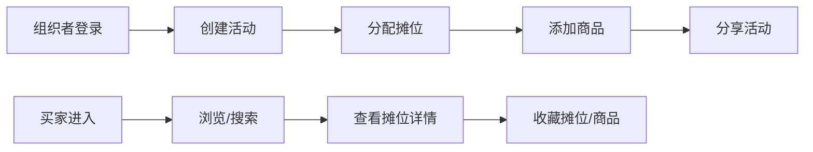

## 1. 产品概述

跳蚤市场摊位管理应用是一款面向小型社区组织者的在线工具，解决传统纸质海报摊位位置无法实时更新、买家难以快速找到目标商品、以及组织者统计摊位费和商品销量困难的问题。

- **目标用户**：社区活动组织者、摊主、买家
- **核心价值**：实时可视化摊位地图、高效商品搜索、摊位管理数字化

## 2. 核心功能

### 2.1 用户角色

| 角色 | 登录方式 | 核心权限 |
|------|----------|----------|
| 组织者 | 模拟登录 | 创建活动、分配摊位、管理商品 |
| 买家 | 无需登录 | 浏览地图、搜索摊位/商品、收藏 |

### 2.2 功能模块

1. **活动管理页**：创建新活动（设置日期、名称、总摊位数量）
2. **活动查看页**：摊位地图、摊位列表、商品详情、全局搜索
3. **活动管理页**：分配摊位、添加商品、更新商品状态

### 2.3 页面详情

| 页面名称 | 模块名称 | 功能描述 |
|----------|----------|----------|
| 活动创建页 | 活动表单 | 输入活动名称、日期、总摊位数量、提交创建 |
| 活动查看页 | 网格地图 | 100x100像素格子、俯视图、点击添加摊位、滚轮缩放、拖拽平移 |
| 活动查看页 | 摊位缩略列表 | 按类型分组、可折叠展开、显示数量、点击高亮地图摊位 |
| 活动查看页 | 摊位详情卡片 | 商品列表（名称/价格/状态）、收藏按钮 |
| 活动查看页 | 全局搜索 | 摊主昵称/商品名称/摊位编号模糊搜索、3字符触发、悬浮结果列表 |
| 活动管理页 | 摊位分配 | 点击空格填写摊位信息、自动生成编号、类型选择 |

## 3. 核心流程

### 组织者流程
组织者登录 → 创建活动（设置名称/日期/摊位数量）→ 在网格地图上分配摊位 → 为摊位添加商品 → 分享活动链接

### 买家流程
进入活动页面 → 浏览摊位列表或地图 → 搜索目标商品/摊主 → 点击摊位查看详情 → 收藏摊位或商品

## 4. 用户界面设计

### 4.1 设计风格
- **主色调**：浅米色背景（#FAF0E6）、深棕色标题栏（#4A2E1B）
- **按钮色**：琥珀色（#FFBF00）→ 悬停深橙色（#E69500），0.2秒过渡
- **摊位类型色**：食品-暖橙、手工-靛蓝、二手-草绿、文创-玫红
- **字体**：标题使用温暖衬线字体，正文使用清晰无衬线字体
- **卡片风格**：圆角8px、轻微阴影、悬停阴影加深并上移2px

### 4.2 页面设计概览

| 页面名称 | 模块名称 | UI元素 |
|----------|----------|--------|
| 活动创建页 | 活动表单 | 居中卡片布局、输入框带标签、琥珀色提交按钮 |
| 活动查看页 | 网格地图 | 浅灰网格线（#D3D3D3）、未售出虚框浅灰、已分配实框按类型着色、悬停显示摊主信息 |
| 活动查看页 | 摊位列表 | 左侧固定宽度、分组折叠、组标题显示数量、缩略图显示类型色 |
| 活动查看页 | 详情卡片 | 弹出式卡片、商品列表带价格标签、收藏按钮空心→实心旋转动画 |
| 活动查看页 | 搜索框 | 右上角固定、输入防抖300ms、悬浮结果半透明白色圆角卡片 |

### 4.3 响应式设计
- **桌面端**：左侧摊位列表 + 右侧地图的双栏布局
- **移动端（<768px）**：摊位列表平铺上方横向滚动、地图自适应屏幕宽度
- **触摸优化**：摊位点击区域扩大、滚动流畅

### 4.4 动画效果
- 摊位高亮：0.2秒呼吸动画 + 边框闪烁两次
- 地图滚动：0.4秒平滑滚动至目标摊位
- 收藏按钮：点击后图标由空心变实心并旋转
- 卡片悬停：阴影加深 + 上移2px，平滑过渡
