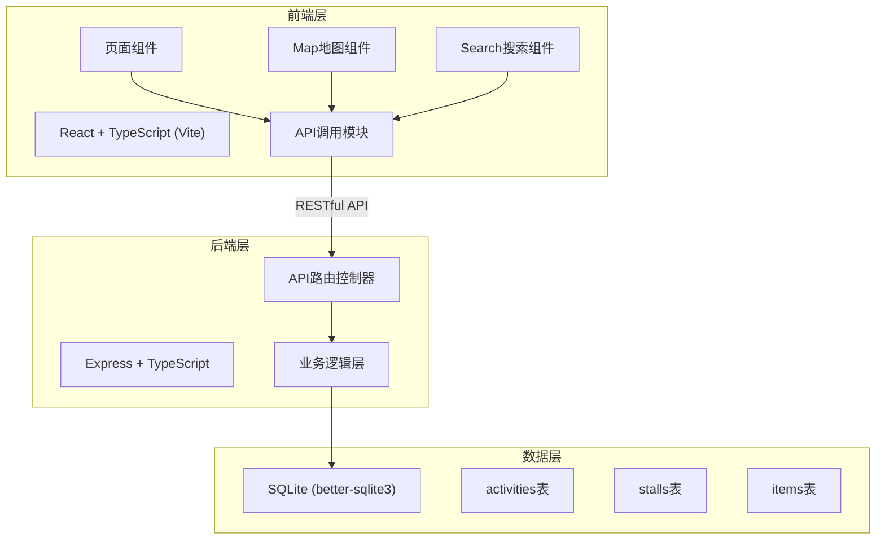
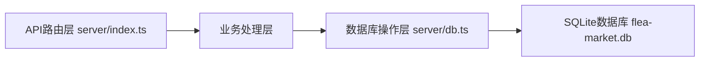
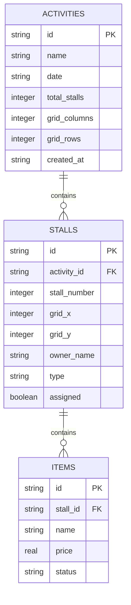

## 1. 架构设计



## 2. 技术说明

- **前端**：React 18 + TypeScript + Vite + TailwindCSS 3 + React Router DOM + Lucide React
- **后端**：Express 4 + TypeScript + better-sqlite3 + uuid + cors
- **构建工具**：Vite（前端构建、代理/client请求到localhost:3001）
- **数据库**：SQLite本地文件存储
- **状态管理**：React Hooks (useState/useEffect/useRef) + 组件本地状态

## 3. 路由定义

| 前端路由 | 用途 |
|----------|------|
| / | 首页，活动列表入口 |
| /activities/new | 创建新活动 |
| /activities/:id | 查看活动地图（买家视角） |
| /activities/:id/manage | 管理活动（组织者视角） |

## 4. API 定义

```typescript
// 数据类型定义
type StallType = 'food' | 'handmade' | 'secondhand' | 'cultural';
type ItemStatus = 'on_sale' | 'sold';

interface Activity {
  id: string;
  name: string;
  date: string;
  totalStalls: number;
  gridColumns: number;
  gridRows: number;
  createdAt: string;
}

interface Stall {
  id: string;
  activityId: string;
  stallNumber: number;
  gridX: number;
  gridY: number;
  ownerName: string | null;
  type: StallType | null;
  assigned: boolean;
}

interface Item {
  id: string;
  stallId: string;
  name: string;
  price: number;
  status: ItemStatus;
}

// API接口
// POST /api/activities - 创建活动
// GET /api/activities/:id - 获取活动详情+所有摊位
// PUT /api/activities/:id/stalls/:stallId - 分配/更新摊位
// GET /api/activities/:id/stalls?type=xxx - 按类型列摊位
// POST /api/activities/:id/stalls/:stallId/items - 添加商品
// GET /api/activities/:id/stalls/:stallId/items - 列出商品
// PUT /api/items/:itemId/status - 更新商品状态
// GET /api/activities/:id/search?q=xxx - 搜索摊主/商品
```

## 5. 服务端架构图



## 6. 数据模型

### 6.1 数据模型定义



### 6.2 DDL语句

```sql
CREATE TABLE IF NOT EXISTS activities (
  id TEXT PRIMARY KEY,
  name TEXT NOT NULL,
  date TEXT NOT NULL,
  total_stalls INTEGER NOT NULL,
  grid_columns INTEGER NOT NULL,
  grid_rows INTEGER NOT NULL,
  created_at TEXT NOT NULL DEFAULT CURRENT_TIMESTAMP
);

CREATE TABLE IF NOT EXISTS stalls (
  id TEXT PRIMARY KEY,
  activity_id TEXT NOT NULL,
  stall_number INTEGER NOT NULL,
  grid_x INTEGER NOT NULL,
  grid_y INTEGER NOT NULL,
  owner_name TEXT,
  type TEXT,
  assigned INTEGER NOT NULL DEFAULT 0,
  FOREIGN KEY (activity_id) REFERENCES activities(id)
);

CREATE TABLE IF NOT EXISTS items (
  id TEXT PRIMARY KEY,
  stall_id TEXT NOT NULL,
  name TEXT NOT NULL,
  price REAL NOT NULL,
  status TEXT NOT NULL DEFAULT 'on_sale',
  FOREIGN KEY (stall_id) REFERENCES stalls(id)
);

CREATE INDEX IF NOT EXISTS idx_stalls_activity_id ON stalls(activity_id);
CREATE INDEX IF NOT EXISTS idx_items_stall_id ON items(stall_id);
CREATE INDEX IF NOT EXISTS idx_stalls_type ON stalls(type);
```
