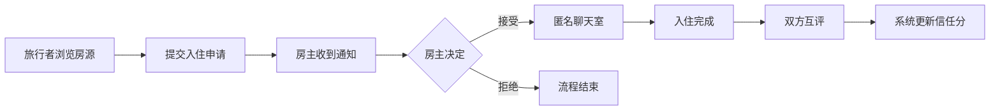

## 1. 产品概述

海外短租民宿匿名匹配与体验评价交换平台，通过匿名机制连接房主与旅行者，双方基于信任分进行匹配，入住结束后通过互评维护社区信任生态。

- 核心目的：解决短租场景下的隐私保护与信任建立问题
- 目标用户：海外民宿房主、跨国旅行者

## 2. 核心功能

### 2.1 用户角色
| 角色 | 注册方式 | 核心权限 |
|------|---------|---------|
| 房主 | 邮箱注册 | 发布房源、管理预约、设置自动回复、查看评价 |
| 旅行者 | 邮箱注册 | 浏览房源、提交预约申请、匿名聊天、发表评价 |

### 2.2 功能模块
1. **首页（旅行者）**：搜索栏、推荐房源瀑布流、信任分展示
2. **房主后台**：房源列表管理、通知面板、评价管理
3. **预约系统**：日历选日期、申请提交、接受/拒绝
4. **匿名聊天室**：临时对话、自动清空
5. **互评系统**：设施/卫生评分、径向条形图展示、信任分计算

### 2.3 页面详情
| 页面名称 | 模块名称 | 功能描述 |
|---------|---------|---------|
| 首页 | 搜索栏 | 按区域、价格范围搜索房源 |
| 首页 | 瀑布流 | 响应式布局展示房源卡片，支持懒加载 |
| 首页 | 预约弹窗 | 底部升起动画，内嵌日历组件选择日期范围 |
| 房主后台 | 房源列表 | 左侧房源卡片列表，悬停显示操作按钮，右侧详情面板 |
| 房主后台 | 通知面板 | 显示预约申请通知，支持接受/拒绝 |
| 房主后台 | 评价管理 | 查看历史评价及信任分变化 |
| 评价页面 | 评分滑块 | 设施评分(0-5)、卫生评分(0-5)，实时视觉反馈 |
| 个人主页 | 径向条形图 | 展示历史评分分布，信任分动画更新 |

## 3. 核心流程

旅行者浏览房源 → 选择心仪房源 → 提交入住申请（选择日期范围）→ 房主收到通知 → 房主接受/拒绝 → 接受后进入匿名聊天室 → 入住结束 → 双方互评 → 系统更新信任分

## 4. 用户界面设计

### 4.1 设计风格
- 主色调：暖白色 (#FFFBF5) + 深灰色文字 (#2D2D2D)
- 辅助色：公寓标签橙色 (#FF8A3D)、独立屋标签蓝色 (#4A90D9)、合租标签绿色 (#52C41A)
- 信任分金色：#FFD700
- 按钮风格：圆角设计，按下0.15秒缩放反馈
- 卡片风格：白色背景、浅灰阴影、圆角设计、悬停上浮4px
- 字体：系统默认无衬线字体，保持清晰可读

### 4.2 页面设计概述
| 页面名称 | 模块名称 | UI元素 |
|---------|---------|--------|
| 首页 | 导航栏 | 半透明固定顶部，滚动时背景从透明渐变到白色（模糊） |
| 首页 | 瀑布流卡片 | 区域名、房型图标、价格、金色星级信任分（0.1精度） |
| 首页 | 预约弹窗 | 0.2秒从底部升起动画，日历选日期（蓝色半透明圆点标记） |
| 房主后台 | 房源卡片 | 左上角色彩标签（橙/蓝/绿），悬停上浮+底部滑出编辑/下架按钮 |
| 房主后台 | 详情面板 | 封面图上传、基础设施清单、可接待人数、自动回复模板、禁入日期 |
| 评价页面 | 评分滑块 | 双滑块（设施/卫生），滑动实时显示分数 |
| 个人主页 | 信任分展示 | 径向条形图，数字递增动画(0.5秒)，背景灰→金黄渐变 |

### 4.3 响应式设计
- 桌面端：瀑布流多列布局，完整导航栏
- 移动端：瀑布流单列布局，导航栏收缩为汉堡菜单
- 全局：底部浮动圆角按钮（快速发布/搜索）
