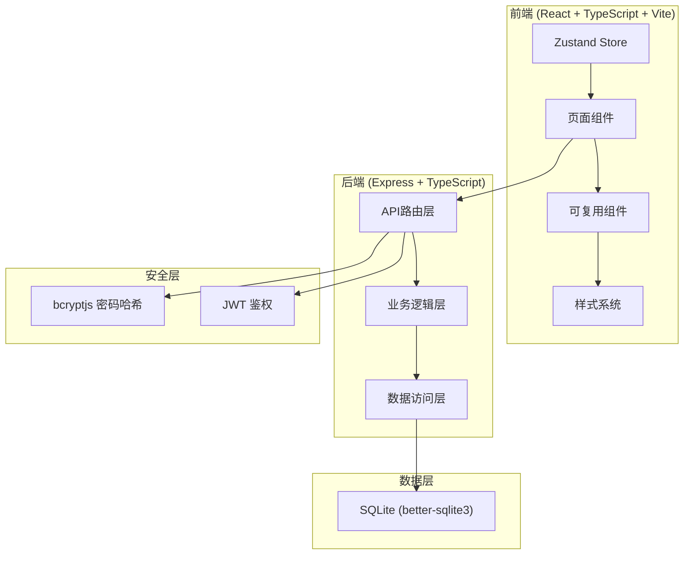
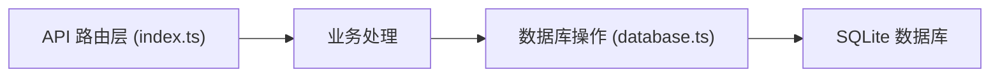
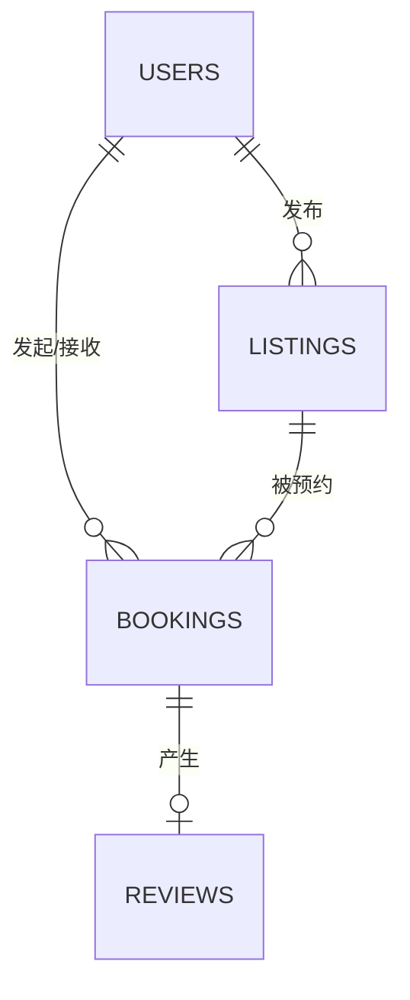

## 1. 架构设计



## 2. 技术选型说明
- **前端框架**: React 18 + TypeScript（严格模式）
- **构建工具**: Vite
- **状态管理**: Zustand
- **路由**: react-router-dom
- **后端框架**: Express.js
- **数据库**: SQLite (better-sqlite3)
- **鉴权**: bcryptjs (密码加密) + jsonwebtoken (JWT)
- **唯一标识**: uuid

## 3. 路由定义
| 路由路径 | 用途 |
|---------|------|
| / | 旅行者首页（搜索+瀑布流） |
| /dashboard | 房主管理后台 |
| /reviews/:bookingId | 评价页面 |
| /profile | 个人主页（评分展示） |
| /login | 登录页面 |
| /register | 注册页面 |

## 4. API 定义

### 4.1 鉴权接口
```typescript
POST /api/auth/register
Request: { email: string; password: string; role: 'host' | 'traveler'; name: string }
Response: { token: string; user: User }

POST /api/auth/login
Request: { email: string; password: string }
Response: { token: string; user: User }
```

### 4.2 房源接口
```typescript
GET /api/listings?region=&page=&limit=
Response: { listings: Listing[]; total: number }

POST /api/listings
Request: { region: string; type: 'apartment' | 'house' | 'shared'; amenities: string[]; capacity: number; price: number; coverImage?: string; autoReply?: string; blockedDates?: string[] }
Response: Listing

PUT /api/listings/:id
Request: Partial<Listing>
Response: Listing

DELETE /api/listings/:id
Response: { success: boolean }
```

### 4.3 预约接口
```typescript
POST /api/bookings
Request: { listingId: string; checkIn: string; checkOut: string }
Response: Booking

GET /api/bookings (host/traveler)
Response: Booking[]

PUT /api/bookings/:id/status
Request: { status: 'accepted' | 'rejected' }
Response: Booking
```

### 4.4 评价接口
```typescript
POST /api/reviews
Request: { bookingId: string; facilitiesScore: number; cleanlinessScore: number }
Response: Review

GET /api/reviews/user/:userId
Response: Review[]
```

## 5. 服务端架构



## 6. 数据模型

### 6.1 ER图


### 6.2 表结构定义
```sql
CREATE TABLE users (
  id TEXT PRIMARY KEY,
  email TEXT UNIQUE NOT NULL,
  password TEXT NOT NULL,
  name TEXT NOT NULL,
  role TEXT NOT NULL CHECK(role IN ('host', 'traveler')),
  trust_score REAL DEFAULT 4.0,
  created_at TEXT DEFAULT CURRENT_TIMESTAMP
);

CREATE TABLE listings (
  id TEXT PRIMARY KEY,
  host_id TEXT NOT NULL REFERENCES users(id),
  region TEXT NOT NULL,
  type TEXT NOT NULL CHECK(type IN ('apartment', 'house', 'shared')),
  amenities TEXT NOT NULL DEFAULT '[]',
  capacity INTEGER NOT NULL DEFAULT 1,
  price REAL NOT NULL,
  cover_image TEXT,
  auto_reply TEXT,
  blocked_dates TEXT NOT NULL DEFAULT '[]',
  status TEXT NOT NULL DEFAULT 'active' CHECK(status IN ('active', 'inactive')),
  created_at TEXT DEFAULT CURRENT_TIMESTAMP
);

CREATE TABLE bookings (
  id TEXT PRIMARY KEY,
  listing_id TEXT NOT NULL REFERENCES listings(id),
  traveler_id TEXT NOT NULL REFERENCES users(id),
  check_in TEXT NOT NULL,
  check_out TEXT NOT NULL,
  status TEXT NOT NULL DEFAULT 'pending' CHECK(status IN ('pending', 'accepted', 'rejected', 'completed', 'cancelled')),
  created_at TEXT DEFAULT CURRENT_TIMESTAMP
);

CREATE TABLE reviews (
  id TEXT PRIMARY KEY,
  booking_id TEXT NOT NULL UNIQUE REFERENCES bookings(id),
  reviewer_id TEXT NOT NULL REFERENCES users(id),
  reviewee_id TEXT NOT NULL REFERENCES users(id),
  facilities_score REAL NOT NULL,
  cleanliness_score REAL NOT NULL,
  created_at TEXT DEFAULT CURRENT_TIMESTAMP
);
```
